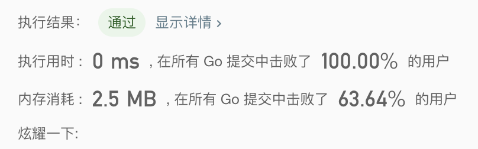

### 题目描述

>   将两个升序链表合并为一个新的升序链表并返回。新链表是通过拼接给定的两个链表的所有节点组成的。 
>
>   示例：
>
>   输入：1->2->4, 1->3->4
>   输出：1->1->2->3->4->4

### 解题思路

-   前提条件是有序
-   遍历链表，如果L1.Val <= L2.Val，Next指向L1，同时将L1指向L1.Next
-   头节点初始化
-   边界条件:
    -   L1 和 L2的长度未知
    -   如果L1长度 < L2长度，tmp.Next 拼接 剩余一条即可
    -   如果L1长度 >= L2长度，已在循环中处理

### 实现

```go
/**
Definition for singly-linked list.
type ListNode struct {
     Val int
     Next *ListNode
}
*/
func mergeTwoLists(l1 *ListNode, l2 *ListNode) *ListNode {
	var head = new(ListNode)
	tmp := head
	for l1 != nil {
		for l2 != nil && l2.Val <= l1.Val {
			tmp.Next = l2
			l2 = l2.Next
			tmp = tmp.Next
		}
		tmp.Next = l1
		l1 = l1.Next
		tmp = tmp.Next
	}
	if l2 != nil {
		tmp.Next = l2
	}
	return head.Next
}
```

### 结果



