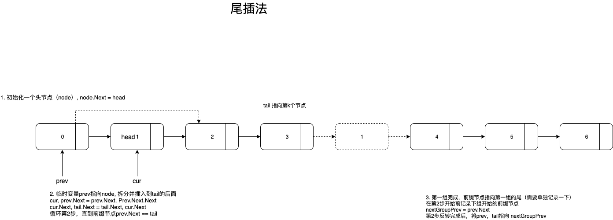

### 描述

> 给你一个链表，每 k 个节点一组进行翻转，请你返回翻转后的链表。
>
> k 是一个正整数，它的值小于或等于链表的长度。
>
> 如果节点总数不是 k 的整数倍，那么请将最后剩余的节点保持原有顺序。
>
>  
>
> 示例：
>
> 给你这个链表：1->2->3->4->5
>
> 当 k = 2 时，应当返回: 2->1->4->3->5
>
> 当 k = 3 时，应当返回: 3->2->1->4->5
>
>  
>
> 说明：
>
> 你的算法只能使用常数的额外空间。
> 你不能只是单纯的改变节点内部的值，而是需要实际进行节点交换。

### 解题思路



### 代码

```go
func reverseKGroup(head *ListNode, k int) *ListNode {
	node := &ListNode{
		Val:  0,
		Next: head,
	}
	prev := node
	tail := node
	for true {
		c := 1
		for tail != nil && c <= k {
			tail = tail.Next
			c++
		}
		if tail == nil {
			break
		}
    // 记录下一组的前缀节点
		nextHead := prev.Next
		var cur *ListNode
		for prev.Next != tail {
			// 拆出cur
			cur, prev.Next = prev.Next, prev.Next.Next
			// cur拼到tail后面
			cur.Next, tail.Next = tail.Next, cur
		}
		prev = nextHead
		tail = nextHead
	}
	return node.Next
}
```

