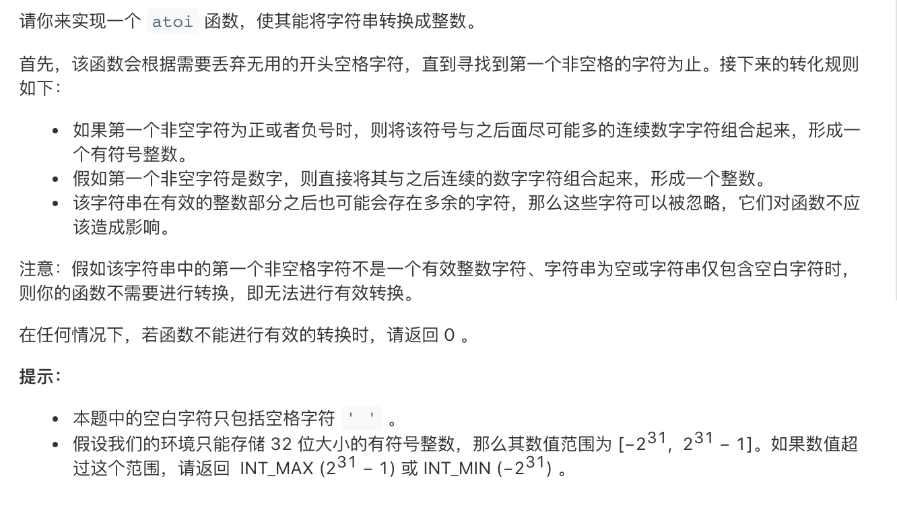

**数字或英文字母？**

```go
var s = "hello world"

for i := 0; i < len(s); i++ {
    if s[i] >= '0' && s[i] <= 9 {
        fmt.Printf("数字: %s", s[i])
    }
    if (s[i] >= 'a' && s[i] <= 'z') || (s[i] >= 'A' && s[i] <= 'Z') {
        fmt.Printf("字母: %s", s[i])
    }
}
```

**int32取值范围**

[-2147483648, 2147483647]

```go
if n >= 2 << 30 {
    return 2<<30-1 // 2147483647
} 
if n < -2<<30 {
    return -20<<30 // -2147483648
}
```

**正解:**

```go
func myAtoi(s string) int {
	var (
		n int8 = 0
		c = 0
	)
	for i := 0; i < len(s); i++ {
		if n == 0 {
            // 过滤空格，匹配符号
			if s[i] == '-' {
				n = -1
			} else if s[i] == '+' {
				n = 1
			} else if s[i] >= '0' && s[i] <= '9' {
				n = 1
				c = c*10 + int(s[i]-'0')
			} else if s[i] == ' ' {
				continue
			} else {
				return 0
			}
		} else {
			if s[i] >= '0' && s[i] <= '9' {
				c = c*10 + int(s[i]-'0')
                // 判断是否越界
				if c >= 2<<30 {
					if n > 0 {
						return 2<<30 - 1
					} else {
						return 0 - 2<<30
					}
				}
			} else {
				break
			}
		}
	}
	return c * int(n)
}

```


