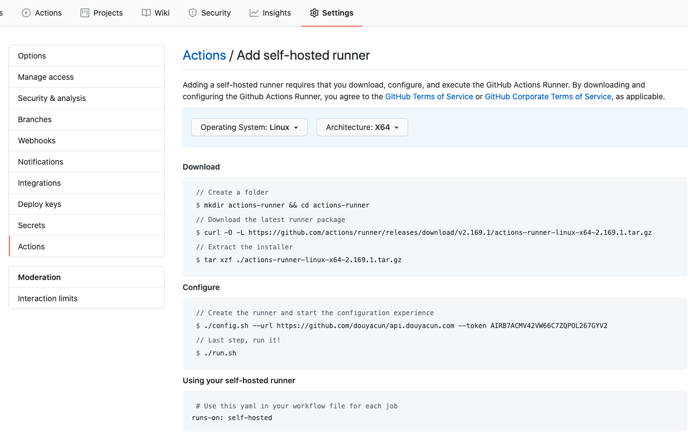

**目的**

1.  迁移博客系统ECS 为docker环境，实践在生产环境使用docker
2.  dockerfile 定制镜像，golang、node、elasticsearch、kibana、kong、kong-ui
3.  使用github action完成docker ci部署

# Go后端迁移

1.  构建image镜像
2.  aliyun容器镜像服务
3.  github actions完成1、2
4.  github actions runner完成服务器部署

## 构建image镜像

`Dockerfile` 

>   Dockerfile 语法参考 Docker--入门到实践 https://yeasy.gitbook.io/docker_practice/image/dockerfile

```dockerfile
### 构建
FROM golang:alpine as builder
WORKDIR /build
COPY . .
RUN go mod download
RUN go build -ldflags "-s -w" -o douyacun main.go

### 运行
FROM alpine as runner
WORKDIR /app
COPY --from=builder /build/douyacun /app
RUN apk add --no-cache bash
VOLUME /data
EXPOSE 9003
ENTRYPOINT ["./douyacun", "start"]
```

多阶段构建，减少go image包的大小

-   `copy --from` 复制builder阶段生成的二进制包
-   `alpine` 是一个面向安全的轻型 `Linux` 发行版，只有5M
    -   alpine太小了，甚至bash环境都没有提供， `apk add --no-cache bash` 安装bash环境，方便进入容器
-   `ENTRYPOINT` ： 没有使用cmd的原因是因为 有其他命令需要使用

TODO:

-   如何使用image中的其他命令
-   cache 加速打包速度

## Github actions

>    文档地址: https://help.github.com/cn/actions

`.github/workflows/go.yml`

```yml
name: Docker Image CI # Actions名称

on: # 执行时机
  push:
    tags:
      - v*
jobs:
  build: # 一个名叫build的任务（名字可以随便起）
    runs-on: ubuntu-latest # 基于最新版Ubuntu系统执行下列任务
    steps:
      - uses: actions/checkout@v1 # 将仓库内容拷贝到Ubuntu系统的虚拟环境
      - name: Build the Docker image # 步骤名字
        run: |
          echo ${{ secrets.DOCKER_PASSWORD_ALI }} | docker login --username=${{ secrets.DOCKER_USER_ALI }} registry.cn-hangzhou.aliyuncs.com --password-stdin
          docker build -t registry.cn-hangzhou.aliyuncs.com/douyacun/api:latest . # 执行构建
          docker push registry.cn-hangzhou.aliyuncs.com/douyacun/api:latest
  deploy:
    runs-on: self-hosted
    needs: build
    steps:
      - name: Docker compose pull image
        run: sudo docker-compose -f /data/web/api.douyacun.com/deployments/docker-compose.yml pull
      - name: Docker compose recreate container
        run: sudo docker-compose -f /data/web/api.douyacun.com/deployments/docker-compose.yml up --force-recreate -d
      - name: Docker image prune
        run: echo y|sudo docker image prune -a
```

`build`  构建docker image，并且push到阿里云 镜像仓库

`deploy` 需要在服务器上部署 runner，不建议使用ssh deploy的方式部署



runner运行后就相当于在ECS执行run 命令了, 这里使用docker-compose命令维护启动命令，先pull最新的image，然后重新构建容器

`deployments/docker-compose.yml`

```yml
version: "3"

services:
  api:
    image: registry.cn-hangzhou.aliyuncs.com/douyacun/api:latest
    ports:
      - "9003:9003"
    volumes:
      - douyacun:/data

volumes:
  douyacun:
    driver_opts:
      o: bind
      device: /data
      type: none
```

TODO:

-   容器监控
-   容器日志收集
-   容器健康检测
-   容器回滚

