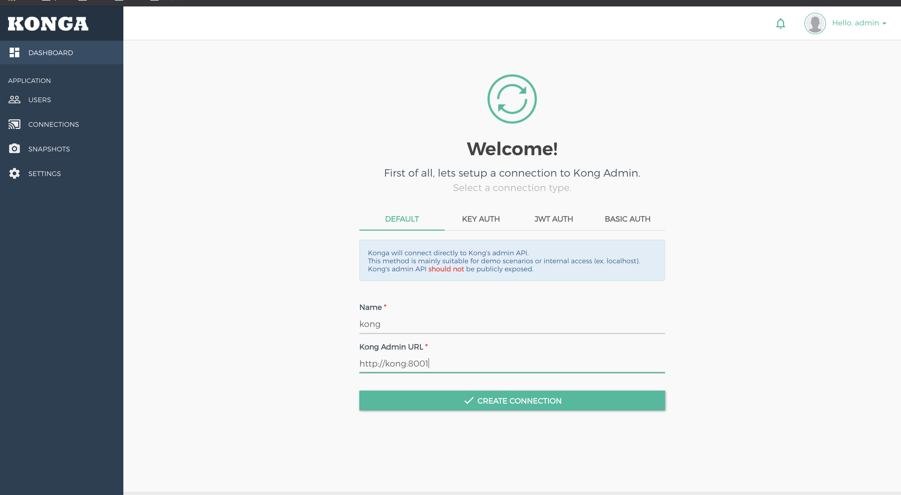
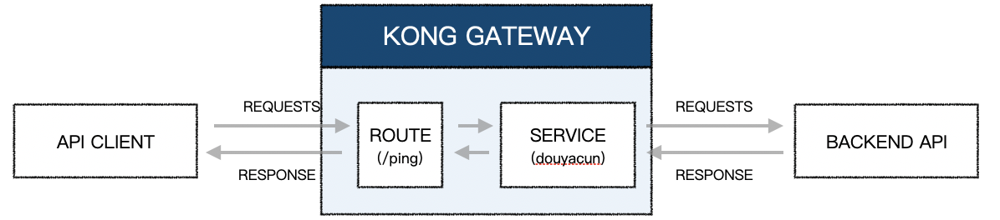
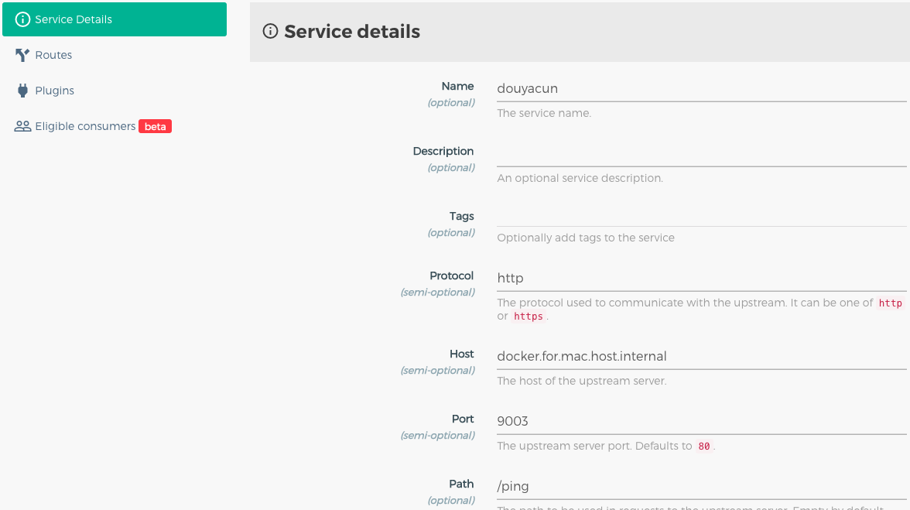
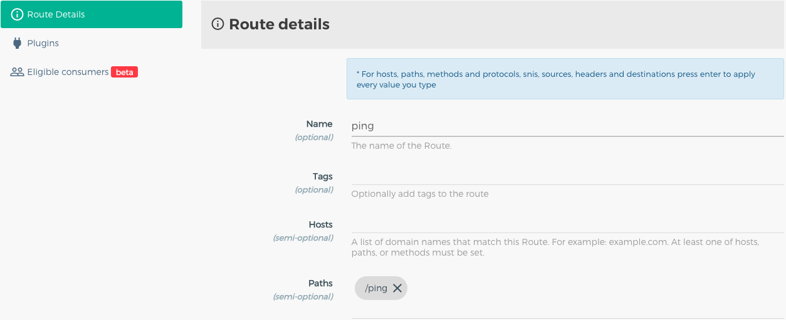
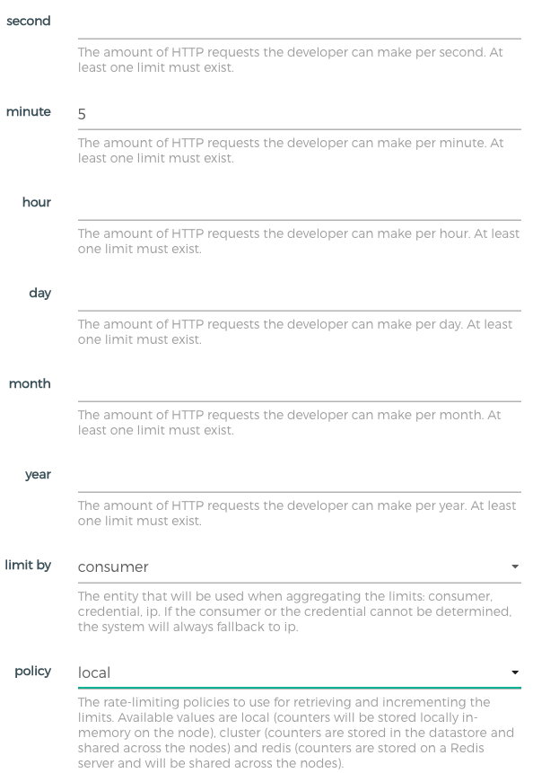
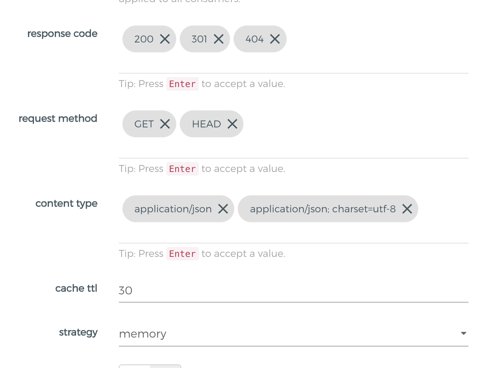

本篇文档目的:

1.  使用docker或centos7部署一套kong的环境
2.  使用kong代理到本地服务
3.  熟悉kong限流和鉴权
4.  负载均衡

# 安装

docker、centos7安装

## docker

[官网](https://docs.konghq.com/install/docker/?_ga=2.181811879.1832554820.1590497490-1678089697.1590497490) 有完整介绍

创建桥接网络，kong和postgres在同一网段中

```shell
$ docker network create kong-net
```

使用postgres存储，这里需要指定密码负责postgres会启动不起来

```shell
$ docker run -d --name kong-database \
--network=kong-net \
-p 5432:5432 \
-e "POSTGRES_USER=kong" \
-e "POSTGRES_DB=kong" \
-e "POSTGRES_PASSWORD=kong" \
postgres:9.6
```

`docker ps -a` 确认一下是否启动了postgres

初始化数据库

```shell
$ docker run --rm \
     --network=kong-net \
     -e "KONG_DATABASE=postgres" \
     -e "KONG_PG_HOST=kong-database" \
     -e "KONG_PG_PASSWORD=kong" \
     -e "KONG_CASSANDRA_CONTACT_POINTS=kong-database" \
     kong:latest kong migrations bootstrap
```

启动kong

```shell
$ docker run -d --name kong \
     --network=kong-net \
     -e "KONG_DATABASE=postgres" \
     -e "KONG_PG_HOST=kong-database" \
     -e "KONG_PG_PASSWORD=kong" \
     -e "KONG_CASSANDRA_CONTACT_POINTS=kong-database" \
     -e "KONG_PROXY_ACCESS_LOG=/dev/stdout" \
     -e "KONG_ADMIN_ACCESS_LOG=/dev/stdout" \
     -e "KONG_PROXY_ERROR_LOG=/dev/stderr" \
     -e "KONG_ADMIN_ERROR_LOG=/dev/stderr" \
     -e "KONG_ADMIN_LISTEN=0.0.0.0:8001, 0.0.0.0:8444 ssl" \
     -p 8000:8000 \
     -p 8443:8443 \
     -p 127.0.0.1:8001:8001 \
     -p 127.0.0.1:8444:8444 \
     kong:latest
```

查看空是否启动成功:

```shell
$ curl -i http://localhost:8001/
```

安装kong管理界面：

```shell
$ docker run -d -p 1337:1337 \
             --network kong-net \
             --name konga \
             -e "NODE_ENV=production" \
             -e "TOKEN_SECRET=kong" \
             pantsel/konga
```

配置konga，连接kong，因为在同一个网络可以使用容器name做为host连接容器



## centos 7

### 安装PostgreSQL

**yum 安装**

安装步骤官网较全

[https://www.postgresql.org/download/linux/redhat/](https://www.postgresql.org/download/linux/redhat/)

```shell
$ yum install -y postgresql10-server  postgresql10  postgresql10-contrib
```

**初始化数据库**

```shell
$ /usr/pgsql-10/bin/postgresql-10-setup initdb
```

**启动数据库**

```shell
$ systemctl enable postgresql-10.service
```

**允许远程连接**

` /var/lib/pgsql/10/data/postgresql.conf`

```shell
$ listen_addresses = '0.0.0.0'
```

**连接验证**

` /var/lib/pgsql/10/data/pg_hba.conf`

```conf
# TYPE  DATABASE        USER            ADDRESS                 METHOD
host    all             all             127.0.0.1/32            trust
# "local" is for Unix domain socket connections only
local   all             all                                     peer
# IPv4 local connections:
host    all             all             127.0.0.1/32            ident
# IPv6 local connections:
host    all             all             ::1/128                 ident
# Allow replication connections from localhost, by a user with the
# replication privilege.
local   replication     all                                     peer
host    replication     all             127.0.0.1/32            ident
host    replication     all             ::1/128                 ident
host    all             all             0.0.0.0/0               trust
```

注意放在最上面，否则本地连接的话会优先命中

`host    replication     all             127.0.0.1/32            ident`

```shell
Ident authentication failed for user "kong"
```

### 安装kong

**yum安装**

```shell
$ sudo yum install epel-release
$ sudo yum install kong-2.0.4.*.noarch.rpm --nogpgcheck
```

**创建数据库**

```plsql
 CREATE USER kong; 
 CREATE DATABASE kong OWNER kong;
```

>   注意保留 ;

**配置文件**

`/etc/kong/kong.conf`

```ini
database = postgres
pg_host = 127.0.0.1
pg_port = 5432
pg_user = kong
pg_database = kong
proxy_listen = 0.0.0.0:80
declarative_config = /etc/kong/kong.yml
```

**迁移数据库**

```
kong migrations bootstrap -c /etc/kong/kong.conf
```

# 概念

架构图


| Concept/Feature | Description                                                  |
| :-------------- | :----------------------------------------------------------- |
| Service         | 多个 Upstream 的集合，是 Route 的转发目标                    |
| Routes          | 求的转发规则，按照 Hostname 和 PATH，将请求转发给 Service    |
| Consumers       | API 的用户，记录用户信息                                     |
| REST API        | 通过 REST API 进行配置管理，从繁琐的配置文件中解放           |
| 插件            | 提供众多开箱即用的插件，且有易于扩展的自定义插件接口，可以使用 Lua 自行开发插件 |
| 限流            | 可以通过插件实现单个服务某些接口的限流，避免服务过载导致不可用 |
| 鉴权            | 权限控制，IP 黑白名单，同样是 OpenResty 的特性               |
| 负载均衡        | Kong Gateway provides two methods for load balancing: straightforward DNS-based or using a ring-balancer. In this guide, you’ll use a ring-balancer, which requires configuring upstream and target entities. With this method, the adding and removing of backend services is handled by Kong Gateway, and no DNS updates are necessary. |

# 为什么用kong?

- 统一入口：服务端微服务框架中，接口权限验证，IP 限制，限流等在各个服务中都单独实现。没有统一入口，不方便统一管理。
- 易用性，扩展性：服务端技术栈主要是LNMP开发，目前在逐步转型到基于golang微服务技术栈上开发。这是一个灰度迁移的过程，我们需要Proxy能操作简单，管理方便。
- 持续集成发布：互联网 2C 产品，用户无时不刻不在使用服务，同时产品还在不断的迭代，服务每时每刻都可以发布，所以必须要热部署能力，并且是自动化的。支持灰度发布，具有故障转移能力

# kong网关提供服务

kong承担的是网关层，可以当作中间件来看待

service: 代表后端api服务

route: 路由到哪个service服务，一个service可以有多个route



### 创建service

`rest api`

```shell
$ curl -i -X POST http://localhost:8001/services \
 --data name=douyacun \
 --data url='http://docker.for.mac.host.internal:9003'
```

界面



### 创建route

`rest api`

```shell
$ curl --location --request POST '127.0.0.1:8001/services/douyacun/routes' \
--form 'name=ping' \
--form 'paths[]=/ping'
```

界面



访问:

```shell
curl --location --request GET '127.0.0.1:8000/ping'
# ok
```

### 限流配置

`rest api` 这样设置，默认是全局配置, 默认是针对consumer,每分钟5次

```shell
$ curl -i -X POST http://localhost:8001/plugins \
--data "name=rate-limiting" \
--data "config.minute=5" \
--data "config.policy=local"
```

界面



超过5次以后会返回

```json
{
    "message": "API rate limit exceeded"
}
```

### proxy_cache 缓存请求插件

`rest api`

```shell
$ curl -i -X POST http://127.0.0.1:8001/plugins \
--data name=proxy-cache \
--data config.content_type="application/json" \
--data config.cache_ttl=30 \
--data config.strategy=memory
```

界面



注意： 如果`content-type` 不一致的话，缓存命中状态会是跳过状态`X-Cache-Status: Bypass` ，像我们上面设置的 `config.content_type="application/json"`  但是response content-type是 `application/json; charset=utf-8`

### key-auth 鉴权

添加key-auth插件

```shell
$ curl -X POST http://127.0.0.1:8001/routes/douyacun/plugins \
 --data name=key-auth
```

添加consumer和Credentials

```shell
$ curl -i -X POST -d "username=douyacun&custom_id=douyacun" http://localhost:8001/consumers/
```

为consumer生成apikey

```shell
$ curl -i -X POST http://localhost:8001/consumers/douyacun/key-auth -d 'key=ASF-JIK-0O1'
```

验证

```shell
$ curl -i http://localhost:8000/api/articles -H 'apikey:ASF-JIK-0O1'
```

### 负载均衡

创建Upstream

```shell
curl -X POST http://127.0.0.1:8001/upstreams \
 --data name=upstream
```

修改之前创建的douyacun service

```shell
curl -X PATCH http://127.0.0.1:8001/services/douyacun \
 --data host='upstream'
```

增加两个后端节点

```shell
$ curl -X POST http://127.0.0.1:8001/upstreams/upstream/targets \
 --data target=’docker.for.mac.host.internal:9004’
 
$ curl -X POST http://127.0.0.1:8001/upstreams/upstream/targets \
 --data target=’docker.for.mac.host.internal:9003’
```

