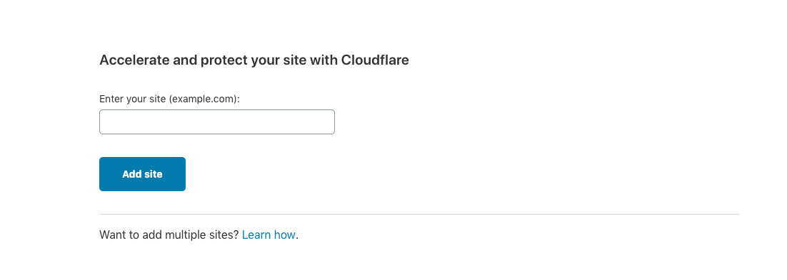
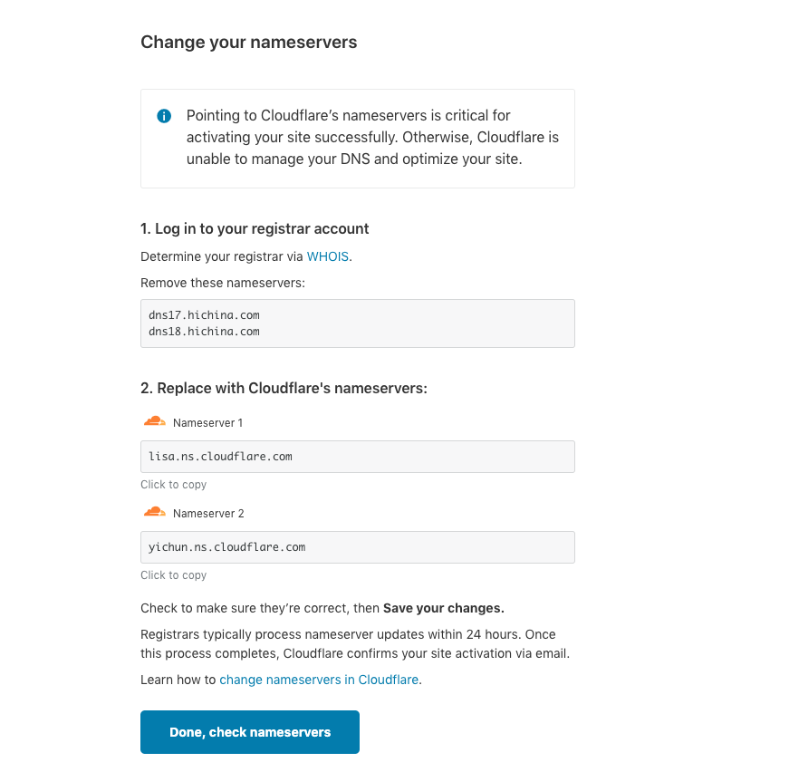
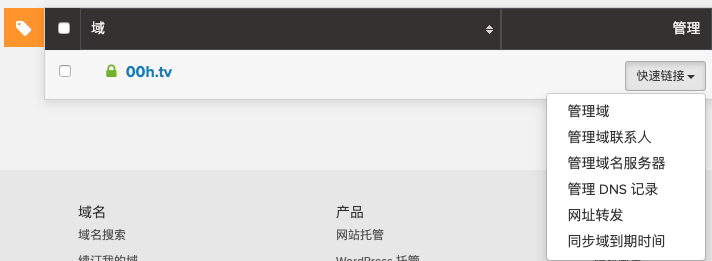
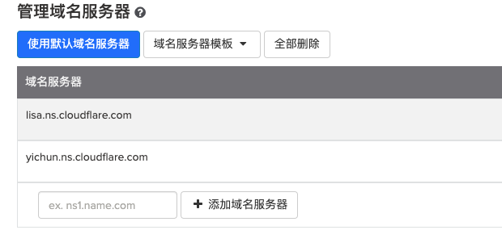
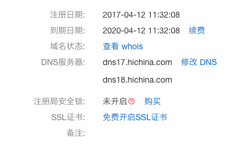

[TOC]

# 背景

- 如果服务器遇到ddns攻击，产生大量的流量费用，承担不起
- [00h.tv](https://www.00h.tv) 多是图片展示，浏览器同时下载图片，会阻塞服务器带宽
- 各国地理位置对访问速度影响较大，网站访问不稳定，会造成丢包的情况
- ip暴露在外，极易遭受攻击

# 需求

- 图片很少有更改的情况，全权交给cloudflare来处理
- 网站是服务端渲染的动态网站，无法全部走cdn缓存，但是里面的js/css是可以缓存的，服务端渲染是不会修改js和css文件
- 考虑到安全性，网站要通过https来访问，连接是安全的...

  


# cloudfare接入步骤

1. 注册账户，邮箱加密码

2. 输入要加速的域名, eg: douyacun.com

   

3. 选择免费版本，confirm plan

4. 确认域名原解析记录，continue, 重点不在这一步

5. name.com  账户/查看我所有的域/管理域名服务器 添加cloudflare 的dns服务器，添加Nameserver1/Nameserver2 - 这里是重点，否则无法进行下一步， 添加成功后 【Done, check nameservers】

6. 阿里云的域名服务器配置位置：域名/域名列表/基本信息

7. 到此算是基本上接入

# Cloudflare 配置项


接下来介绍的功能都是免费功能，主要是：DNS/SSL/Speed/Caching/Page Rules

### DNS

域名dns服务器已经配置到cloudflare进行管理，相应的A/CNAME/MX ...记录都需要在这配置


Proxied：Make sure all A, AAAA, and CNAME records pointing to proxied records are also proxied to avoid exposing your origin IP. 这是官方的原话，满足我们前面提到的需求，隐藏服务器的真实ip地址

```
➜  github ping 00h.tv
PING 00h.tv (104.31.82.191): 56 data bytes
64 bytes from 104.31.82.191: icmp_seq=0 ttl=53 time=165.261 ms
64 bytes from 104.31.82.191: icmp_seq=1 ttl=53 time=183.431 ms
64 bytes from 104.31.82.191: icmp_seq=2 ttl=53 time=178.056 ms
64 bytes from 104.31.82.191: icmp_seq=3 ttl=53 time=170.380 ms
^C
--- 00h.tv ping statistics ---
4 packets transmitted, 4 packets received, 0.0% packet loss
round-trip min/avg/max/stddev = 165.261/174.282/183.431/6.974 ms
```

```
您查询的 IP：104.31.82.191

所在地理位置：Cloudflare

GeoIP: United States
```

```
Request URL: https://www.00h.tv
Request Method: GET
Status Code: 200 
Remote Address: 104.31.82.191:443
Referrer Policy: no-referrer-when-downgrade
```

### SSL/TLS


简单来说：如果源服务器无法接受安全 (HTTPS) 连接，您需要选择“Flexible” （灵活）。如果有自己签名的 SSL 证书，可以选择“Full” （完全）；如果拥有证书颁发机构颁发的有效 SSL 证书，可以选择“Full (strict)” （完全（严格））。

**Off:**   访问者与 Cloudflare 之间没有安全连接，Cloudflare 与源服务器之间也没有安全连接。这意味着访问者只能通过 HTTP 查看您的网站，而任何尝试通过 HTTPS 连接的访问者都会给注意到 HTTP 301 重定向HTTP协议

**Flexible （灵活） SSL:**  访问者与 Cloudflare 之间使用安全连接，但 Cloudflare 与您的源服务器之间没有安全连接。 Web 服务器不需要拥有 SSL 证书，但访问者仍然会浏览该网站的 HTTPS版本。此设置仅适用于端口 443-> 80，而不适用于其他端口，如 2053。这方式只应该在用户完全无法在自己的源服务器上设置 SSL的时候使用

**Full （完全） SSL**：访问者与 Cloudflare 之间为安全连接，Cloudflare 与您的源服务器之间为安全连接（但不需要经过身份验证）。服务器配置需要至少有自我签名的证书，以应答 HTTPS 连接。这样的证书的真实性并未经验证

**Full SSL (Strict) （完全 - 严格SSL）：**访问者与 Cloudflare 之间为安全连接，Cloudflare 与您的源服务器之间为安全且经过验证的连接。服务器配置必须使用*有效* 的SSL 证书来应答 HTTPS 连接。此证书必须由[证书颁发机构](https://en.wikipedia.org/wiki/Certificate_authority)签署，该证书颁发机构[必须得到 Cloudflare 信任](https://github.com/cloudflare/cfssl_trust)，而到期日期须为未来的日期，并回复请求域名（主机名）

### Caching

**Purge Cache:**  清除文件缓存,支持`*`通配符匹配删除，支持全量删除

**Cache Level:**  缓存的级别，选择standard就行

### Page Rule

配置哪些url可以缓存走cdn，免费账户可以设置3个规则


建议使用`*`通配符进行url匹配，规则只有3条

**Browser cache TTL:** 浏览器缓存时间

**Always Online:** 如果服务不可用，cloudflare会提供网站的副本，使网站能正常访问

**Cache Level:** 

- Bypass 正常访问通过， 注意如果资源访问返回404，cloudflare也会缓存5分钟

  ```
  200 301    120m;
  302 303    20m;
  403        5m;
  404        5m;
  any        0s;
  ```

- No query string 仅在url没有参数时缓存。 example.com/pic.jpg

- Standard 包含参数，每个不同的url都会返回不同的资源： example.com/pic.jpg?with=query 

- Ignore query string 忽略url参数：example.com/pic.jpg?ignore=this-query-string~~`

# 缓存是否命中

那我们如何检测cdn缓存是否命中呢？

```
Response Headers:
age: 87637
cache-control: public, max-age=31536000
cf-cache-status: HIT
cf-ray: 50f39a7f7cbd9605-SJC
```

Response Headers会返回`cf-cache-status`来表示当前资源缓存是否命中，如果没有命中就是`miss`,如果响应头中直接没`cf-cache-status`, 说明cloudflare没有规则命中缓存当前资源，考虑以下几个因素：

1. Page rule 是否覆盖当前url
2. Page rule Cache Level 设置为Cache Everything,正常情况下cloudflare是不会缓存html，cache everything会缓存所有与rule匹配的规则
3. 如果没有page rule设置，cloudflare会使用标准模式[RFC rule](http://www.w3.org/Protocols/rfc2616/rfc2616-sec14.html#sec14.9.3)
4. RFC cache rule, 以下3个设置不会使用cdn缓存
   1. pragma: 优先级最高，no-cache
   2. Cache-control: no-cache
   3. expires: 0，优先级最低