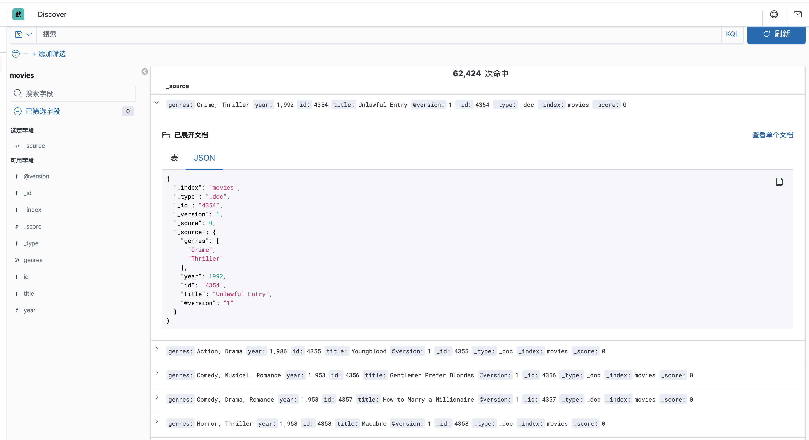

# 文档

- logstash最佳实践(只能入门看看)：https://doc.yonyoucloud.com/doc/logstash-best-practice-cn/index.html

- 官方文档(看过logstash最佳实践以后，官方文档的大概结构就知道了)：https://www.elastic.co/guide/en/logstash/current/index.html

- filter grok 工具(logstash提供正则匹配工具)：http://grokdebug.herokuapp.com/
- logstash下载地址: https://www.elastic.co/cn/downloads/logstash
- 测试数据集: https://grouplens.org/datasets/movielens/

# 定义配置文件

logstash.conf

```conf
input {
        file {
                path => "/Users/liuning/Documents/utils/datasets/movies.csv"
                start_position => "beginning"
                sincedb_path => "/dev/null"
        }
}

filter {
        csv {
                separator => ","
                skip_header => true
                columns => ["id","content","genres"]
        }
        mutate {
                split => ["genres", "|"]
                remove_field => ["path", "message", "@timestamp", "host"]
        }
        mutate {
                split => ["content", "("]
                add_field => { "title" => "%{[content][0]}"}
                add_field => { "year" => "%{[content][1]}"}
        }
        mutate {
                convert => {
                        "year" => "integer"
                }
                strip => ["title"]
                remove_field => ["path", "host","@timestamp","message","content"]
        }
}

output {
        elasticsearch {
                index => "movies"
                document_id => "%{id}"
        }
        stdout { codec => rubydebug }
}
```

- file 读取文件，还支持网络等。
  - path：这里会有坑，如果启动后一直不读取数据，估计是路径出了问题，这里不支持中文，`-`, 老老实实放到一个简单的路径里，不知道下划线支不支持，自己试试
  - start_position：从文件开始的位置读，首次提取数据时，可以这么设置。
  - sincedb_path: logstash读取文件后，会记录文件已经读取的位置，重启也会从上次的位置开始，这里让他写入``/dev/null`,就可以每次从头开始方便调试。
- 从grouplens下载datasets是csv格式的，logstash默认值csv解析
  - autodetect_column_names: 默认是不自动解析表头
  - separator: csv分隔列是用`,`默认是`,`写不写都行
  - quota_char：csv 如果某一列有逗号的话，需要带上`"`表示引用格式，这里自带的csv插件是支持的。如果有解析错乱的话，不用考虑这个。
  - skip_header：跳过表头

- mutate: 修改数据，添加字段，移除字段等等

  - split：分割字段为数据
  - remove_field：移除一些没用的字段
  - strip：去掉空格, php trim() ,python strip()，golang strings.Trim()

- output：输出到哪

  - elasticsearch
    - index:指定索引
    - document_id：指定文档id，否则会默认生成

  - stdout：标准输出到控制台

# 运行

```shell
sudo ./bin/logstash -f logstash.conf
```

这里用sudo，是因为要写入到/dev/null, 需要root权限。

具体 elasticsearch、kibana是如果运行的，看 [elasticsearch docker的安装步骤](安装运行.md)



# logstash 同步mysql到elasticsearch

有需求需要把mysql中的数据同步到elasticsearch中, 按照每条记录的更新时间导入数据

[官方文档](https://www.elastic.co/guide/en/logstash/current/plugins-inputs-jdbc.html)

## 安装

看一下logstash已经有的plugins，我当前用的是7.6.0默认已经有了input jdbc了

```
bin/logstash-plugin list
```

老版本需要安装插件：

```
bin/logstash-plugin install logstash-input-jdbc
```

下在java mysql连接驱动，jdbc_driver_library: [从这里下载最新的版本](https://mvnrepository.com/artifact/mysql/mysql-connector-java)

# 配置文件

```conf
input {
	jdbc {
		jdbc_validate_connection => true
		jdbc_driver_library => "/opt/driver/mysql-connector-java-5.1.36.jar"
		jdbc_driver_class => "com.mysql.jdbc.Driver"
		jdbc_connection_string => "jdbc:mysql://localhost:3306/videos_t"
		jdbc_user => "root"
		jdbc_password => "123456"
		# 定时器
		schedule => "*/1 * * * * "
		# 记录 sql_last_value 值的类型，支持: number / timestamp
		tracking_column_type => "timestamp"
		# 记录上一次查询是最后的值
		use_column_value => true
		tracking_column => "updated_at"
		# 时区 local 或 utc
		plugin_timezone="local"
		# sql_last_value logstash提供的预定义宏，上一次最后查询列的值，具体那一列由 tracking_column 指定
		statement => "select * from foo where updated_at > :sql_last_value"
		# 分页，防止首次导入的时候数据过多
		jdbc_paging_enabled => "true"
		jdbc_page_size => "10000"
	}
}

filter {
}

output {
	stdout { codec => json_lines }
}
```

这里的需要是按照更新时间导入数据，需要用到3个配置：

- `use_column_value`:  使用上一次查询的值，作为 sql_last_value
- `tracking_column`: 使用哪一列
- `tracking_column_type`: 该列值的类型，`numeric`, `timestamp`

> 如果是只有插入同步到elasticsearch的话，可以按id同步 `tracking_column => "id"`    `tracking_column_type => "numeric"`

- `statement` : sql语句，支持参数绑定的形式
- `prepared_statement_bind_values`: 数组，sql中绑定的参数

- `schedule`: 定时器，具体看cron的用法
- `plugin_timezone`: 按更新时间同步数据的话，一定要注意时区，默认是:utc,支持local和utc。否则每次查询条件都是差8个小时
- `jdbc_paging_enabled`: 分页，第一次同步几百万的话，一次查询数据量可能太多
- `jdbc_page_size`: 每页条数
- `logstash_jdbc_last_run`: 上一次同步的值, 默认在 `～/.logstash_jdbc_last_run`, 这个最后单独配置一下，一张表同步的话还可以，如果是多张的话就会用成同一个文件中的值

# 错误

这个错误用logstash(7.5.0)报的错，github issue作者提到新版已经修复这个问题所以上面用的版本是7.6.0

```error
com.mysql.jdbc.Driver not loaded. Are you sure you've included the correct jdbc driver in :jdbc_driver_library?
```

