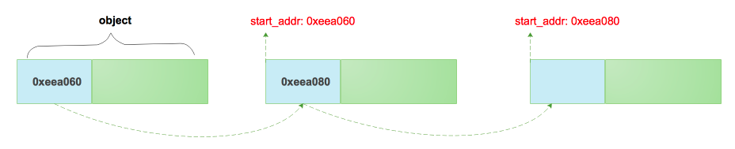

[TOC]

版本:

- go 1.13.4
- tcmalloc  gperftools 2.7

我是学习go源码时看到go内存分配使用tcmalloc,早在看redis源码时就了解到tcmalloc了，redis支持zmalloc、tcmalloc、jemalloc几种内存分配，之前只是看了redis自带的zmalloc,没深入了解一下tcmalloc。看来存在必有其道理，不定啥时候就用到

- https://github.com/gperftools/gperftools
- [TCMalloc : Thread-Caching Malloc](http://goog-perftools.sourceforge.net/doc/tcmalloc.html)

学习内存分配，就要先了解一下物理内存的相关概念和描述：

- [linux物理内存描述](http://www.ilinuxkernel.com/files/Linux_Physical_Memory_Description.pdf)
- [Linux物理内存页面分配](http://www.ilinuxkernel.com/files/Linux_Physical_Memory_Page_Allocation.pdf)
- [linux内存地址映射](http://www.ilinuxkernel.com/files/Linux_Memory_Address_Mapping.pdf)

看完这些以后总结了几个问题：

- 什么是逻辑地址、线性地址、物理地址，linux是如何进行地址映射的？

- linux是管理内存的(NUMA), 节点(node)、区域(zone)、page(页面)？

- 为什么一个16G的内存，内核需要160M维护page_table？

- 什么是缺页异常？（给顶的逻辑地址不合法，逻辑页面没有对应的物理页面，MMU将会产生中断，向核心发出信号）


# 基础知识

## 堆栈


进程如何分配内存：

1. static alloction: 声明全局变量时属于静态分配，该空间只会分配一次，并且永远不会释放。
2. automatic allocation: 声明函数参数/局部变量 的复合语句会自动栈空间，复合语句推出时会自动释放变量
3. dynamic allocation: malloc/free

# TCMalloc

1. **TCMalloc要比操作系统提供glibc 2.3 malloc（ptmalloc2）内存分配快**。内存的分配速度和合适的大小对于开发者来说非常重要，如果满足不了开发者的需求可能更倾向于自己实现内存分配规则
2. **TCMalloc减少了多线程之间的锁竞争**。对于小对象分配，几乎是0竞争，对于大对象，TCMalloc使用避免上下文切换的自旋锁，ptmalloc2使用per thread arenas(每个线程都会有自己的锁，避免线程之间的竞争)，问题是内存无法从arenas移动到另外一个arenas。例如：线程一申请一块300M内存，任务完成后。线程二在相同的地址空间启动，如果两个线程绑定了不同arena,线程一申请的300M内存就无法复用，必须重新申请，导致内存爆炸。
3. **TCMalloc另一个优势是对琐碎内存的高效利用**。
> 自旋锁：多线程同步的一种锁，线程反复检查锁变量是否可用。由于线程在这一过程中保持执行，因此是一种忙等待。一旦获取了自旋锁，线程会一直保持该锁，直至显式释放自旋锁。自旋锁避免了进程上下文的调度开销，因此对于线程只会阻塞很短时间的场合是有效的 - [摘自维基百科](https://zh.wikipedia.org/wiki/自旋锁)

## 概述

基本思想: 小内存通过线程层次缓存分配(无锁，速度快)，分配失败后请求上层补一批，前面分配了过多的内存则回收

线程:

ThreadCache: 每个线程私有一份，尺寸小于256K的小内存申请均由ThreadCache进行分配，线程之间不需要竞争，非常高效。节省了加锁释放锁的时间。

全局: 

PageHeap: 中央堆处理器，被所有线程共享（分配需要锁定），负责和操作系统申请、释放内存，大尺寸内存申请直接通过PageHeap分配，

CentralCache: 作为PageHeap和ThreadCache的中间人，负责将PageHeap的内存切分为小块，恰当时机分配给ThreadCache，回收ThreadCache的内存并部分返还给PageHeap

span: 一块连续的内存页。
object: object是由span切分成的小块，object预设了一些规则，如8byte、16byte、32bbyte..., 同一个span切出来的object都是相同的规格，object不大于256k，超大内存直接分配span使用\

ThreadCache、CentralCache管理object, PageHeap管理的是span

## PageHeap 大内存分配

大对象（>32k）对齐内存页面4k(4的倍数)， 由central page heap处理，central page heap也是一个数组

k个pages分配过程：

1. 查看k个页面的空闲列表（free_list）。
2. 如果free_list为空，看下一个空闲列表是否有，如此循环
3. 最终，查询到最后一个空闲列表
4. 如果匹配失败，会从操作系统申请
5. 如果有大于k个page的空闲列表，会分配k给当前申请，剩下的pages会重新插入到相应的空闲列表中。

```c++
// 根据起始page的位置和长度确定span的范围
struct Span {
  PageID        start;          // Starting page number
  Length        length;         // Number of pages in span
  Span*         next;           // 注意，这里span结构一个双向链表
  Span*         prev;           // 
  union {
    void* objects;              // Span会在CentralFreeList中拆分成由object组成的free list
    char span_iter_space[sizeof(SpanSet::iterator)];
  };
  unsigned int  refcount : 16;  // span的object被引用次数，refcount = 0时表示此span没有被使用
  unsigned int  sizeclass : 8;  // span被切分的object属于哪个级别的sizeClass
  unsigned int  location : 2;   // Span在的位置IN_USE？normal？returned？
  unsigned int  sample : 1;     // Sampled jobject?
  bool          has_span_iter : 1; 
  // What freelist the span is on: IN_USE if on none, or normal or returned
  enum { IN_USE, ON_NORMAL_FREELIST, ON_RETURNED_FREELIST };
};
```
- IN_USE：正在使用 ON_NORMAL_FREELIST：未被使用 ON_RETURNED_FREELIST：用户已经归还

> refcount、sizeclass、objects数据CentralFreeList管理的内存

PageHeap维护了
- page和span的关系
- 空闲span的伙伴关系

PageHeap结构体

```c++
class PERFTOOLS_DLL_DECL PageHeap {
  PageMap pagemap_;
  struct SpanList {
    Span        normal;
    Span        returned;
  };
  SpanSet large_normal_;
  SpanSet large_returned_;

  SpanList free_[kMaxPages];
};
```

- PageMap pagemap_ 维护id和Page的映射关系
- 大于kMaxPages页面统一存放在large_normal_中，不在按照页面数目区分

## CentralCache
CentralCache是由size_class个CentralFreeList组成的数组由Static(static_vars.h)类管理
```c++
class CentralFreeList {
  SpinLock lock_;
  // We keep linked lists of empty and non-empty spans.
  size_t   size_class_;     // size-class span切分尺寸，每个span只能按同一种size-class切分
  Span     empty_;          // 未分配Span
  Span     nonempty_;       // 已分配Span
}
```
CentralFreeList作为中间人，从PageHeap中取出部分span并按照预定大小将其拆分为大小固定的object供ThreadCache共享。CentralFreelist是全局的，除了构造函数，其余操作都需加锁。

## ThreadCache 小内存分配

**小对象分配**

1. 将其大小映射到相应的大小object
2. 在本地thread_cached中相应的free_list查找
3. 如果free_list不为空，从列表中删除第一个对象并返回它

**thread_cache free_list为空**

1. 从此大小类的central cache的free_list中获取一堆object
2. 将获取到的object放到thread_cache的free_list中
3. 将新获取的object其中一个返回

**central_cache free_list为空**

1. 从central page allocator中申请一批page
2. 拆分为该大小级别（size_class）的一组object
3. 新对象(object)放置在中央缓存（central cache）的空闲列表（free_list）中

每个thread独立维护了各自的离散式空闲列表

```c++
// https://github.com/gperftools/gperftools/blob/master/src/thread_cache.h
// https://github.com/gperftools/gperftools/blob/master/src/thread_cache.cc
class ThreadCache {
  class FreeList {
    void*    list_;       // 链表第一个节点
    uint32_t length_;      // 当前长度
    int32_t size_;
  }
  ThreadCache* next_;
  ThreadCache* prev_;
  // kClassSizesMax 96
  FreeList      list_[96];    // size_class 数组，可用链表
  int32         size_;        // 可用内存大小
  int32         max_size_;    // size_ > max_size_ --> Scavenge()
  pthread_t     tid_;         // 属于哪个线程
}
```
ThreadCache list_变量即为size class的实现，在实现free list时没有使用next来指针指向下一个位置，而是直接使用 void* list_, 将下一个object的地址直接存储在上个前8个字节中，可以模拟单向链表，object分配个应用程序后可以直接覆盖前8个字节，节省了一个指针的空间。



## size-class
```c++
  // 1. Sizes <= 1024 have an alignment >= 8. ceil(size/8)
  // 2. Sizes > 1024 have an alignment >= 128. ceil(size/128).

  //   Size       Expression                      Index
  //   -------------------------------------------------------
  //   0          (0 + 7) / 8                     0
  //   1          (1 + 7) / 8                     1
  //   ...
  //   1024       (1024 + 7) / 8                  128
  //   1025       (1025 + 127 + (120<<7)) / 128   129
  //   ...
  //   32768      (32768 + 127 + (120<<7)) / 128  376
```


# go 内存分配

go在程序启动时会分配一块虚拟内存地址是连续的内存, 结构如下


## 布局

### spans

是page和其管理对象的反查表，在回收时，从哪来回哪去。利用该表可访问地址相邻大块内存使用状态，以便将多个相邻内存合并成更大的内存，减少碎片，更好适应分配需求。

### bitemap

和gc有关，先不做过多深入，研究gc时候会深入理解

栈(stack)、全局变量和静态变量（.data/.bss）占用1bit，0: gc不需要关心是否回收，1: 需要分析是否需要回收

堆(heap) 需要占用2bit

### arena

用户对象分配区域，就是通常说的堆(heap)，go从heap中申请的内存就是在这个区域。

### 逃逸分析

什么时候从heap分配对象，go会自动确定哪些对象应该放在栈上，哪些应该放在堆上。简单的说：当一个对象的内容可能在生成该对象的函数结束后被访问，那么这个对象就会被分配在堆上。

**返回对象指针**

```go
func foo() *string {
	str := "Hello world"
	return &str
}
func main() {
	fmt.Println(foo())
}
```

```shell
$ git:(master) ✗ go run -gcflags '-m -l' bar.go
# command-line-arguments
./bar.go:7:9: &str escapes to heap
./bar.go:6:2: moved to heap: str
./bar.go:11:17: foo() escapes to heap
./bar.go:11:13: main ... argument does not escape
0xc0000101e0
```

**传递了对象的指针到其他函数**

```go
func greeter(name *string) {
	 *name = "hello " + *name
}
func main() {
	name := "douyacun"
	greeter(&name)
	fmt.Println(name)
}
```

```shell
➜  bar git:(master) ✗ go run -gcflags '-m -l' bar.go
# command-line-arguments
./bar.go:6:20: "hello " + *name escapes to heap
./bar.go:5:14: greeter name does not escape
./bar.go:12:13: name escapes to heap
./bar.go:11:10: main &name does not escape
./bar.go:12:13: main ... argument does not escape
hello douyacun
```

**在闭包中使用了对象并且需要修改对象**

```go
func main() {
	name := "douyacun"
	greeter := func() {
		name = "hello " + name
	}
	greeter()
	fmt.Println(name)
}
```

```shell
➜  bar git:(master) ✗ go run -gcflags '-m -l' bar.go
# command-line-arguments
./bar.go:11:13: name escapes to heap
./bar.go:8:19: "hello " + name escapes to heap
./bar.go:7:13: main func literal does not escape
./bar.go:11:13: main ... argument does not escape
hello douyacun
```

**使用new**

```go
func main() {
	name := new([]string)
	fmt.Println(name)
}
```

```shell
➜  bar git:(master) ✗ go run -gcflags '-m -l' bar.go
# command-line-arguments
./bar.go:7:13: name escapes to heap
./bar.go:6:13: new([]string) escapes to heap
./bar.go:7:13: main ... argument does not escape
&[]
```

## 小对象分配过程

这里翻译了一下源代码的注释，描述的很清楚`runtime/mheap.go`

**mcache分配**

1. 将尺寸四舍五入到small size classes的一种
2. 在 **P** 的 mcache中查看相应的mspan
3. 扫描mspan的bitmap查找空闲坑位
4. 如果有空闲坑位，分配这个坑位，这个过程不需要获取锁

> P是协程中的用于运行go代码的虚拟资源,同一时间只能有一个线程访问同一个P,所以p的资源不需要锁

**mcentral分配**

1. mcache没有空闲坑位
2. 从有坑位的mcentral列表中获取一个新的mspan
3. 获得这个mspan需要锁定mcentral，mcentral是在线程的共享空间中，会有竞争

**mheap分配**

1. mcentral没有坑位
2. 从mheap申请一批page，切分为mspan
3. 这个过程需要加锁
4. 如果mheap没有坑位，从操作系统申请

小对象分3个阶段获取可用的span，然后从span中分配对象


## 大对象分配

分配大内存直接通过mhe

ap获取，绕过mcache/mcentral, 大对象分配时会四舍五入(8kb)，在包含k个页面的空闲列表中寻找第K个条目，如果他是空的，向上查找，直到找到，如果失败，从操作系统查看早

# GC

gc不是一句能说清的，后续单独深入了解一下