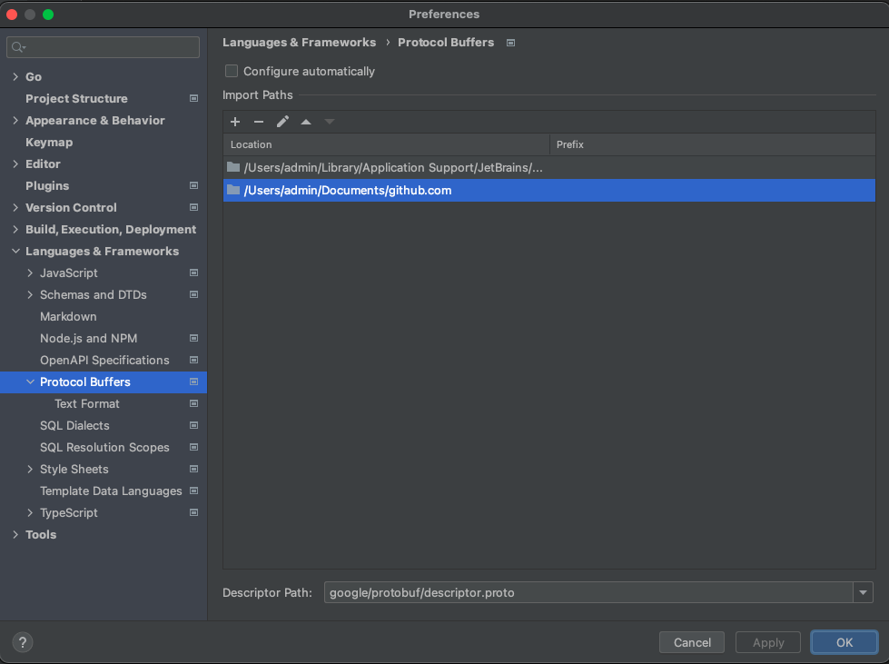

## 概要

- Q&A
- 多目录多文件编译
- Goland配置支持proto

### Q&A

1. 如何安装protobuf 以及相应的依赖

protoc 是protobuf提供的命令行工具

通过 [github protoc release](https://github.com/protocolbuffers/protobuf/releases/tag/v3.17.3) 下载

mac 可以通过 `brew install protobuf`

go 语言使用protobuf 需要安装插件： `go install google.golang.org/protobuf/cmd/protoc-gen-go`

go 语言推荐安装插件：`go get github.com/gogo/protobuf/protoc-gen-gogofaster`

> gogofast 可以减少指针的使用，减少垃圾回收的时间
>
> Fields without pointers cause less time in the garbage collector. More code generation results in more convenient methods.

2. grpc和protobuf是什么关系，如何配合使用

protobuf 是协议定义的是结构体，方便不同语言之间的参数转换。

grpc是网络通信框架，可以用json、thrift、protobuf作为结构体

grpc不是go语言专有，go语言使用grpc需要安装:  `go get -u google.golang.org/grpc`

go语言grpc配合protobuf使用，需要安装protobuf插件: `go install google.golang.org/grpc/cmd/protoc-gen-go-grpc`

如何编译protobuf后面说。


### 多目录多文件编译

多目录结构：

```shell
➜  protobuf-compile tree
.
├── Makefile
└── proto
    ├── article
    │   ├── article.pb.go
    │   ├── article.proto
    │   ├── message.pb.go
    │   └── message.proto
    └── user
        └── author.proto
```

有多个微服务，用户中心/文章中心/审核中心 不同的团队服务通过grpc接口提供基础数据访问。这时候都是直接下发protobuf文件来方便传递数据

拆分多个目录，多个包相对来说就比较好维护protobuf文件。万一对方改了多个proto文件，直接丢给我们一个目录。我们也直接将目录覆盖

message 需要关联article的信息。同时还需要关联user包中的author。

到这需要先弄明白protobuf是如何import其他文件的。

1. protobuf支持相同目录下的文件直接import

```protobuf
syntax = "proto3";
option go_package = "protobuf-compile/proto/article;article";

package article;

import "article.proto";

message Message {
  int32 id = 1;
  string title = 2;
  string content = 3;
  string articleId = 4;
  article.Article article = 6;
}
```

artitle和message是在同一个包下面的，可以直接import即可。

2. 如果是多个目录，需要指定相对的根路径

--proto_path 指定根路径

推荐直接以项目路径作为根路径的：

```protobuf
syntax = "proto3";
option go_package = "protobuf-compile/proto/article;article";

package article;

import "protobuf-compile/proto/article/article.proto";
import "protobuf-compile/proto/user/author.proto";

message Message {
  int32 id = 1;
  string title = 2;
  string content = 3;
  string articleId = 4;
  user.Author author = 5;
  article.Article article = 6;
}
```

此时的import就都是绝对路径，这是就不能即有相对路径，又有绝对路径了，否则会报错：

```protobuf
syntax = "proto3";
option go_package = "protobuf-compile/proto/article;article";

package article;

import "article.proto";
import "protobuf-compile/proto/user/author.proto";

message Message {
  int32 id = 1;
  string title = 2;
  string content = 3;
  string articleId = 4;
  user.Author author = 5;
  article.Article article = 6;
}
```

```shell
protoc /Users/admin/Documents/github.com/protobuf-compile/proto/article/*.proto \
                --proto_path=/Users/admin/Documents/github.com \
                --proto_path=/Users/admin/Documents/github.com/protobuf-compile/proto/article \
                --go_out=plugins=grpc:/Users/admin/Documents/github.com
article.proto:10:9: "article.Article.id" is already defined in file "protobuf-compile/proto/article/article.proto".
article.proto:11:10: "article.Article.title" is already defined in file "protobuf-compile/proto/article/article.proto".
article.proto:12:10: "article.Article.content" is already defined in file "protobuf-compile/proto/article/article.proto".
article.proto:13:15: "article.Article.author" is already defined in file "protobuf-compile/proto/article/article.proto".
article.proto:9:9: "article.Article" is already defined in file "protobuf-compile/proto/article/article.proto".
article.proto:17:9: "article.SearchArticleResponse.code" is already defined in file "protobuf-compile/proto/article/article.proto".
article.proto:18:10: "article.SearchArticleResponse.error_message" is already defined in file "protobuf-compile/proto/article/article.proto".
article.proto:24:8: "article.SearchArticleResponse.data" is already defined in file "protobuf-compile/proto/article/article.proto".
article.proto:20:11: "article.SearchArticleResponse.Data.page" is already defined in file "protobuf-compile/proto/article/article.proto".
article.proto:21:11: "article.SearchArticleResponse.Data.page_size" is already defined in file "protobuf-compile/proto/article/article.proto".
article.proto:22:11: "article.SearchArticleResponse.Data.count" is already defined in file "protobuf-compile/proto/article/article.proto".
article.proto:19:11: "article.SearchArticleResponse.Data" is already defined in file "protobuf-compile/proto/article/article.proto".
article.proto:16:9: "article.SearchArticleResponse" is already defined in file "protobuf-compile/proto/article/article.proto".
article.proto:24:3: "article.SearchArticleResponse.Data" seems to be defined in "protobuf-compile/proto/article/article.proto", which is not imported by "article.proto".  To use it here, please add the necessary import.
protobuf-compile/proto/article/message.proto:6:1: Import "article.proto" was not found or had errors.
protobuf-compile/proto/article/message.proto:15:3: "article.Article" seems to be defined in "protobuf-compile/proto/article/article.proto", which is not imported by "protobuf-compile/proto/article/message.proto".  To use it here, please add the necessary import.
```

**多目录，多文件如何编译**

推荐设置根目录，以绝对路径import文件。protoc编译如何写?

但对对某个目录下的proto文件进行编译：

```shell
# 当前makefile所在目录
CurDir=$(shell pwd)
# 当前项目所在目录 - 根目录
PROJECT_PATH=$(shell cd "../$(dirname "$0")"; pwd)


.PHONY: proto
proto:
	protoc ${PROJECT_PATH}/protobuf-compile/proto/article/*.proto \
		--proto_path=${PROJECT_PATH} \
		--go_out=plugins=grpc:${PROJECT_PATH}

	protoc ${PROJECT_PATH}/protobuf-compile/proto/user/*.proto \
		--proto_path=${PROJECT_PATH} \
		--go_out=plugins=grpc:${PROJECT_PATH}
```

编译后：

```
.
├── Makefile
└── proto
    ├── article
    │   ├── article.pb.go
    │   ├── article.proto
    │   ├── message.pb.go
    │   └── message.proto
    └── user
        ├── author.pb.go
        └── author.proto
```

### Goland配置支持protobuf

需要安装插件： Protocol Buffers Editor

配置：Preferences > Languages & Frameworks >Protocol Buffers

取消： Configure automatically

添加：根目录所在目录



