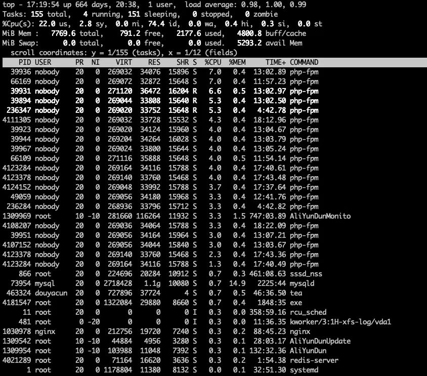

帮朋友维护一下后端服务器，最近开始反应app很卡，每次启动要等1，2分钟，那不是炸了吗？

当时排查的思路：

- 负载如何
- cpu/内存 饱和度
- 带宽使用量如何
- 新上线的功能
- QPS是多少
- 阻塞请求有多少
- 磁盘使用情况

第一反应是先去服务器上看下负载，负载不高，cpu使用率22%，内存使用率 28%，到这可以松一口气了，服务器没炸，当时很卡咋回事。



通过负载、cpu、内存是没办法反应出问题，QPS和接口延迟当时没有监控，所以也没办法看到，其后就是看阿里云的云监控返现带宽已经饱和，那肯定就是带宽满了呗。截图加钱临时升级一下带宽。延迟就降下来了，到底是因为啥导致的带宽使用量突然上来了，这里靠猜是很难的，而且阿里云的监控是不能到接口层级的。搭建接口层级的监控就比较重要。

go语言有prometheus监控就很方便，这里记录一下监控的指标（不是教程）

- delay 延迟，90/95/99分位延迟
- qps，qpm
- request body size
- request body size

go的话，sdk会自动统计内存、gc、goroutine的使用情况

grafana 小项目直接用的 官网提供的服务：https://grafana.com/

**第一个问题：延迟统计用histogram还是summary？**

官网给出答案：https://prometheus.io/docs/practices/histograms/，也对其进行了比较

总结一句都可以用来观察 delay  和 body size，但还是更推荐使用histogram，summary虽然统计比较精准，但是会有全局锁，会影响并发，其次不支持聚合，要统计每个接口还要看到汇总的趋势

> Histograms and summaries both sample observations, typically request durations or response sizes. They track the number of observations *and* the sum of the observed values, allowing you to calculate the *average* of the observed values.

```go
var httpRequestDurationHistogram = prometheus.NewHistogramVec(prometheus.HistogramOpts{
	Name:    "http_request_duration_second",
	Help:    "histogram：统计接口延迟响应时间",
	Buckets: prometheus.DefBuckets,
	//Objectives: map[float64]float64{0.5: 0.05, 0.9: 0.01, 0.99: 0.001},
}, []string{"code", "url"})

var httpRequestSizeHistogram = prometheus.NewHistogramVec(prometheus.HistogramOpts{
	Name:    "http_request_size_byte",
	Help:    "histogram: 统计接口请求体的大小",
	Buckets: prometheus.ExponentialBuckets(100, 10, 8),
}, []string{"code", "url"})

var httpResponseSizeHistogram = prometheus.NewHistogramVec(prometheus.HistogramOpts{
	Name:    "http_response_size_byte",
	Help:    "histogram: 统计接口响应内容大小",
	Buckets: prometheus.ExponentialBuckets(100, 10, 8),
}, []string{"code", "url"})

var httpRequestsInflightGauge = prometheus.NewGaugeVec(prometheus.GaugeOpts{
	Name: "http_request_inflight",
	Help: "Gauge: 请求堆积数量",
}, []string{"url"})
```

**第二个问题：php如何使用prometheus**

github 仓库：https://github.com/PromPHP/prometheus_client_php

php的话是有fpm来管理进程的，所以没办法像go一样直接汇总统计到内存，这里prometheus_client_php是通过汇总到redis来记录，具体用法看github

**第三个问题：grafana QPS如何统计，rate函数的含义**

我们没有必要增加一个 `http_request_total` 来单独记录请求总数，因为 `http_request_duration_second` histogram会记录三个字短：_bucket、_sum、count，可以用count + rate来计算qps

```
sum by(code) (rate(http_request_duration_count{job="$job"}[$__rate_interval]))
```

rate是可以来计算qps增长率，不过只是平均值不能代表顺时

> Calculates the per-second average rate of increase of the time series in the range vector. Breaks in monotonicity (such as counter resets due to target restarts) are automatically adjusted for. Also, the calculation extrapolates to the ends of the time range, allowing for missed scrapes or imperfect alignment of scrape cycles with the range's time period.
