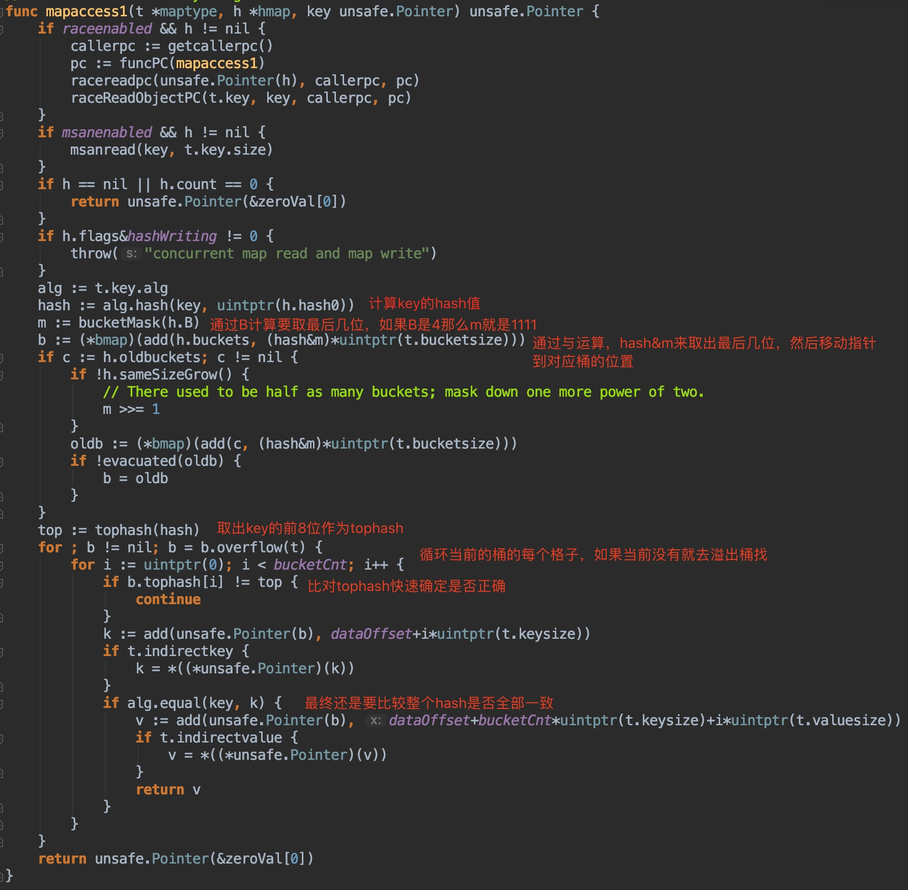
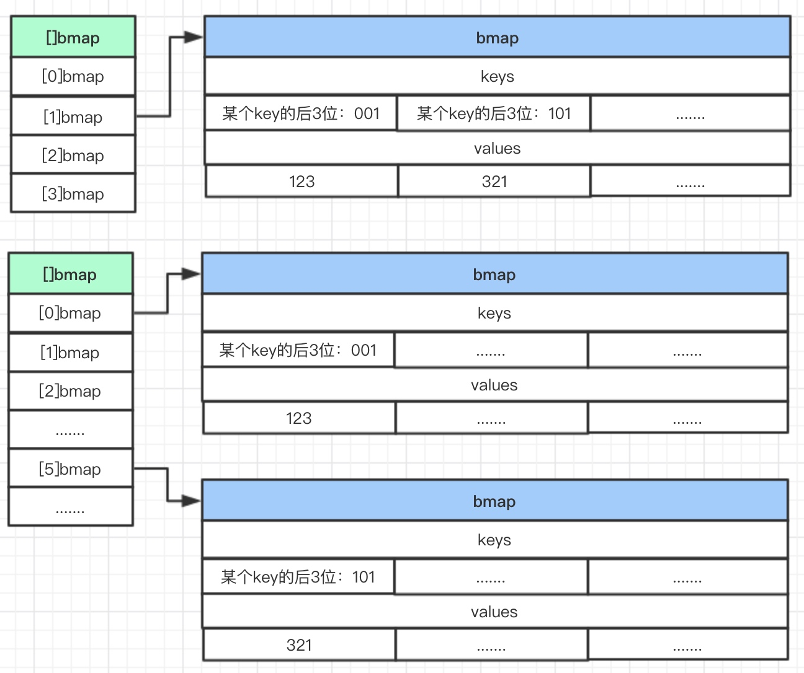
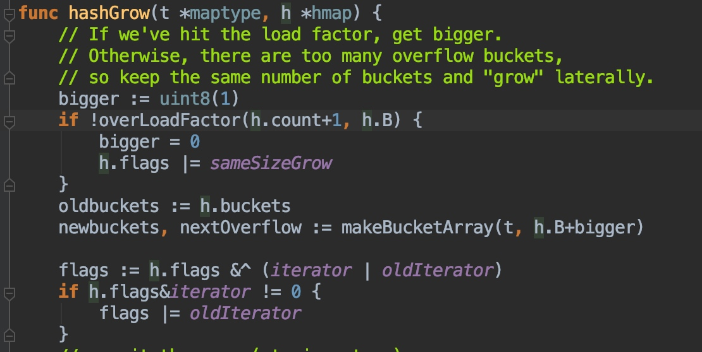
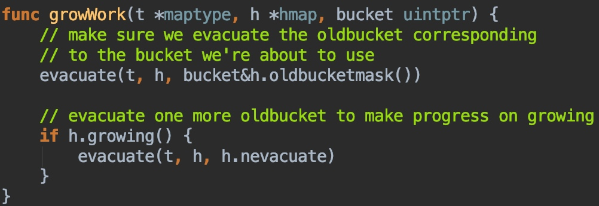

[toc]

# 疑惑

1. 如何区分变量是数组还是切片
2. 数组复制是否像c语言一样，只复制数组开始的地址
3. 为什么字符串（"hello world"）计算大小unsafe.Sizeof()是16

# 数组

### 定义方式：

```go
var a [3]int                    // 定义长度为3的int型数组, 数组中的每个元素都以零值初始化
var b = [...]int{1, 2, 3}       // 定义长度为3的int型数组, 长度根据初始化元素的数目自动计算
var c = [...]int{2: 3, 1: 2}    // 定义长度为3的int型数组, 索引的方式来初始化数组的元素
var d = [...]int{1, 2, 4: 5, 6} // 定义长度为6的int型数组, 元素为 1, 2, 0, 0, 5, 6
```

### 概念： 数组是一个固定长度的特定类型元素组成的序列，长度/类型

- 不同长度和类型数据组成数组类型是不同的
- 不同长度的数组因为长度不同无法直接赋值

- 不同于切片，数组的长度是明确指定的
- 不同于c语言数组，go语言数组是值语义，并不是隐式指向第一个元素指针，当一个数组被复制和传递是，实际会复制整个数组
- len 和 cap 返回的结果始终是对应数组的长度
- 数组可以用于数值、字符串、结构体、函数、接口、管道数组

### 内存结构：在内存中连续存储

```
| 1 | 2 | 3 | 4 | 5 |
```

```go
var a = [...]int{1, 2, 3, 4, 5}
fmt.Println(unsafe.Sizeof(a))
// 40
```

Sizeof(a)大小是40，我这系统是64位的所以int位64位,8个字节， 8*5 = 40

# 字符串

### 概念： 一个字符串是一个不可改变的字节序列

- 字符串是一个只读的字节数组，长度是固定的
- 字符串长度并不是字符串类型的一部分，不同长度的字符串可以等值比较
- 字符串是一个结构体，因此字符串赋值操作也就是reflect.StringHeader复制操作，不会涉及到底层数组的复制
- 字符串是只读的，相同字符串常量，通常是对应同一个字符串常量
- 字符串和数组类似也可以通过len获取字符串长度，StringHeader也可以获取

```go
var a = "Hello world"
fmt.Println(len(a))
fmt.Println((*reflect.StringHeader)(unsafe.Pointer(&a)).Len)、
fmt.Println(unsafe.Sizeof(a))
// 11
// 11
// 16
```

a内存的数据，使用reflect.StringHeader类型来解释，类型强制转换, unsafe.Sizeof(a)其实计算的是，下面reflect.StringHeader结构的大小，unitptr 8字节 + int 8字节 = 16字节，因此可以称呼go字符串为字符串结构体

### 数据结构在reflect.StringHeader定义：

```go
type StringHeader struct {
    Data uintptr
    Len  int
}
```

字符串的内存结构：


# 切片

### 概念：切片就是一种简化版的动态数组，动态数组的长度不固定，切片相对于数组更具有灵活性#

- 切片的长度不是类型的组成部分，数组的长度需要计算得出
- 容量必须大于或等于切片的长度
- 在对切片本身赋值或参数传递时，和数组指针的操作方式类似，只是复制切片头信息（`reflect.SliceHeader`）

结构体定义：

```go
type SliceHeader struct {
    Data uintptr
    Len  int
    Cap  int
}
```

 内存布局：x := []int{2,3,5,7,11}


切片声明：

```go
var a []int // 这里只是声明类型，结构体还没有初始化，所以为nil
b := []int{} // 结构体已经初始化了
fmt.Println(a == nil, b == nil)
fmt.Println(unsafe.Sizeof(a))// 8 + 8 + 8 = 24
// true false
// 24
g := make([]int, 3) // 有3个元素的切片, len和cap都为3
```

### 切片新增和删除：

增加元素

```go
var a = []int{1, 2, 3, 4}
fmt.Println(a, len(a), cap(a))
// [1 2 3 4] 4 4

a = append(a, 5)
fmt.Println(a, len(a), cap(a))
// [1 2 3 4 5] 5 8

var b = make([]int, 0, 1)
b = append(b, 1, 2, 3, 4, 5, 6)
fmt.Println(b, len(b), cap(b))
// [1 2 3 4 5 6] 6 6

var c = make([]int, 1023, 1024)
c = append(c, 1, 3)
fmt.Println(c, len(c), cap(c))
// [0 0 0 0 ...] 1025 1280
```

在容量不足的情况下，`append`的操作会导致重新分配内存，可能导致巨大的内存分配和复制数据代价，目的是为了减少向操作malloc申请堆内存的次数，重复的申请代价也是昂贵的，关于go内存管理的策略可以研究一下[tcmalloc](https://dirtysalt.github.io/html/tcmalloc.html#orga1d3bec)。从上面可以看出，初始化切片a，长度和容量都是4，新增一个元素后，长度是5，容量是8, 内存空间不足go向操作系统申请了内存重分配，关于go切片扩容的策略：

- 如果新的大小是当前大小2倍以上，则大小增长为新大小
- 如果当前大小小于1024，按每次2倍增长，否则每次按当前大小1/4增长。直到增长的大小超过或等于新大小。
  - 1024 >= 1024
  - 1024 + 1024 / 4 = 1280
  - 1280 > 1023 + 2
- 如果最终容量（cap）计算值溢出，则最终容量（cap）就是新申请容量（cap）：意思是如果容量计算的值大于uint的最大值范围，那么最终的容量就是新申请容量

```go
// runtime/slice.go/func growslice(et *_type, old slice, cap int) slice {}
newcap := old.cap
doublecap := newcap + newcap
if cap > doublecap {
  newcap = cap
} else {
  if old.len < 1024 {
    newcap = doublecap
  } else {
    // Check 0 < newcap to detect overflow
    // and prevent an infinite loop.
    for 0 < newcap && newcap < cap {
      newcap += newcap / 4
    }
    // Set newcap to the requested cap when
    // the newcap calculation overflowed.
    if newcap <= 0 {
      newcap = cap
    }
  }
}

capmem = roundupsize(uintptr(newcap) * sys.PtrSize)
// uintptr: 能存储指针的整型,也能存储int，官方解释：uintptr is an integer type that is large enough to hold the bit pattern of any pointer.
// sys.PtrSize 64位系统是8

// 内存对齐
// Returns size of the memory block that mallocgc will allocate if you ask for the size.
func roundupsize(size uintptr) uintptr {
  // _MaxSmallSize: 32768
	if size < _MaxSmallSize {
		if size <= smallSizeMax-8 {
			return uintptr(class_to_size[size_to_class8[(size+smallSizeDiv-1)/smallSizeDiv]])
		} else {
			return uintptr(class_to_size[size_to_class128[(size-smallSizeMax+largeSizeDiv-1)/largeSizeDiv]])
		}
	}
	if size+_PageSize < size {
		return size
	}
	return round(size, _PageSize)
}

// size_to_class8: 0, 1, 2, 3, 3, 4, 4, 5, 5, 6, 6, 7, 7, 8, 8, 9, 9......
// class_to_size: 0, 8, 16, 32, 48, 64, 80, 96, 112, 128, 144, 160......
```

扩容和内存对齐

```go
// 这个例子 讲讲扩容或内存
var a = make([]int, 1, 1)
fmt.Printf("%v\t%v\n", a, (*reflect.SliceHeader)(unsafe.Pointer(&a)))
a = append(a, 2, 3, 4, 5)
fmt.Printf("%v\t%v\n", a, (*reflect.SliceHeader)(unsafe.Pointer(&a)))
// [0]             &{824634335232 1 1}
// [0 2 3 4 5]     &{824634368000 5 6}

```

按照扩容的第二条，大于两倍旧容量，按理说应该是5但这里是6，那就是接下来的内存对齐了
capmem = roundupsize(uintptr(newcap) * sys.PtrSize)
newcap 我们计算出来是5, uintptr(newcap) * sys.PtrSize -> 5 * 8 = 40; roundupsize(40)
(size+smallSizeDiv-1)/smallSizeDiv] -> (40 + 8 - 1)/8 = 5（这里是因为int存储的，后面小数都是截取）class_to_size[size_to_class8[5]] -> 48 
 48 / 8 = 6 所以最终cap为6

删除元素

```go
a = []int{1, 2, 3}
a = a[1:] // 删除开头1个元素
a = a[N:] // 删除开头N个元素
a = append(a[:0], a[1:]...) // 删除开头1个元素
a = a[:copy(a, a[1:])] // 删除开头1个元素
a = append(a[:i], a[i+1:]...) // 删除中间1个元素
```

### 切片使用技巧

0长切片特性（长度为0，容量不为0），应用场景：过滤掉字符串中的某些字符， 切片高效操作的要点是要降低内存分配的次数

```go
func Filter(s []byte, f func(x byte) bool) []byte {
	b := s[:0] // 这里b的长度是0，容量是s容量等价于 var b = make([]byte, 0, cap(s))
	for _, x := range s {
		if !f(x) {
			b = append(b, x)
		}
	}
	return b
}
```

切片避免内存泄漏, FindPhoneNumber会加载整个文件到内存中，搜索第一个出现的号码，最终结构以切片方式返回，返回结果指向保存整个文件的数组，因为切片引用了整个原始数组，导致垃圾回收器不能及时释放底层的空间

```go
func FindPhoneNumber(filename string) []byte {
    b, _ := ioutil.ReadFile(filename)
    return regexp.MustCompile("[0-9]+").Find(b)
}
```


类似的问题，在删除切片元素时可能会遇到。假设切片里存放的是指针对象，那么下面删除末尾的元素后，被删除的元素依然被切片底层数组引用，从而导致不能及时被自动垃圾回收器回收

```go
var a []*int{ ... }
a = a[:len(a)-1] // 被删除的最后一个元素依然被引用, 可能导致GC操作被阻碍

var a []*int{ ... }
a[len(a)-1] = nil // GC回收最后一个元素内存
a = a[:len(a)-1]  // 从切片删除最后一个元素
```

# hash map

推荐阅读：[大话图解golang map源码详解](https://www.linkinstar.wiki/2019/06/03/golang/source-code/graphic-golang-map/)  

> 这里是照搬的，人家写的很好，防止他站点关掉了，几句没发看了

源代码：`src/runtime/map.go`


那么下面我将从这几个方面来说明，你先记住有下面几个方向，这样可以有一个大致的思路：

- 基础结构：golang中的map是什么样子的，是由什么数据结构组成的？
- 初始化：初始化之后map是怎么样的？
- get：如何获取一个元素？
- put：如何存放一个元素？
- 扩容：当存放空间不够的时候扩容是怎么扩的？

## 基础结构

### 图解


这个就是golang中map的结构，其实真的不复杂，我省略了其中一些和结构关系不大的字段，就只剩下这些了。

### 大话

大话来描述一些要点：

- **最外面是hmap结构体，用buckets存放一些名字叫bmap的桶（数量不定，是2的指数倍）**
- **bmap是一种有8个格子的桶（一定只有8个格子），每个格子存放一对key-value**
- **bmap有一个overflow，用于连接下一个bmap（溢出桶）**
- **hmap还有oldbuckets，用于存放老数据（用于扩容时）**
- **mapextra用于存放非指针数据（用于优化存储和访问），内部的overflow和oldoverflow实际还是bmap的数组。**

## 初始化

初始化就不需要图去说明了，因为初始化之后就是产生基础的一个结构，根据map中存放的类型不同。这里主要说明一下，初始化的代码放在什么位置。我也删除了其中一些代码，大致看看就好。

```
// makehmap_small implements Go map creation for make(map[k]v) and
// make(map[k]v, hint) when hint is known to be at most bucketCnt
// at compile time and the map needs to be allocated on the heap.
func makemap_small() *hmap {
	h := new(hmap)
	h.hash0 = fastrand()
	return h
}

// makemap implements Go map creation for make(map[k]v, hint).
// If the compiler has determined that the map or the first bucket
// can be created on the stack, h and/or bucket may be non-nil.
// If h != nil, the map can be created directly in h.
// If h.buckets != nil, bucket pointed to can be used as the first bucket.
func makemap(t *maptype, hint int, h *hmap) *hmap {
	.....

	// initialize Hmap
	if h == nil {
		h = (*hmap)(newobject(t.hmap))
	}
	h.hash0 = fastrand()

	// find size parameter which will hold the requested # of elements
	B := uint8(0)
	for overLoadFactor(hint, B) {
		B++
	}
	h.B = B
	
	......
	return h
}
```

**其中需要注意一个点：“B”**，还记得刚才说名字叫bmap的桶数量是不确定的吗？这个B一定程度上表示的就是桶的数量，当然不是说B是3桶的数量就是3，而是2的3次方，也就是8；当B为5，桶的数量就是32；记住这个B，后面会用到它。

其实你想嘛，初始化还能干什么，**最重要的肯定就是确定一开始要有多少个桶，初始的大小还是很重要的**，还有一些别的初始化哈希种子等等，问题不大。我们的重点还是要放在存/取上面。

## GET

### 图解

其实从结构上面来看，我们已经可以摸到一些门道了。先自己想一下，要从一个hashmap中获取一个元素，那么一定是通过key的哈希值去定位到这个元素，那么想着这个大致方向，看下面一张流程图来详细理解golang中是如何实现的。


### 大话

下面说明要点：

- **计算出key的hash**
- **用最后的“B”位来确定在哪个桶（“B”就是前面说的那个，B为4，就有16个桶，0101用十进制表示为5，所以在5号桶）**
- **根据key的前8位快速确定是在哪个格子（额外说明一下，在bmap中存放了每个key对应的tophash，是key的前8位）**
- **最终还是需要比对key完整的hash是否匹配，如果匹配则获取对应value**
- **如果都没有找到，就去下一个overflow找**

总结一下：通过后B位确定桶，通过前8位确定格子，循环遍历连着的所有桶全部找完为止。
那么为什么要有这个tophash呢？因为tophash可以快速确定key是否正确，你可以把它理解成一种缓存措施，如果前8位都不对了，后面就没有必要比较了。

### 源码一瞥


其中红色的字标出的地方说明了上面的关键点，最后有关key和value具体的存放方式和取出的定位不做深究，有兴趣可以看最后的参考博客。

## PUT

其实当你知道了如何GET，那么PUT就没有什么难度了，因为本质是一样的。PUT的时候一样的方式去定位key的位置：

- 通过key的后“B”位确定是哪一个桶
- 通过key的前8位快速确定是否已经存在
- 最终确定存放位置，如果8个格子已经满了，没地方放了，那么就重新创建一个bmap作为溢出桶连接在overflow

### 图解


这里主要图解说明一下，如果新来的key发现前面有一个格子空着（这个情况是删除造成的），就会记录这个位置，当全部扫描完成之后发现自己确实是新来的，那么就会放前面那个空着的，而不会放最后（我把这个称为紧凑原则，尽可能保证数据存放紧凑，这样下次扫描会快）

### 代码位置

go/src/runtime/hashmap.go的mapassign函数就是map的put方法，因为代码很长这里就不多赘述了。

## 扩容

这个就是最复杂的地方了，但是呢？Don’t worry我这里还是会省略其中某些部分，将最重要的地方拎出来。

### 扩容的方式

1. 相同容量扩容
2. 2倍容量扩容
   啥意思呢？第一种出现的情况是：因为map不断的put和delete，出现了很多空格，这些空格会导致bmap很长，但是中间有很多空的地方，扫描时间变长。所以第一种扩容实际是一种整理，将数据整理到前面一起。第二种呢：就是真的不够用了，扩容两倍。

### 扩容的条件

#### 装载因子

如果你看过Java的HashMap实现，就知道有个装载因子，同样的在golang中也有，但是不一样哦。装载因子的定义是这个样子：
loadFactor := count / (2^B)
其中count为map中元素的个数，B就是之前个那个“B”
翻译一下就是装载因子 = （map中元素的个数）/（map当前桶的个数）

#### 扩容条件1

装载因子 > 6.5（这个值是源码中写的）
其实意思就是，桶只有那么几个，但是元素很多，证明有很多溢出桶的存在（可以想成链表拉的太长了），那么扫描速度会很慢，就要扩容。

#### 扩容条件2

overflow 的 bucket 数量过多：当 B 小于 15，如果 overflow 的 bucket 数量超过 2^B ；当 B >= 15，如果 overflow 的 bucket 数量超过 2^15 。
其实意思就是，可能有一个单独的一条链拉的很长，溢出桶太多了，说白了就是，加入的key不巧，后B位都一样，一直落在同一个桶里面，这个桶一直放，虽然装载因子不高，但是扫描速度就很慢。

#### 扩容条件3

当前不能正在扩容

### 图解


这张图表示的就是相同容量的扩容，实际上就是一种整理，将分散的数据集合到一起，提高扫描效率。（上面表示扩容之前，下面表示扩容之后）


这张图表示的是就是2倍的扩容（上面表示扩容之前，下面表示扩容之后），如果有两个key后三位分别是001和101，当B=2时，只有4个桶，只看最后两位，这两个key后两位都是01所以在一个桶里面；扩容之后B=3，就会有8个桶，看后面三位，于是它们就分到了不同的桶里面。

### 大话

下面说一些扩容时的细节：

- 扩容不是一次性完成的，还记的我们hmap一开始有一个oldbuckets吗？是先将老数据存到这个里面
- 每次搬运1到2个bucket，当插入或修改、删除key触发
- 扩容之后肯定会影响到get和put，遍历的时候肯定会先从oldbuckets拿，put肯定也要考虑是否要放到新产生的桶里面去

### 源码一瞥


扩容的三个条件，看到了吗？这个地方在mapassign方法中。


这里可以看到，注释也写的很清楚，如果是加载因子超出了，那么就2倍扩容，如果不是那么就是因为太多溢出桶了，sameSizeGrow表示就是相同容量扩容


evacuate是搬运方法，这边可以看到，每次搬运是1到2个

evacuate实在是太长了，也非常复杂，但是情况就是图上描述的那样，有兴趣的可以详细去看，这里不截图说明了。