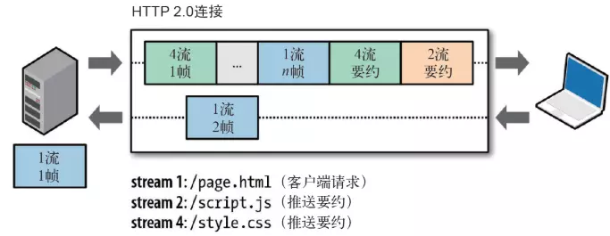

# 二进制传输
HTTP/2 传输数据量的大幅减少, 主要有两个原因: 以二进制方式传输和 Header 压缩。我们先来介绍二进制传输，HTTP/2 采用二进制格式传输数据，而非 HTTP/1.x 里纯文本形式的报文 ，二进制协议解析起来更高效。HTTP/2 将请求和响应数据分割为更小的帧，并且它们采用二进制编码。

它把 TCP 协议的部分特性挪到了应用层，把原来的 "Header+Body" 的消息 " 打散 " 为数个小片的二进制 " 帧 "(Frame), 用 "HEADERS" 帧存放头数据、"DATA" 帧存放实体数据。HTTP/2 数据分帧后，“Header+Body" 的报文结构就完全消失了，协议看到的只是一个个 " 碎片”。

HTTP/2 中，同域名下所有通信都在单个连接上完成，该连接可以承载任意数量的双向数据流。每个数据流都以消息的形式发送，而消息又由一个或多个帧组成。**多个帧之间可以乱序发送，根据帧首部的流标识可以重新组装**。

# Header 压缩

HTTP/2 并没有使用传统的压缩算法，而是开发了专门的 "HPACK”算法，在客户端和服务器两端建立“字典”，用索引号表示重复的字符串，还采用哈夫曼编码来压缩整数和字符串，可以达到 50%~90% 的高压缩率。

具体来说：

- 在客户端和服务器端使用“首部表”来跟踪和存储之前发送的键 - 值对，对于相同的数据，不再通过每次请求和响应发送。
- 首部表在 HTTP/2 的连接存续期内始终存在，由客户端和服务器共同渐进地更新 。
- 每个新的首部键 - 值对要么被追加到当前表的末尾，要么替换表中之前的值。

# 多路复用

在 HTTP/2 中引入了多路复用的技术。多路复用很好地解决了浏览器限制同一个域名下请求数量的问题，同时也更容易实现全速传输，毕竟新开一个 TCP 连接都需要慢慢提升传输速度。

在 HTTP/2 中，有了二进制分帧之后，HTTP /2 不再依赖 TCP 链接去实现多流并行了，在 HTTP/2 中：

- 同域名下所有通信都在单个连接上完成。
- 单个连接可以承载任意数量的双向数据流。
- 数据流以消息的形式发送，而消息又由一个或多个帧组成，多个帧之间可以乱序发送，因为根据帧首部的流标识可以重新组装。

这一特性使性能有了极大提升：

- 同个域名只需要占用一个 TCP 连接，使用一个连接并行发送多个请求和响应, 这样整个页面资源的下载过程只需要一次慢启动，同时也避免了多个 TCP 连接竞争带宽所带来的问题。
- 并行交错地发送多个请求 / 响应，请求 / 响应之间互不影响。
- 在 HTTP/2 中，每个请求都可以带一个 31bit 的优先值，0 表示最高优先级， 数值越大优先级越低。有了这个优先值，客户端和服务器就可以在处理不同的流时采取不同的策略，以最优的方式发送流、消息和帧。

# Server Push

TTP2 还在一定程度上改变了传统的“请求 - 应答”工作模式，服务器不再完全被动地响应请求，也可以新建“流”主动向客户端发送消息。比如，在浏览器刚请求 HTML 的时候就提前把可能会用到的 JS、CSS 文件发给客户端，减少等待的延迟，这被称为 " 服务器推送 "（ Server Push，也叫 Cache push）。



另外需要补充的是，服务端可以主动推送，客户端也有权利选择是否接收。如果服务端推送的资源已经被浏览器缓存过，浏览器可以通过发送 RST_STREAM 帧来拒收。主动推送也遵守同源策略。换句话说，服务器不能随便将第三方资源推送给客户端，而必须是经过双方确认才行。


# 配置nginx使用http2

- [免费https证书](./letsencrypt.md)

```nginx
server {
    listen 443 ssl http2;
    server_name www.example.com;

    ssl_certificate /etc/nginx/ssl/*.example.com/fullchain.cer;
    ssl_certificate_key /etc/nginx/ssl/*.example.com/*.example.com.key;

    # disable SSLv2
    ssl_protocols TLSv1 TLSv1.1 TLSv1.2;

    # ciphers' order matters
    ssl_ciphers "ECDHE-RSA-AES128-GCM-SHA256:ECDHE-RSA-AES256-GCM-SHA384:ECDHE-RSA-AES128-SHA256:ECDHE-RSA-AES256-SHA384:AES128-GCM-SHA256:AES256-GCM-SHA384:AES128-SHA256:AES256-SHA256:ECDHE-RSA-AES128-SHA:ECDHE-RSA-AES256-SHA:AES128-SHA:AES256-SHA:DES-CBC3-SHA:!aNULL";

    ...
}
```

```shell
# curl -I https://www.douyacun.com
HTTP/2 200
server: openresty/1.15.8.2
date: Sat, 22 Feb 2020 16:03:00 GMT
content-type: text/html; charset=utf-8
content-length: 57890
vary: Accept-Encoding
x-powered-by: Next.js
etag: "e222-J6hQavZqthjlqWZcgZo9xa0vNyE"
vary: Accept-Encoding
```