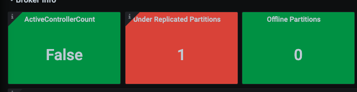
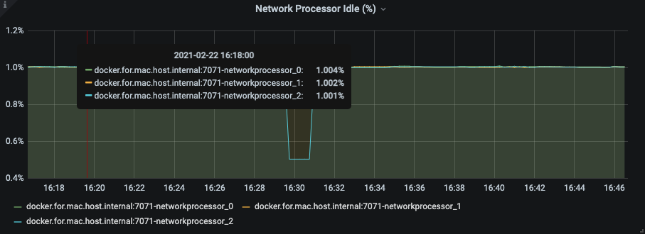
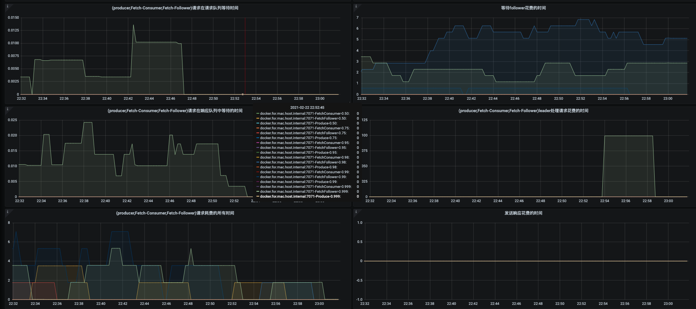
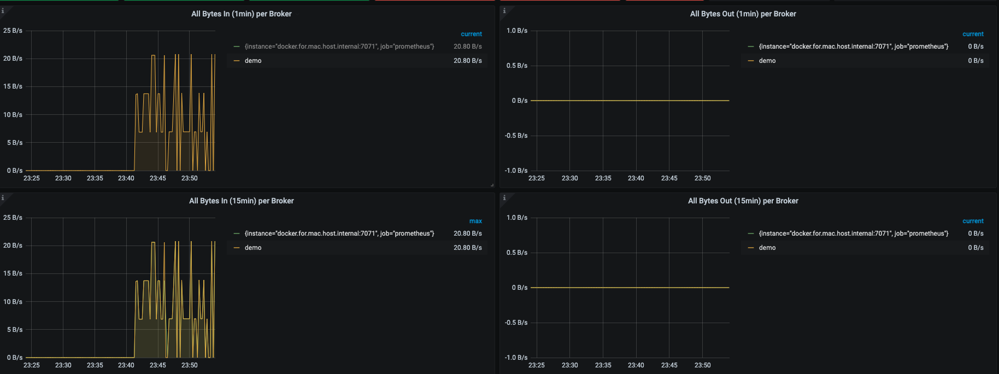
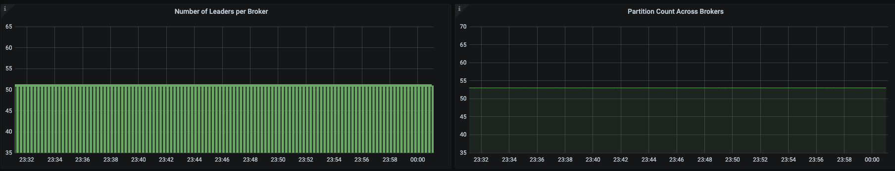

# 监控指标

grafana dashboards https://grafana.com/grafana/dashboards/10973

阿里云kafka arms监控 https://help.aliyun.com/document_detail/141108.html?spm=a2c4g.11186623.6.570.7b1b65732naKbX

Kafka各指标的含义: https://docs.confluent.io/current/kafka/monitoring.html?spm=a2c4g.11186623.2.13.47ed6688HS2ItR


看了一下其他kafka监控文章都没有自信说明kafka各项指标，指标含义，以及如何收集，再次自信整理了一下kafka监控指标、含义以及如何收集：

- broker度量指标
    - 正在复制的分区数量 - 关键指标
    - 活跃控制器数量
    - 请求处理器空闲率 
    - 请求度量指标
- topic度量指标
    - 主题流入字节速率
    - 主题流出字节速率
    - 主题流入消息速率
- partition度量指标
    - 分区数量
    - 首领分区数量
    - 离线分区数量
    - 分区占用磁盘大小
    - 分区文件数量
    - 分区消息最大偏移量
    - 分区消息最小偏移量

# jmx-exporter 指标收集

prometheus 提供了 jmx_exporter 来收集 kafka 指标

Github：[https://github.com/prometheus/jmx_exporter](https://github.com/prometheus/jmx_exporter)

配置文件：[https://github.com/prometheus/jmx_exporter/blob/master/example_configs/kafka-2_0_0.yml](https://github.com/prometheus/jmx_exporter/blob/master/example_configs/kafka-2_0_0.yml)

配合kafka启动脚本，修改 `bin/kafka_server_start.sh`，添加常量，只需要在一个实例中添加即可

```shell
export KAFKA_OPTS="-javaagent:$base_dir/jmx_prometheus_javaagent-0.15.0.jar=7071:$conf_dir/kafka-2_0_0.yml"
```

prometheus targets 收集 metrics

```yaml
static_configs:
  - targets: ['127.0.0.1:7071']
```

> 如果是docker启动的prometheus，而kafka是宿主机启动的话

```yaml
static_configs:
  - targets: ['docker.for.mac.host.internal:7071']
```

# broker 度量指标

**under replicated partitions : 正在复制分区数量**

JMX MBean:  `kafka.server:type=RelicaManager,name=UnderReplicatedPartitions`

Prometheus: 

- `kafka_cluster_partition_underreplicated`  各个topic patition
- `kafka_server_replicamanager_underreplicatedpartitions`  总

如果说 broker 只有一个可监控的度量指标，那么它一定是指 `under replicated partitions`

该 topic 下的 partition，其中副本处于失效或者失败的比率。失败或者失效是指副本不处于 ISR 队列中。目前控制副本是否处于 ISR 中由 **replica.log.max.ms** 这个参数控制。

Kafka具有副本的功能，不同的broker上保存了每个parition的不同副本，具体存在几台broker上，是由配置的副本因子所决定的。尽管有大量副本的存在，但kafka只会在最初把数据写入partition的leader（一个leader多个follower），leader是随机的在ISR（in-sync replicas）池（所有处于同步状态的partition副本）中选举出来的。另外，消费者只会读取partition leader，这样follower副本将作为备份存在，以保证kafka的高可用性，从而防某个broker挂掉。

如果 `Under Replicated Partitions` 非同步数量一直不变说明存在broker已经下线了，我启动了3个broker，topic demo partition 3 replication-factor 3, 主动下线 broker-id: 2



`./kafka-topics.sh --describe --under-replicated-partitions`  可以查看具体是哪个broker出现了问题

```
	Topic: demo	Partition: 0	Leader: 1	Replicas: 1,0,2	Isr: 1,0
	Topic: demo	Partition: 1	Leader: 1	Replicas: 2,1,0	Isr: 1,0
	Topic: demo	Partition: 2	Leader: 0	Replicas: 0,2,1	Isr: 1,0
```


**active controller count : 活跃控制器数量**

如果集群没有控制器，集群就无法对主题和分区创建，broker故障作出响应，问题很严重

控制器：负责分区副本leader选举，第一个broker通过向zookeeper创建一个临时节点 /controller 让自己成为控制器，控制器只能有一个。

当broker离开集群后，有些分区副本就会失去leader，控制器会遍历剩下的分区，选举新leader并通知素有分区

当有新broker加入集群后，控制器会检查该broker是否包含现有分区的副本

JMX MBean: `kafka.controller:type=KafkaController,name=ActiveControllerCount`

Prometheus: `kafka_controller_kafkacontroller_activecontrollercount`


**request handler avg idle percent : 请求处理空闲率**

Kafka 使用了两个线程池来处理客户端的请求:网络处理器线程池和请求处理器线程池。 

- 网络处理器线程池负责通过网络读入和写出数据



JMX MBean: `kafka.network:type=SocketServer,name=NetworkProcessorAvgIdlePercent`

Prometheus: `kafka_network_processor_idlepercent`

- 请求处理器线程池负责处理来自客户端的请求，包括 从磁盘读取消息和往磁盘写入消息

JMX MBean: `kafka.server:type=KafkaRequestHandlerPool,name=RequestHandlerAvgIdlePercent`

Prometheus: `kafka_server_kafkarequesthandlerpool_requesthandleravgidlepercent_count`

数值越低，说明broker的负载越高。如果空闲百分比低于20%，说明存在潜在的问题，如果低于10%，说明出现了性能问题


**请求度量指标**

百分位：0.50、0.75、0.95、0.98、0.99、0.99



- `kafka.network:type=RequestMetrics,name=TotalTimeMs,request={Produce|FetchConsumer|FetchFollower}`  broker处理请求耗费的所有时间，从收到请求开始计算，直到将响应返回给请求者

- `kafka.network:type=RequestMetrics,name=RequestQueueTimeMs,request={Produce|FetchConsumer|FetchFollower}` 请求停留在队列中的时间，从收到请求开始计算，直到开始处理请求

- `kafka.network:type=RequestMetrics,name=LocalTimeMs,request={Produce|FetchConsumer|FetchFollower}` leader处理请求花费的时间

- `kafka.network:type=RequestMetrics,name=ResponseQueueTimeMs,request={Produce|FetchConsumer|FetchFollower}` 请求在响应队列中等待的时间， 响应在发送给请求者之前停留在队列的时间
- `kafka.network:type=RequestMetrics,name=RemoteTimeMs,request={Produce|FetchConsumer|FetchFollower}` 等待follower花费的时间，请求处理完毕之前，用于等待跟随者的时间
- `kafka.network:type=RequestMetrics,name=ResponseSendTimeMs,request={Produce|FetchConsumer|FetchFollower}`  实际发送响应的时间


# topic 度量指标



**bytes in : 主题流入字节**

broker接收的生成者客户端消息流量 字节数据

JMX MBean：`kafka.server:type=BrokerTopicMetrics,name=BytesInPerSec`

Prometheus：`kafka_server_brokertopicmetrics_bytesin_total`

OneMinuteRate: 前1分钟的平均值 `irate(kafka_server_brokertopicmetrics_bytesin_total[1m])`

FiveMinuteRate: 前5分钟的平均值 `irate(kafka_server_brokertopicmetrics_bytesin_total[5m])`

FifeenMinuteRate: 前15分钟的平均值 `irate(kafka_server_brokertopicmetrics_bytesin_total[15m])`

**bytes out : 主题流出字节**

流出字节速 率显示的是消费者从 broker 读取消息的速率

JMX MBean: `kafka.server:type=BrokerTopicMetrics,name=BytesOutPerSec`

Prometheus: `kafka_server_brokertopicmetrics_bytesout_total`

**messages in 主题流入的消息**

消息速率：每秒生成消息的个数

JMX MBean: `kafka.server:type=BrokerTopicMetrics,name=MessageInPerSec`

Prometheus: `kafka_server_brokertopicmetrics_messagesin_total`

> 为什么没有消息的流出速率?
>
> brocker是将整个消息批次发送消费者，并没有展开批次，也就不会计算消费消息的数量

# Partition 分区指标



**partition count 分区数量**

分配给broker的分区总数，包括broker的每一个分区副本，不管是首领还是副本

JMX MBean: `kafka.server:type=ReplicaManager,name=PartitionCount`

Prometheus: `kafka_server_replicamanager_partitioncount`

**Number of Leaders per Broker 首领数量**

broker 首领分区数量

JMX MBean: `kafka.server:type=ReplicaManager,name=LeaderCount`

Prometheus: `kafka_server_replicamanager_leadercount`

**Offline Partitions 离线分区**

该度量只能由集群控制器提供，显示了集群里没有首领的分区数量，发生这种情况主要有2个原因：

- 包含分区副本的所有broker都关闭
- 由于消息数量不匹配，没有同步副本能够拿到首领身份 (unclean.leader.enable = false)

JMX MBean: `kafka.controller:type=kafkaController,name=offlinePartitionsCount`

Prometheus: `kafka_controller_kafkacontroller_offlinepartitionscount`

离线分区会影响生产者客户端，导致消息丢失，问题很严重


# json 配置

```json
{"annotations":{"list":[{"builtIn":1,"datasource":"-- Grafana --","enable":true,"hide":true,"iconColor":"rgba(0, 211, 255, 1)","name":"Annotations & Alerts","type":"dashboard"}]},"description":"Base Example of an Kafka Dashboard for DC/OS 1.12","editable":true,"gnetId":10973,"graphTooltip":0,"id":1,"links":[],"panels":[{"collapsed":false,"datasource":null,"gridPos":{"h":1,"w":24,"x":0,"y":0},"id":38,"panels":[],"title":"Kafka概览","type":"row"},{"aliasColors":{},"bars":false,"dashLength":10,"dashes":false,"datasource":"Prometheus","fieldConfig":{"defaults":{"custom":{},"links":[]},"overrides":[]},"fill":1,"fillGradient":0,"gridPos":{"h":9,"w":12,"x":0,"y":1},"hiddenSeries":false,"id":120,"legend":{"avg":false,"current":false,"max":false,"min":false,"show":false,"total":false,"values":false},"lines":true,"linewidth":1,"links":[],"nullPointMode":"null","options":{"alertThreshold":true},"percentage":false,"pluginVersion":"7.3.7","pointradius":5,"points":false,"renderer":"flot","seriesOverrides":[],"spaceLength":10,"stack":false,"steppedLine":false,"targets":[{"expr":"sum without(instance)(rate(kafka_server_brokertopicmetrics_bytesin_total{job=\"kafka\",topic!=\"\"}[5m]))","format":"time_series","intervalFactor":1,"legendFormat":"{{topic}}","refId":"A"}],"thresholds":[],"timeFrom":null,"timeRegions":[],"timeShift":null,"title":"Bytes In Per Topic","tooltip":{"shared":true,"sort":0,"value_type":"individual"},"type":"graph","xaxis":{"buckets":null,"mode":"time","name":null,"show":true,"values":[]},"yaxes":[{"format":"short","label":null,"logBase":1,"max":null,"min":null,"show":true},{"format":"short","label":null,"logBase":1,"max":null,"min":null,"show":true}],"yaxis":{"align":false,"alignLevel":null}},{"aliasColors":{},"bars":false,"dashLength":10,"dashes":false,"datasource":"Prometheus","fieldConfig":{"defaults":{"custom":{},"links":[]},"overrides":[]},"fill":1,"fillGradient":0,"gridPos":{"h":9,"w":12,"x":12,"y":1},"hiddenSeries":false,"id":122,"legend":{"avg":false,"current":false,"max":false,"min":false,"show":false,"total":false,"values":false},"lines":true,"linewidth":1,"links":[],"nullPointMode":"null","options":{"alertThreshold":true},"percentage":false,"pluginVersion":"7.3.7","pointradius":5,"points":false,"renderer":"flot","seriesOverrides":[],"spaceLength":10,"stack":false,"steppedLine":false,"targets":[{"expr":"sum without(instance)(rate(kafka_server_brokertopicmetrics_bytesout_total{job=\"kafka\",topic!=\"\"}[5m]))","format":"time_series","intervalFactor":1,"legendFormat":"{{topic}}","refId":"A"}],"thresholds":[],"timeFrom":null,"timeRegions":[],"timeShift":null,"title":"Bytes Out Per Topic","tooltip":{"shared":true,"sort":0,"value_type":"individual"},"type":"graph","xaxis":{"buckets":null,"mode":"time","name":null,"show":true,"values":[]},"yaxes":[{"format":"short","label":null,"logBase":1,"max":null,"min":null,"show":true},{"format":"short","label":null,"logBase":1,"max":null,"min":null,"show":true}],"yaxis":{"align":false,"alignLevel":null}},{"aliasColors":{},"bars":true,"dashLength":10,"dashes":false,"datasource":"Prometheus","decimals":2,"description":"Average messages per second per Kafka broker","fieldConfig":{"defaults":{"custom":{},"links":[],"mappings":[],"thresholds":{"mode":"absolute","steps":[{"color":"green","value":null},{"color":"red","value":80}]}},"overrides":[]},"fill":0,"fillGradient":0,"gridPos":{"h":10,"w":8,"x":0,"y":10},"hiddenSeries":false,"id":108,"legend":{"alignAsTable":true,"avg":false,"current":true,"max":false,"min":false,"rightSide":false,"show":false,"total":false,"values":true},"lines":true,"linewidth":1,"links":[],"nullPointMode":"null","options":{"alertThreshold":true},"percentage":false,"pluginVersion":"7.3.7","pointradius":5,"points":false,"renderer":"flot","seriesOverrides":[],"spaceLength":10,"stack":false,"steppedLine":false,"targets":[{"expr":"avg(irate(kafka_server_brokertopicmetrics_messagesin_total[1m])) by (topic)","format":"time_series","interval":"","intervalFactor":1,"legendFormat":"{{topic}}","refId":"A"}],"thresholds":[],"timeFrom":null,"timeRegions":[],"timeShift":null,"title":"Kafka avg msg/sec (1m) by Topic","tooltip":{"shared":true,"sort":0,"value_type":"individual"},"type":"graph","xaxis":{"buckets":null,"mode":"time","name":null,"show":true,"values":[]},"yaxes":[{"decimals":0,"format":"short","label":null,"logBase":1,"max":null,"min":null,"show":true},{"format":"short","label":null,"logBase":1,"max":null,"min":null,"show":true}],"yaxis":{"align":false,"alignLevel":null}},{"aliasColors":{},"bars":true,"dashLength":10,"dashes":false,"datasource":"Prometheus","decimals":2,"description":"Average messages per second per Kafka broker","fieldConfig":{"defaults":{"custom":{},"links":[]},"overrides":[]},"fill":0,"fillGradient":0,"gridPos":{"h":10,"w":8,"x":8,"y":10},"hiddenSeries":false,"id":110,"legend":{"alignAsTable":true,"avg":false,"current":true,"max":false,"min":false,"rightSide":false,"show":false,"total":false,"values":true},"lines":true,"linewidth":1,"links":[],"nullPointMode":"null","options":{"alertThreshold":true},"percentage":false,"pluginVersion":"7.3.7","pointradius":5,"points":false,"renderer":"flot","seriesOverrides":[],"spaceLength":10,"stack":false,"steppedLine":false,"targets":[{"expr":"avg(irate(kafka_server_brokertopicmetrics_messagesin_total[5m])) by (topic)","format":"time_series","interval":"","intervalFactor":1,"legendFormat":"{{topic}}","refId":"A"}],"thresholds":[],"timeFrom":null,"timeRegions":[],"timeShift":null,"title":"Kafka avg msg/sec (5m) by Topic","tooltip":{"shared":true,"sort":0,"value_type":"individual"},"type":"graph","xaxis":{"buckets":null,"mode":"time","name":null,"show":true,"values":[]},"yaxes":[{"decimals":0,"format":"short","label":null,"logBase":1,"max":null,"min":null,"show":true},{"format":"short","label":null,"logBase":1,"max":null,"min":null,"show":true}],"yaxis":{"align":false,"alignLevel":null}},{"aliasColors":{},"bars":true,"dashLength":10,"dashes":false,"datasource":"Prometheus","decimals":1,"description":"Average messages per second per Kafka broker","fieldConfig":{"defaults":{"custom":{},"links":[]},"overrides":[]},"fill":0,"fillGradient":0,"gridPos":{"h":10,"w":8,"x":16,"y":10},"hiddenSeries":false,"id":109,"legend":{"alignAsTable":false,"avg":true,"current":true,"hideEmpty":false,"hideZero":false,"max":true,"min":false,"rightSide":false,"show":false,"total":false,"values":true},"lines":true,"linewidth":1,"links":[],"nullPointMode":"null","options":{"alertThreshold":true},"percentage":false,"pluginVersion":"7.3.7","pointradius":5,"points":false,"renderer":"flot","seriesOverrides":[],"spaceLength":10,"stack":true,"steppedLine":false,"targets":[{"expr":"avg(irate(kafka_server_brokertopicmetrics_messagesin_total[15m])) by (topic)","format":"time_series","instant":false,"interval":"","intervalFactor":1,"legendFormat":"{{topic}}","refId":"A"}],"thresholds":[],"timeFrom":null,"timeRegions":[],"timeShift":null,"title":"Kafka avg msg/sec (15m) by Topic","tooltip":{"shared":true,"sort":0,"value_type":"individual"},"type":"graph","xaxis":{"buckets":null,"mode":"time","name":null,"show":true,"values":[]},"yaxes":[{"decimals":0,"format":"short","label":null,"logBase":1,"max":null,"min":null,"show":true},{"format":"short","label":null,"logBase":1,"max":null,"min":null,"show":true}],"yaxis":{"align":false,"alignLevel":null}},{"aliasColors":{},"bars":true,"dashLength":10,"dashes":false,"datasource":"Prometheus","description":"Number of leaders on this broker. This should be mostly even across all brokers. If not, set auto.leader.rebalance.enable to true on all brokers in the cluster.","fieldConfig":{"defaults":{"custom":{},"links":[]},"overrides":[]},"fill":2,"fillGradient":0,"gridPos":{"h":9,"w":12,"x":0,"y":20},"hiddenSeries":false,"id":50,"legend":{"alignAsTable":true,"avg":false,"current":true,"max":false,"min":false,"rightSide":true,"show":false,"total":false,"values":true},"lines":true,"linewidth":5,"links":[],"nullPointMode":"null","options":{"alertThreshold":true},"percentage":false,"pluginVersion":"7.3.7","pointradius":5,"points":false,"renderer":"flot","seriesOverrides":[],"spaceLength":10,"stack":true,"steppedLine":false,"targets":[{"expr":"max(kafka_server_replicamanager_leadercount)by(instance)","format":"time_series","intervalFactor":1,"legendFormat":"{{instance}}","refId":"A"}],"thresholds":[],"timeFrom":null,"timeRegions":[],"timeShift":null,"title":"Number of Leaders per Broker","tooltip":{"shared":true,"sort":0,"value_type":"individual"},"type":"graph","xaxis":{"buckets":null,"mode":"time","name":null,"show":true,"values":[]},"yaxes":[{"format":"none","label":null,"logBase":1,"max":null,"min":null,"show":true},{"format":"short","label":null,"logBase":1,"max":null,"min":null,"show":false}],"yaxis":{"align":false,"alignLevel":null}},{"aliasColors":{},"bars":false,"dashLength":10,"dashes":false,"datasource":"Prometheus","description":"Number of partitions on this broker. This should be mostly even across all brokers.","fieldConfig":{"defaults":{"custom":{},"links":[]},"overrides":[]},"fill":1,"fillGradient":0,"gridPos":{"h":9,"w":12,"x":12,"y":20},"hiddenSeries":false,"id":60,"legend":{"alignAsTable":true,"avg":false,"current":true,"max":false,"min":false,"rightSide":true,"show":false,"total":false,"values":true},"lines":true,"linewidth":1,"links":[],"nullPointMode":"null","options":{"alertThreshold":true},"percentage":false,"pluginVersion":"7.3.7","pointradius":5,"points":false,"renderer":"flot","seriesOverrides":[],"spaceLength":10,"stack":false,"steppedLine":false,"targets":[{"expr":"(kafka_server_replicamanager_partitioncount)","format":"time_series","intervalFactor":1,"legendFormat":"{{instance}}","refId":"A"}],"thresholds":[],"timeFrom":null,"timeRegions":[],"timeShift":null,"title":"Partition Count Across Brokers","tooltip":{"shared":true,"sort":0,"value_type":"individual"},"type":"graph","xaxis":{"buckets":null,"mode":"time","name":null,"show":true,"values":[]},"yaxes":[{"format":"short","label":null,"logBase":1,"max":null,"min":null,"show":true},{"format":"short","label":null,"logBase":1,"max":null,"min":null,"show":true}],"yaxis":{"align":false,"alignLevel":null}},{"collapsed":false,"datasource":null,"gridPos":{"h":1,"w":24,"x":0,"y":29},"id":40,"panels":[],"title":"Broker Info","type":"row"},{"cacheTimeout":null,"colorBackground":true,"colorValue":false,"colors":["#299c46","rgba(237, 129, 40, 0.89)","#d44a3a"],"datasource":"Prometheus","description":"The first node to boot in a Kafka cluster automatically becomes the controller, and there can be only one. The controller in a Kafka cluster is responsible for maintaining the list of partition leaders, and coordinating leadership transitions (in the event a partition leader becomes unavailable). If it becomes necessary to replace the controller, a new controller is randomly chosen by ZooKeeper from the pool of brokers. In general, it is not possible for this value to be greater than one, but you should definitely alert on a value of zero that lasts for more than a short period (< 1s) of time.","fieldConfig":{"defaults":{"custom":{}},"overrides":[]},"format":"none","gauge":{"maxValue":100,"minValue":0,"show":false,"thresholdLabels":false,"thresholdMarkers":true},"gridPos":{"h":4,"w":3,"x":0,"y":30},"id":26,"interval":null,"links":[],"mappingType":1,"mappingTypes":[{"name":"value to text","value":1},{"name":"range to text","value":2}],"maxDataPoints":100,"nullPointMode":"connected","nullText":null,"postfix":"","postfixFontSize":"50%","prefix":"","prefixFontSize":"50%","rangeMaps":[{"from":"null","text":"N/A","to":"null"}],"sparkline":{"fillColor":"rgba(31, 118, 189, 0.18)","full":false,"lineColor":"rgb(31, 120, 193)","show":false},"tableColumn":"","targets":[{"expr":"sum(kafka_controller_kafkacontroller_activecontrollercount)","format":"time_series","intervalFactor":1,"refId":"A"}],"thresholds":"true,false","title":"ActiveControllerCount","type":"singlestat","valueFontSize":"80%","valueMaps":[{"op":"=","text":"True","value":"1"},{"op":"=","text":"False","value":"0"}],"valueName":"current"},{"cacheTimeout":null,"colorBackground":true,"colorValue":false,"colors":["#299c46","rgba(237, 129, 40, 0.89)","#d44a3a"],"datasource":"Prometheus","decimals":0,"description":"In a healthy cluster, the number of in sync replicas (ISRs) should be exactly equal to the total number of replicas. If partition replicas fall too far behind their leaders, the follower partition is removed from the ISR pool, and you should see a corresponding increase in IsrShrinksPerSec. Since Kafka’s high-availability guarantees cannot be met without replication, investigation is certainly warranted should this metric value exceed zero for extended time periods.\n\nIf this metric has a value greater than 1 it means that data is not being replicated to enough number of brokers thereby increasing the probability of data loss.","fieldConfig":{"defaults":{"custom":{}},"overrides":[]},"format":"none","gauge":{"maxValue":100,"minValue":0,"show":false,"thresholdLabels":false,"thresholdMarkers":true},"gridPos":{"h":4,"w":3,"x":3,"y":30},"id":28,"interval":null,"links":[],"mappingType":1,"mappingTypes":[{"name":"value to text","value":1},{"name":"range to text","value":2}],"maxDataPoints":100,"nullPointMode":"connected","nullText":null,"postfix":"","postfixFontSize":"50%","prefix":"","prefixFontSize":"50%","rangeMaps":[{"from":"null","text":"N/A","to":"null"}],"sparkline":{"fillColor":"rgba(31, 118, 189, 0.18)","full":false,"lineColor":"rgb(31, 120, 193)","show":false},"tableColumn":"","targets":[{"expr":"max(kafka_cluster_partition_underreplicated)","format":"time_series","intervalFactor":1,"refId":"A"}],"thresholds":"1,1","title":"Under Replicated Partitions","type":"singlestat","valueFontSize":"80%","valueMaps":[{"op":"=","text":"N/A","value":"null"}],"valueName":"current"},{"cacheTimeout":null,"colorBackground":true,"colorValue":false,"colors":["#299c46","rgba(237, 129, 40, 0.89)","#d44a3a"],"datasource":"Prometheus","decimals":0,"fieldConfig":{"defaults":{"custom":{}},"overrides":[]},"format":"none","gauge":{"maxValue":100,"minValue":0,"show":false,"thresholdLabels":false,"thresholdMarkers":true},"gridPos":{"h":4,"w":3,"x":6,"y":30},"id":30,"interval":null,"links":[],"mappingType":1,"mappingTypes":[{"name":"value to text","value":1},{"name":"range to text","value":2}],"maxDataPoints":100,"nullPointMode":"connected","nullText":null,"postfix":"","postfixFontSize":"50%","prefix":"","prefixFontSize":"50%","rangeMaps":[{"from":"null","text":"N/A","to":"null"}],"sparkline":{"fillColor":"rgba(31, 118, 189, 0.18)","full":false,"lineColor":"rgb(31, 120, 193)","show":false},"tableColumn":"","targets":[{"expr":"max(kafka_controller_kafkacontroller_offlinepartitionscount)","format":"time_series","intervalFactor":1,"refId":"A"}],"thresholds":"1,1","title":"Offline Partitions","type":"singlestat","valueFontSize":"80%","valueMaps":[{"op":"=","text":"N/A","value":"null"}],"valueName":"current"},{"cacheTimeout":null,"colorBackground":true,"colorValue":false,"colors":["#d44a3a","#629e51","#c15c17"],"datasource":"Prometheus","fieldConfig":{"defaults":{"custom":{}},"overrides":[]},"format":"none","gauge":{"maxValue":100,"minValue":0,"show":false,"thresholdLabels":false,"thresholdMarkers":false},"gridPos":{"h":4,"w":3,"x":9,"y":30},"id":44,"interval":null,"links":[],"mappingType":1,"mappingTypes":[{"name":"value to text","value":1},{"name":"range to text","value":2}],"maxDataPoints":100,"nullPointMode":"connected","nullText":null,"postfix":"","postfixFontSize":"50%","prefix":"","prefixFontSize":"50%","rangeMaps":[{"from":"null","text":"N/A","to":"null"}],"sparkline":{"fillColor":"rgba(31, 118, 189, 0.18)","full":false,"lineColor":"rgb(31, 120, 193)","show":true},"tableColumn":"","targets":[{"expr":"sum(kafka_server_replicamanager_partitioncount)","format":"time_series","instant":false,"intervalFactor":1,"refId":"A"}],"thresholds":"","title":"Total Partition Count","type":"singlestat","valueFontSize":"80%","valueMaps":[{"op":"=","text":"N/A","value":"null"}],"valueName":"avg"},{"cacheTimeout":null,"colorBackground":true,"colorValue":false,"colors":["#d44a3a","#629e51","#c15c17"],"datasource":"Prometheus","decimals":0,"description":"The number of in-sync replicas (ISRs) for a particular partition should remain fairly static, the only exceptions are when you are expanding your broker cluster or removing partitions. In order to maintain high availability, a healthy Kafka cluster requires a minimum number of ISRs for failover. A replica could be removed from the ISR pool for a couple of reasons: it is too far behind the leader’s offset (user-configurable by setting the replica.lag.max.messages configuration parameter), or it has not contacted the leader for some time (configurable with the replica.socket.timeout.ms parameter). No matter the reason, an increase in IsrShrinksPerSec without a corresponding increase in IsrExpandsPerSec shortly thereafter is cause for concern and requires user intervention.The Kafka documentation provides a wealth of information on the user-configurable parameters for brokers.","fieldConfig":{"defaults":{"custom":{}},"overrides":[]},"format":"none","gauge":{"maxValue":100,"minValue":0,"show":false,"thresholdLabels":false,"thresholdMarkers":true},"gridPos":{"h":4,"w":3,"x":12,"y":30},"id":34,"interval":null,"links":[],"mappingType":1,"mappingTypes":[{"name":"value to text","value":1},{"name":"range to text","value":2}],"maxDataPoints":100,"nullPointMode":"connected","nullText":null,"postfix":"","postfixFontSize":"50%","prefix":"","prefixFontSize":"50%","rangeMaps":[{"from":"null","text":"N/A","to":"null"}],"sparkline":{"fillColor":"rgba(31, 118, 189, 0.18)","full":false,"lineColor":"rgb(31, 120, 193)","show":true},"tableColumn":"","targets":[{"expr":"sum(kafka_server_replicamanager_isrexpands_total)","format":"time_series","intervalFactor":1,"refId":"A"}],"thresholds":"","title":"ISR Expansion Rate","type":"singlestat","valueFontSize":"80%","valueMaps":[{"op":"=","text":"N/A","value":"null"}],"valueName":"current"},{"cacheTimeout":null,"colorBackground":true,"colorValue":false,"colors":["#d44a3a","#629e51","#299c46"],"datasource":"Prometheus","decimals":0,"description":"The number of in-sync replicas (ISRs) for a particular partition should remain fairly static, the only exceptions are when you are expanding your broker cluster or removing partitions. In order to maintain high availability, a healthy Kafka cluster requires a minimum number of ISRs for failover. A replica could be removed from the ISR pool for a couple of reasons: it is too far behind the leader’s offset (user-configurable by setting the replica.lag.max.messages configuration parameter), or it has not contacted the leader for some time (configurable with the replica.socket.timeout.ms parameter). No matter the reason, an increase in IsrShrinksPerSec without a corresponding increase in IsrExpandsPerSec shortly thereafter is cause for concern and requires user intervention.The Kafka documentation provides a wealth of information on the user-configurable parameters for brokers.","fieldConfig":{"defaults":{"custom":{}},"overrides":[]},"format":"none","gauge":{"maxValue":100,"minValue":0,"show":false,"thresholdLabels":false,"thresholdMarkers":true},"gridPos":{"h":4,"w":2,"x":15,"y":30},"id":32,"interval":null,"links":[],"mappingType":1,"mappingTypes":[{"name":"value to text","value":1},{"name":"range to text","value":2}],"maxDataPoints":100,"nullPointMode":"connected","nullText":null,"postfix":"","postfixFontSize":"50%","prefix":"","prefixFontSize":"50%","rangeMaps":[{"from":"null","text":"N/A","to":"null"}],"sparkline":{"fillColor":"rgba(31, 118, 189, 0.18)","full":false,"lineColor":"rgb(31, 120, 193)","show":true},"tableColumn":"","targets":[{"expr":"sum(kafka_server_replicamanager_isrshrinks_total)","format":"time_series","intervalFactor":1,"refId":"A"}],"thresholds":"","title":"ISR Shrink Rate","type":"singlestat","valueFontSize":"80%","valueMaps":[{"op":"=","text":"N/A","value":"null"}],"valueName":"avg"},{"cacheTimeout":null,"colorBackground":true,"colorValue":false,"colors":["#299c46","#629e51","#d44a3a"],"datasource":"Prometheus","description":"Number of requests waiting in the producer purgatory. This should be non-zero when acks=all is used on the producer.","fieldConfig":{"defaults":{"custom":{}},"overrides":[]},"format":"short","gauge":{"maxValue":100,"minValue":0,"show":false,"thresholdLabels":false,"thresholdMarkers":true},"gridPos":{"h":4,"w":3,"x":17,"y":30},"id":103,"interval":null,"links":[],"mappingType":1,"mappingTypes":[{"name":"value to text","value":1},{"name":"range to text","value":2}],"maxDataPoints":100,"nullPointMode":"connected","nullText":null,"postfix":"","postfixFontSize":"50%","prefix":"","prefixFontSize":"50%","rangeMaps":[{"from":"null","text":"N/A","to":"null"}],"sparkline":{"fillColor":"rgba(31, 118, 189, 0.18)","full":true,"lineColor":"rgb(31, 120, 193)","show":true},"tableColumn":"","targets":[{"expr":"sum(kafka_server_delayedoperationpurgatory_numdelayedoperations_delayedoperation_produce)","format":"time_series","intervalFactor":1,"refId":"A"}],"thresholds":"","title":"Producer Purgatory Requests Waiting","type":"singlestat","valueFontSize":"80%","valueMaps":[{"op":"=","text":"N/A","value":"null"}],"valueName":"current"},{"cacheTimeout":null,"colorBackground":true,"colorValue":false,"colors":["#d44a3a","#629e51","#299c46"],"datasource":"Prometheus","fieldConfig":{"defaults":{"custom":{}},"overrides":[]},"format":"none","gauge":{"maxValue":100,"minValue":0,"show":false,"thresholdLabels":false,"thresholdMarkers":true},"gridPos":{"h":4,"w":4,"x":20,"y":30},"id":36,"interval":null,"links":[],"mappingType":1,"mappingTypes":[{"name":"value to text","value":1},{"name":"range to text","value":2}],"maxDataPoints":100,"nullPointMode":"connected","nullText":null,"postfix":"","postfixFontSize":"50%","prefix":"","prefixFontSize":"50%","rangeMaps":[{"from":"null","text":"N/A","to":"null"}],"sparkline":{"fillColor":"rgba(31, 118, 189, 0.18)","full":true,"lineColor":"rgb(31, 120, 193)","show":true},"tableColumn":"","targets":[{"expr":"max(kafka_server_delayedoperationpurgatory_purgatorysize_delayedoperation_fetch)","format":"time_series","intervalFactor":1,"refId":"A"}],"thresholds":"","title":"Delayed Fetch Operation Purgatory Size","type":"singlestat","valueFontSize":"80%","valueMaps":[{"op":"=","text":"N/A","value":"null"}],"valueName":"current"},{"aliasColors":{},"bars":false,"dashLength":10,"dashes":false,"datasource":"Prometheus","description":"Generally, disk throughput tends to be the main bottleneck in Kafka performance. However, that’s not to say that the network is never a bottleneck. Depending on your use case, hardware, and configuration, the network can quickly become the slowest segment of a message’s trip, especially if you are sending messages across data centers. Tracking network throughput on your brokers gives you more information as to where potential bottlenecks may lie, and can inform decisions like whether or not you should enable end-to-end compression of your messages.","fieldConfig":{"defaults":{"custom":{},"links":[]},"overrides":[]},"fill":1,"fillGradient":0,"gridPos":{"h":9,"w":12,"x":0,"y":34},"hiddenSeries":false,"id":20,"legend":{"alignAsTable":true,"avg":false,"current":true,"max":false,"min":false,"rightSide":true,"show":true,"total":false,"values":true},"lines":true,"linewidth":1,"links":[],"nullPointMode":"null","options":{"alertThreshold":true},"percentage":false,"pluginVersion":"7.3.7","pointradius":5,"points":false,"renderer":"flot","seriesOverrides":[],"spaceLength":10,"stack":false,"steppedLine":false,"targets":[{"expr":"irate(kafka_server_brokertopicmetrics_bytesin_total{topic!=\"\"}[1m])","format":"time_series","interval":"15s","intervalFactor":1,"legendFormat":"{{topic}}","refId":"A"}],"thresholds":[],"timeFrom":null,"timeRegions":[],"timeShift":null,"title":"All Bytes In (1min) per Broker","tooltip":{"shared":true,"sort":0,"value_type":"individual"},"type":"graph","xaxis":{"buckets":null,"mode":"time","name":null,"show":true,"values":[]},"yaxes":[{"format":"Bps","label":null,"logBase":1,"max":null,"min":"0","show":true},{"format":"short","label":null,"logBase":1,"max":null,"min":null,"show":true}],"yaxis":{"align":false,"alignLevel":null}},{"aliasColors":{},"bars":false,"dashLength":10,"dashes":false,"datasource":"Prometheus","description":"Generally, disk throughput tends to be the main bottleneck in Kafka performance. However, that’s not to say that the network is never a bottleneck. Depending on your use case, hardware, and configuration, the network can quickly become the slowest segment of a message’s trip, especially if you are sending messages across data centers. Tracking network throughput on your brokers gives you more information as to where potential bottlenecks may lie, and can inform decisions like whether or not you should enable end-to-end compression of your messages.","fieldConfig":{"defaults":{"custom":{},"links":[]},"overrides":[]},"fill":1,"fillGradient":0,"gridPos":{"h":9,"w":12,"x":12,"y":34},"hiddenSeries":false,"id":22,"legend":{"alignAsTable":true,"avg":false,"current":true,"max":false,"min":false,"rightSide":true,"show":true,"total":false,"values":true},"lines":true,"linewidth":1,"links":[],"nullPointMode":"null","options":{"alertThreshold":true},"percentage":false,"pluginVersion":"7.3.7","pointradius":5,"points":false,"renderer":"flot","seriesOverrides":[],"spaceLength":10,"stack":false,"steppedLine":false,"targets":[{"expr":"irate(kafka_server_brokertopicmetrics_bytesout_total{topic!=\"\"}[1m])","format":"time_series","interval":"","intervalFactor":1,"legendFormat":"{{topic}}","refId":"A"}],"thresholds":[],"timeFrom":null,"timeRegions":[],"timeShift":null,"title":"All Bytes Out (1min) per Broker","tooltip":{"shared":true,"sort":0,"value_type":"individual"},"type":"graph","xaxis":{"buckets":null,"mode":"time","name":null,"show":true,"values":[]},"yaxes":[{"format":"Bps","label":null,"logBase":1,"max":null,"min":null,"show":true},{"format":"short","label":null,"logBase":1,"max":null,"min":null,"show":false}],"yaxis":{"align":false,"alignLevel":null}},{"aliasColors":{},"bars":false,"dashLength":10,"dashes":false,"datasource":"Prometheus","description":"Generally, disk throughput tends to be the main bottleneck in Kafka performance. However, that’s not to say that the network is never a bottleneck. Depending on your use case, hardware, and configuration, the network can quickly become the slowest segment of a message’s trip, especially if you are sending messages across data centers. Tracking network throughput on your brokers gives you more information as to where potential bottlenecks may lie, and can inform decisions like whether or not you should enable end-to-end compression of your messages.","fieldConfig":{"defaults":{"custom":{},"links":[]},"overrides":[]},"fill":1,"fillGradient":0,"gridPos":{"h":9,"w":12,"x":0,"y":43},"hiddenSeries":false,"id":51,"legend":{"alignAsTable":true,"avg":false,"current":false,"max":true,"min":false,"rightSide":true,"show":true,"total":false,"values":true},"lines":true,"linewidth":1,"links":[],"nullPointMode":"null","options":{"alertThreshold":true},"percentage":false,"pluginVersion":"7.3.7","pointradius":5,"points":false,"renderer":"flot","seriesOverrides":[],"spaceLength":10,"stack":false,"steppedLine":false,"targets":[{"expr":"irate(kafka_server_brokertopicmetrics_bytesin_total{topic!=\"\"}[15m])","format":"time_series","interval":"15s","intervalFactor":1,"legendFormat":"{{topic}}","refId":"A"}],"thresholds":[],"timeFrom":null,"timeRegions":[],"timeShift":null,"title":"All Bytes In (15min) per Broker","tooltip":{"shared":true,"sort":0,"value_type":"individual"},"type":"graph","xaxis":{"buckets":null,"mode":"time","name":null,"show":true,"values":[]},"yaxes":[{"format":"Bps","label":null,"logBase":1,"max":null,"min":null,"show":true},{"format":"short","label":null,"logBase":1,"max":null,"min":null,"show":true}],"yaxis":{"align":false,"alignLevel":null}},{"aliasColors":{},"bars":false,"dashLength":10,"dashes":false,"datasource":"Prometheus","description":"Generally, disk throughput tends to be the main bottleneck in Kafka performance. However, that’s not to say that the network is never a bottleneck. Depending on your use case, hardware, and configuration, the network can quickly become the slowest segment of a message’s trip, especially if you are sending messages across data centers. Tracking network throughput on your brokers gives you more information as to where potential bottlenecks may lie, and can inform decisions like whether or not you should enable end-to-end compression of your messages.","fieldConfig":{"defaults":{"custom":{},"links":[]},"overrides":[]},"fill":1,"fillGradient":0,"gridPos":{"h":9,"w":12,"x":12,"y":43},"hiddenSeries":false,"id":52,"legend":{"alignAsTable":true,"avg":false,"current":true,"max":false,"min":false,"rightSide":true,"show":true,"total":false,"values":true},"lines":true,"linewidth":1,"links":[],"nullPointMode":"null","options":{"alertThreshold":true},"percentage":false,"pluginVersion":"7.3.7","pointradius":5,"points":false,"renderer":"flot","seriesOverrides":[],"spaceLength":10,"stack":false,"steppedLine":false,"targets":[{"expr":"irate(kafka_server_brokertopicmetrics_bytesout_total{topic!=\"\"}[15m])","format":"time_series","interval":"","intervalFactor":1,"legendFormat":"{{topic}}","refId":"A"}],"thresholds":[],"timeFrom":null,"timeRegions":[],"timeShift":null,"title":"All Bytes Out (15min) per Broker","tooltip":{"shared":true,"sort":0,"value_type":"individual"},"type":"graph","xaxis":{"buckets":null,"mode":"time","name":null,"show":true,"values":[]},"yaxes":[{"format":"Bps","label":null,"logBase":1,"max":null,"min":null,"show":true},{"format":"short","label":null,"logBase":1,"max":null,"min":null,"show":false}],"yaxis":{"align":false,"alignLevel":null}},{"collapsed":false,"datasource":null,"gridPos":{"h":1,"w":24,"x":0,"y":52},"id":93,"panels":[],"title":"Leaders","type":"row"},{"cacheTimeout":null,"colorBackground":true,"colorValue":false,"colors":["#299c46","rgba(237, 129, 40, 0.89)","#d44a3a"],"datasource":"Prometheus","decimals":null,"fieldConfig":{"defaults":{"custom":{}},"overrides":[]},"format":"ms","gauge":{"maxValue":100,"minValue":0,"show":false,"thresholdLabels":false,"thresholdMarkers":true},"gridPos":{"h":2,"w":6,"x":0,"y":53},"id":64,"interval":null,"links":[],"mappingType":1,"mappingTypes":[{"name":"value to text","value":1},{"name":"range to text","value":2}],"maxDataPoints":100,"nullPointMode":"connected","nullText":null,"postfix":"","postfixFontSize":"50%","prefix":"","prefixFontSize":"50%","rangeMaps":[{"from":"null","text":"N/A","to":"null"}],"sparkline":{"fillColor":"rgba(31, 118, 189, 0.18)","full":true,"lineColor":"rgb(31, 120, 193)","show":true},"tableColumn":"","targets":[{"expr":"max(kafka_controller_controllerstats_leaderelectionrateandtimems)","format":"time_series","intervalFactor":1,"legendFormat":"","refId":"A"}],"thresholds":"","title":"Max Recorded Leader Election Latency","type":"singlestat","valueFontSize":"80%","valueMaps":[{"op":"=","text":"N/A","value":"null"}],"valueName":"current"},{"cacheTimeout":null,"colorBackground":true,"colorValue":false,"colors":["#299c46","rgba(237, 129, 40, 0.89)","#d44a3a"],"datasource":"Prometheus","decimals":null,"fieldConfig":{"defaults":{"custom":{}},"overrides":[]},"format":"none","gauge":{"maxValue":100,"minValue":0,"show":false,"thresholdLabels":false,"thresholdMarkers":true},"gridPos":{"h":2,"w":6,"x":6,"y":53},"id":65,"interval":null,"links":[],"mappingType":1,"mappingTypes":[{"name":"value to text","value":1},{"name":"range to text","value":2}],"maxDataPoints":100,"nullPointMode":"connected","nullText":null,"postfix":"","postfixFontSize":"50%","prefix":"","prefixFontSize":"50%","rangeMaps":[{"from":"null","text":"N/A","to":"null"}],"sparkline":{"fillColor":"rgba(31, 118, 189, 0.18)","full":true,"lineColor":"#629e51","show":true},"tableColumn":"","targets":[{"expr":"max(kafka_controller_controllerstats_uncleanleaderelections_total)","format":"time_series","interval":"","intervalFactor":1,"legendFormat":"","refId":"A"}],"thresholds":"","title":"Unclean Leader Elections (15min)","type":"singlestat","valueFontSize":"80%","valueMaps":[{"op":"=","text":"N/A","value":"null"}],"valueName":"current"},{"cacheTimeout":null,"colorBackground":true,"colorValue":false,"colors":["#299c46","rgba(237, 129, 40, 0.89)","#d44a3a"],"datasource":"Prometheus","fieldConfig":{"defaults":{"custom":{}},"overrides":[]},"format":"ms","gauge":{"maxValue":100,"minValue":0,"show":false,"thresholdLabels":false,"thresholdMarkers":true},"gridPos":{"h":2,"w":6,"x":12,"y":53},"id":69,"interval":null,"links":[],"mappingType":1,"mappingTypes":[{"name":"value to text","value":1},{"name":"range to text","value":2}],"maxDataPoints":100,"nullPointMode":"connected","nullText":null,"postfix":"","postfixFontSize":"50%","prefix":"","prefixFontSize":"50%","rangeMaps":[{"from":"null","text":"N/A","to":"null"}],"sparkline":{"fillColor":"rgba(31, 118, 189, 0.18)","full":true,"lineColor":"rgb(31, 120, 193)","show":true},"tableColumn":"","targets":[{"expr":"max(kafka_server_replicafetchermanager_maxlag)","format":"time_series","intervalFactor":1,"refId":"A"}],"thresholds":"","title":"Max Lag - Follower/Leader Replicas","type":"singlestat","valueFontSize":"80%","valueMaps":[{"op":"=","text":"N/A","value":"null"}],"valueName":"current"},{"cacheTimeout":null,"colorBackground":true,"colorValue":false,"colors":["#299c46","rgba(237, 129, 40, 0.89)","#d44a3a"],"datasource":"Prometheus","description":"Time the request waits for the follower. This is non-zero for produce requests when acks=all","fieldConfig":{"defaults":{"custom":{}},"overrides":[]},"format":"ms","gauge":{"maxValue":100,"minValue":0,"show":false,"thresholdLabels":false,"thresholdMarkers":true},"gridPos":{"h":2,"w":6,"x":18,"y":53},"id":85,"interval":null,"links":[],"mappingType":1,"mappingTypes":[{"name":"value to text","value":1},{"name":"range to text","value":2}],"maxDataPoints":100,"nullPointMode":"connected","nullText":null,"postfix":"","postfixFontSize":"50%","prefix":"","prefixFontSize":"50%","rangeMaps":[{"from":"null","text":"N/A","to":"null"}],"sparkline":{"fillColor":"rgba(31, 118, 189, 0.18)","full":true,"lineColor":"rgb(31, 120, 193)","show":true},"tableColumn":"","targets":[{"expr":"avg(kafka_network_requestmetrics_totaltimems{request=\"FetchFollower\"})","format":"time_series","hide":false,"intervalFactor":1,"refId":"A"}],"thresholds":"","title":"Avg Time Request Waits for Follower (ms)","type":"singlestat","valueFontSize":"80%","valueMaps":[{"op":"=","text":"N/A","value":"null"}],"valueName":"current"},{"collapsed":false,"datasource":null,"gridPos":{"h":1,"w":24,"x":0,"y":55},"id":91,"panels":[],"title":"Requests","type":"row"},{"cacheTimeout":null,"colorBackground":true,"colorValue":false,"colors":["#299c46","#508642","#d44a3a"],"datasource":"Prometheus","description":"Size of the request queue. A congested request queue will not be able to process incoming or outgoing requests","fieldConfig":{"defaults":{"custom":{}},"overrides":[]},"format":"none","gauge":{"maxValue":100,"minValue":0,"show":false,"thresholdLabels":false,"thresholdMarkers":true},"gridPos":{"h":4,"w":3,"x":0,"y":56},"id":83,"interval":null,"links":[],"mappingType":1,"mappingTypes":[{"name":"value to text","value":1},{"name":"range to text","value":2}],"maxDataPoints":100,"nullPointMode":"connected","nullText":null,"postfix":"","postfixFontSize":"50%","prefix":"","prefixFontSize":"50%","rangeMaps":[{"from":"null","text":"N/A","to":"null"}],"sparkline":{"fillColor":"rgba(31, 118, 189, 0.18)","full":true,"lineColor":"rgb(31, 120, 193)","show":true},"tableColumn":"","targets":[{"expr":"max(kafka_network_requestchannel_requestqueuesize)","format":"time_series","intervalFactor":1,"refId":"A"}],"thresholds":"","title":"Current Request Queue Size","type":"singlestat","valueFontSize":"80%","valueMaps":[{"op":"=","text":"N/A","value":"null"}],"valueName":"current"},{"cacheTimeout":null,"colorBackground":true,"colorValue":false,"colors":["#299c46","#508642","#d44a3a"],"datasource":"Prometheus","description":"","fieldConfig":{"defaults":{"custom":{}},"overrides":[]},"format":"ms","gauge":{"maxValue":100,"minValue":0,"show":false,"thresholdLabels":false,"thresholdMarkers":true},"gridPos":{"h":4,"w":3,"x":3,"y":56},"id":81,"interval":null,"links":[],"mappingType":1,"mappingTypes":[{"name":"value to text","value":1},{"name":"range to text","value":2}],"maxDataPoints":100,"nullPointMode":"connected","nullText":null,"postfix":"","postfixFontSize":"50%","prefix":"","prefixFontSize":"50%","rangeMaps":[{"from":"null","text":"N/A","to":"null"}],"sparkline":{"fillColor":"rgba(31, 118, 189, 0.18)","full":true,"lineColor":"rgb(31, 120, 193)","show":true},"tableColumn":"","targets":[{"expr":"avg(kafka_network_requestmetrics_totaltimems{request=\"Produce\"})","format":"time_series","intervalFactor":1,"refId":"A"}],"thresholds":"","title":"Avg  Produce Time (ms)","type":"singlestat","valueFontSize":"80%","valueMaps":[{"op":"=","text":"N/A","value":"null"}],"valueName":"current"},{"cacheTimeout":null,"colorBackground":true,"colorValue":false,"colors":["#299c46","#508642","#d44a3a"],"datasource":"Prometheus","description":"","fieldConfig":{"defaults":{"custom":{}},"overrides":[]},"format":"ms","gauge":{"maxValue":100,"minValue":0,"show":false,"thresholdLabels":false,"thresholdMarkers":true},"gridPos":{"h":4,"w":3,"x":6,"y":56},"id":89,"interval":null,"links":[],"mappingType":1,"mappingTypes":[{"name":"value to text","value":1},{"name":"range to text","value":2}],"maxDataPoints":100,"nullPointMode":"connected","nullText":null,"postfix":"","postfixFontSize":"50%","prefix":"","prefixFontSize":"50%","rangeMaps":[{"from":"null","text":"N/A","to":"null"}],"sparkline":{"fillColor":"rgba(31, 118, 189, 0.18)","full":true,"lineColor":"rgb(31, 120, 193)","show":true},"tableColumn":"","targets":[{"expr":"avg(kafka_network_requestmetrics_responsesendtimems{request=\"FetchConsumer\"})","format":"time_series","intervalFactor":1,"refId":"A"}],"thresholds":"","title":"Avg FetchConsumer Time (ms)","type":"singlestat","valueFontSize":"80%","valueMaps":[{"op":"=","text":"N/A","value":"null"}],"valueName":"current"},{"cacheTimeout":null,"colorBackground":false,"colorValue":false,"colors":["#299c46","rgba(237, 129, 40, 0.89)","#d44a3a"],"datasource":"Prometheus","description":"Time the request is processed at the leader","fieldConfig":{"defaults":{"custom":{}},"overrides":[]},"format":"ms","gauge":{"maxValue":100,"minValue":0,"show":false,"thresholdLabels":false,"thresholdMarkers":true},"gridPos":{"h":4,"w":5,"x":9,"y":56},"id":77,"interval":null,"links":[],"mappingType":1,"mappingTypes":[{"name":"value to text","value":1},{"name":"range to text","value":2}],"maxDataPoints":100,"nullPointMode":"connected","nullText":null,"postfix":"","postfixFontSize":"50%","prefix":"","prefixFontSize":"50%","rangeMaps":[{"from":"null","text":"N/A","to":"null"}],"sparkline":{"fillColor":"rgba(31, 118, 189, 0.18)","full":false,"lineColor":"rgb(31, 120, 193)","show":false},"tableColumn":"","targets":[{"expr":"avg(kafka_network_requestmetrics_localtimems{request =~ \"Produce|FetchConsumer|FetchFollower\"})","format":"time_series","intervalFactor":1,"refId":"A"}],"thresholds":"","title":"Avg Request Processing Time (ms) at Leader","type":"singlestat","valueFontSize":"80%","valueMaps":[{"op":"=","text":"N/A","value":"null"}],"valueName":"avg"},{"cacheTimeout":null,"colorBackground":false,"colorValue":false,"colors":["#299c46","rgba(237, 129, 40, 0.89)","#d44a3a"],"datasource":"Prometheus","description":"Time the request waits in the request queue","fieldConfig":{"defaults":{"custom":{}},"overrides":[]},"format":"ms","gauge":{"maxValue":100,"minValue":0,"show":false,"thresholdLabels":false,"thresholdMarkers":true},"gridPos":{"h":4,"w":5,"x":14,"y":56},"id":79,"interval":null,"links":[],"mappingType":1,"mappingTypes":[{"name":"value to text","value":1},{"name":"range to text","value":2}],"maxDataPoints":100,"nullPointMode":"connected","nullText":null,"postfix":"","postfixFontSize":"50%","prefix":"","prefixFontSize":"50%","rangeMaps":[{"from":"null","text":"N/A","to":"null"}],"sparkline":{"fillColor":"rgba(31, 118, 189, 0.18)","full":false,"lineColor":"rgb(31, 120, 193)","show":false},"tableColumn":"","targets":[{"expr":"avg(kafka_network_requestmetrics_requestqueuetimems{request =~ \"Produce|FetchConsumer|FetchFollower\"})","format":"time_series","intervalFactor":1,"refId":"A"}],"thresholds":"","title":"Avg Request Waiting Time in Request Queue (ms)","type":"singlestat","valueFontSize":"80%","valueMaps":[{"op":"=","text":"N/A","value":"null"}],"valueName":"current"},{"cacheTimeout":null,"colorBackground":false,"colorValue":false,"colors":["#299c46","rgba(237, 129, 40, 0.89)","#d44a3a"],"datasource":"Prometheus","fieldConfig":{"defaults":{"custom":{}},"overrides":[]},"format":"ms","gauge":{"maxValue":100,"minValue":0,"show":false,"thresholdLabels":false,"thresholdMarkers":true},"gridPos":{"h":4,"w":5,"x":19,"y":56},"id":87,"interval":null,"links":[],"mappingType":1,"mappingTypes":[{"name":"value to text","value":1},{"name":"range to text","value":2}],"maxDataPoints":100,"nullPointMode":"connected","nullText":null,"postfix":"","postfixFontSize":"50%","prefix":"","prefixFontSize":"50%","rangeMaps":[{"from":"null","text":"N/A","to":"null"}],"sparkline":{"fillColor":"rgba(31, 118, 189, 0.18)","full":false,"lineColor":"rgb(31, 120, 193)","show":false},"tableColumn":"","targets":[{"expr":"avg(kafka_network_requestmetrics_responsequeuetimems{request =~ \"Produce|FetchConsumer|FetchFollower\"})","format":"time_series","intervalFactor":1,"refId":"A"}],"thresholds":"","title":"Avg Request Waiting Time in Response Queue (ms)","type":"singlestat","valueFontSize":"80%","valueMaps":[{"op":"=","text":"N/A","value":"null"}],"valueName":"current"},{"aliasColors":{},"bars":false,"dashLength":10,"dashes":false,"datasource":"Prometheus","fieldConfig":{"defaults":{"custom":{},"links":[]},"overrides":[]},"fill":1,"fillGradient":0,"gridPos":{"h":9,"w":12,"x":0,"y":60},"hiddenSeries":false,"id":56,"legend":{"avg":false,"current":false,"max":false,"min":false,"show":false,"total":false,"values":false},"lines":true,"linewidth":1,"links":[],"nullPointMode":"null","options":{"alertThreshold":true},"percentage":false,"pluginVersion":"7.3.7","pointradius":5,"points":false,"renderer":"flot","seriesOverrides":[],"spaceLength":10,"stack":false,"steppedLine":false,"targets":[{"expr":"sum(kafka_server_brokertopicmetrics_totalproducerequests_total) by (instance)","format":"time_series","instant":false,"intervalFactor":1,"legendFormat":"{{instance}}","refId":"A"}],"thresholds":[],"timeFrom":null,"timeRegions":[],"timeShift":null,"title":"Produce Request Rate / sec (15min) by Broker","tooltip":{"shared":true,"sort":0,"value_type":"individual"},"type":"graph","xaxis":{"buckets":null,"mode":"time","name":null,"show":true,"values":[]},"yaxes":[{"format":"short","label":null,"logBase":1,"max":null,"min":null,"show":true},{"format":"short","label":null,"logBase":1,"max":null,"min":null,"show":true}],"yaxis":{"align":false,"alignLevel":null}},{"aliasColors":{},"bars":false,"dashLength":10,"dashes":false,"datasource":"Prometheus","fieldConfig":{"defaults":{"custom":{},"links":[]},"overrides":[]},"fill":1,"fillGradient":0,"gridPos":{"h":9,"w":12,"x":12,"y":60},"hiddenSeries":false,"id":58,"legend":{"avg":false,"current":false,"max":false,"min":false,"show":false,"total":false,"values":false},"lines":true,"linewidth":1,"links":[],"nullPointMode":"null","options":{"alertThreshold":true},"percentage":false,"pluginVersion":"7.3.7","pointradius":5,"points":false,"renderer":"flot","seriesOverrides":[],"spaceLength":10,"stack":false,"steppedLine":false,"targets":[{"expr":"sum(kafka_server_brokertopicmetrics_totalfetchrequests_total) by (instance)","format":"time_series","intervalFactor":1,"legendFormat":"{{instance}}","refId":"A"}],"thresholds":[],"timeFrom":null,"timeRegions":[],"timeShift":null,"title":"Fetch Request Rate / sec (15min) by Broker","tooltip":{"shared":true,"sort":0,"value_type":"individual"},"type":"graph","xaxis":{"buckets":null,"mode":"time","name":null,"show":true,"values":[]},"yaxes":[{"format":"short","label":null,"logBase":1,"max":null,"min":null,"show":true},{"format":"short","label":null,"logBase":1,"max":null,"min":null,"show":true}],"yaxis":{"align":false,"alignLevel":null}},{"aliasColors":{},"bars":false,"dashLength":10,"dashes":false,"datasource":"Prometheus","fieldConfig":{"defaults":{"custom":{},"links":[]},"overrides":[]},"fill":1,"fillGradient":0,"gridPos":{"h":9,"w":12,"x":0,"y":69},"hiddenSeries":false,"id":111,"legend":{"avg":false,"current":false,"max":false,"min":false,"show":false,"total":false,"values":false},"lines":true,"linewidth":1,"links":[],"nullPointMode":"null","options":{"alertThreshold":true},"percentage":false,"pluginVersion":"7.3.7","pointradius":5,"points":false,"renderer":"flot","seriesOverrides":[],"spaceLength":10,"stack":false,"steppedLine":false,"targets":[{"expr":"sum(kafka_server_brokertopicmetrics_totalproducerequests_total) by (topic)","format":"time_series","intervalFactor":1,"legendFormat":"{{topic}}","refId":"A"}],"thresholds":[],"timeFrom":null,"timeRegions":[],"timeShift":null,"title":"Produce Request Rate / sec (15min) by Topic","tooltip":{"shared":true,"sort":0,"value_type":"individual"},"type":"graph","xaxis":{"buckets":null,"mode":"time","name":null,"show":true,"values":[]},"yaxes":[{"format":"short","label":null,"logBase":1,"max":null,"min":null,"show":true},{"format":"short","label":null,"logBase":1,"max":null,"min":null,"show":true}],"yaxis":{"align":false,"alignLevel":null}},{"aliasColors":{},"bars":false,"dashLength":10,"dashes":false,"datasource":"Prometheus","fieldConfig":{"defaults":{"custom":{},"links":[]},"overrides":[]},"fill":1,"fillGradient":0,"gridPos":{"h":9,"w":12,"x":12,"y":69},"hiddenSeries":false,"id":112,"legend":{"avg":false,"current":false,"max":false,"min":false,"show":false,"total":false,"values":false},"lines":true,"linewidth":1,"links":[],"nullPointMode":"null","options":{"alertThreshold":true},"percentage":false,"pluginVersion":"7.3.7","pointradius":5,"points":false,"renderer":"flot","seriesOverrides":[],"spaceLength":10,"stack":false,"steppedLine":false,"targets":[{"expr":"sum(kafka_server_brokertopicmetrics_totalfetchrequests_total) by (topic)","format":"time_series","intervalFactor":1,"legendFormat":"{{topic}}","refId":"A"}],"thresholds":[],"timeFrom":null,"timeRegions":[],"timeShift":null,"title":"Fetch Request Rate / sec (15min) by Topic","tooltip":{"shared":true,"sort":0,"value_type":"individual"},"type":"graph","xaxis":{"buckets":null,"mode":"time","name":null,"show":true,"values":[]},"yaxes":[{"format":"short","label":null,"logBase":1,"max":null,"min":null,"show":true},{"format":"short","label":null,"logBase":1,"max":null,"min":null,"show":true}],"yaxis":{"align":false,"alignLevel":null}},{"collapsed":false,"datasource":null,"gridPos":{"h":1,"w":24,"x":0,"y":78},"id":46,"panels":[],"title":"Network Info","type":"row"},{"aliasColors":{},"bars":false,"dashLength":10,"dashes":false,"datasource":"Prometheus","fieldConfig":{"defaults":{"custom":{},"links":[]},"overrides":[]},"fill":1,"fillGradient":0,"gridPos":{"h":9,"w":12,"x":0,"y":79},"hiddenSeries":false,"id":54,"legend":{"avg":false,"current":false,"max":false,"min":false,"show":true,"total":false,"values":false},"lines":true,"linewidth":1,"links":[],"nullPointMode":"null","options":{"alertThreshold":true},"percentage":false,"pluginVersion":"7.3.7","pointradius":5,"points":false,"renderer":"flot","seriesOverrides":[],"spaceLength":10,"stack":false,"steppedLine":false,"targets":[{"expr":"irate(kafka_server_fetcherstats_requests_total[15m])","format":"time_series","interval":"","intervalFactor":1,"legendFormat":"","refId":"A"}],"thresholds":[],"timeFrom":null,"timeRegions":[],"timeShift":null,"title":"Network Request Rate / sec (15min)","tooltip":{"shared":true,"sort":0,"value_type":"individual"},"type":"graph","xaxis":{"buckets":null,"mode":"time","name":null,"show":true,"values":[]},"yaxes":[{"format":"short","label":null,"logBase":1,"max":null,"min":null,"show":true},{"format":"short","label":null,"logBase":1,"max":null,"min":null,"show":true}],"yaxis":{"align":false,"alignLevel":null}},{"aliasColors":{},"bars":false,"dashLength":10,"dashes":false,"datasource":"Prometheus","description":"Average fraction of time the network processor threads are idle. Values are between 0 (all resources are used) and 1 (all resources are available)","fieldConfig":{"defaults":{"custom":{},"links":[]},"overrides":[]},"fill":1,"fillGradient":0,"gridPos":{"h":9,"w":12,"x":12,"y":79},"hiddenSeries":false,"id":48,"legend":{"avg":false,"current":false,"max":false,"min":false,"show":true,"total":false,"values":false},"lines":true,"linewidth":1,"links":[],"nullPointMode":"null","options":{"alertThreshold":true},"percentage":false,"pluginVersion":"7.3.7","pointradius":5,"points":false,"renderer":"flot","seriesOverrides":[],"spaceLength":10,"stack":false,"steppedLine":false,"targets":[{"expr":"avg(kafka_network_processor_idlepercent{networkProcessor=\"0\"} * 100) by (instance)","format":"time_series","interval":"","intervalFactor":1,"legendFormat":"{{instance}}-networkprocessor_0","refId":"A"},{"expr":"avg(kafka_network_processor_idlepercent{networkProcessor=\"1\"} * 100) by (instance)","format":"time_series","interval":"","intervalFactor":1,"legendFormat":"{{instance}}-networkprocessor_1","refId":"B"},{"expr":"avg(kafka_network_processor_idlepercent{networkProcessor=\"2\"} * 100) by (instance)","format":"time_series","interval":"","intervalFactor":1,"legendFormat":"{{instance}}-networkprocessor_2","refId":"C"}],"thresholds":[],"timeFrom":null,"timeRegions":[],"timeShift":null,"title":"Network Processor Idle (%)","tooltip":{"shared":true,"sort":0,"value_type":"individual"},"type":"graph","xaxis":{"buckets":null,"mode":"time","name":null,"show":true,"values":[]},"yaxes":[{"format":"percent","label":null,"logBase":1,"max":null,"min":null,"show":true},{"format":"short","label":null,"logBase":1,"max":null,"min":null,"show":true}],"yaxis":{"align":false,"alignLevel":null}},{"aliasColors":{},"bars":false,"dashLength":10,"dashes":false,"datasource":"Prometheus","description":"请求(producer,Fetch-Consumer,Fetch-Follower)在请求队列中的等待时间，从收到请求开始计算，直到开始处理请求。","fieldConfig":{"defaults":{"custom":{}},"overrides":[]},"fill":1,"fillGradient":0,"gridPos":{"h":9,"w":12,"x":0,"y":88},"hiddenSeries":false,"id":126,"legend":{"avg":false,"current":false,"max":false,"min":false,"rightSide":true,"show":false,"total":false,"values":false},"lines":true,"linewidth":1,"links":[],"nullPointMode":"null","options":{"alertThreshold":true},"percentage":false,"pluginVersion":"7.3.7","pointradius":5,"points":false,"renderer":"flot","seriesOverrides":[],"spaceLength":10,"stack":false,"steppedLine":false,"targets":[{"expr":"rate(kafka_network_requestmetrics_requestqueuetimems{request =~ \"Produce|FetchConsumer|FetchFollower\"}[5m])","format":"time_series","interval":"","intervalFactor":1,"legendFormat":"{{instance}}-{{request}}-{{quantile}}","refId":"A"}],"thresholds":[],"timeFrom":null,"timeRegions":[],"timeShift":null,"title":"(producer,Fetch-Consumer,Fetch-Follower)请求在请求队列等待时间","tooltip":{"shared":true,"sort":0,"value_type":"individual"},"type":"graph","xaxis":{"buckets":null,"mode":"time","name":null,"show":true,"values":[]},"yaxes":[{"format":"short","label":null,"logBase":1,"max":null,"min":null,"show":true},{"format":"short","label":null,"logBase":1,"max":null,"min":null,"show":true}],"yaxis":{"align":false,"alignLevel":null}},{"aliasColors":{},"bars":false,"dashLength":10,"dashes":false,"datasource":"Prometheus","description":"请求(producer,Fetch-Consumer,Fetch-Follower)处理完毕之前，用于等待跟随者的时间","fieldConfig":{"defaults":{"custom":{}},"overrides":[]},"fill":1,"fillGradient":0,"gridPos":{"h":9,"w":12,"x":12,"y":88},"hiddenSeries":false,"id":134,"legend":{"avg":false,"current":false,"max":false,"min":false,"rightSide":true,"show":false,"total":false,"values":false},"lines":true,"linewidth":1,"links":[],"nullPointMode":"null","options":{"alertThreshold":true},"percentage":false,"pluginVersion":"7.3.7","pointradius":5,"points":false,"renderer":"flot","seriesOverrides":[],"spaceLength":10,"stack":false,"steppedLine":false,"targets":[{"expr":"rate(kafka_network_requestmetrics_remotetimems{request =~ \"Produce|FetchConsumer|FetchFollower\"}[15m])","format":"time_series","interval":"","intervalFactor":1,"legendFormat":"{{instance}}-{{request}}-{{quantile}}","refId":"A"}],"thresholds":[],"timeFrom":null,"timeRegions":[],"timeShift":null,"title":"(producer,Fetch-Consumer,Fetch-Follower)等待follower花费的时间","tooltip":{"shared":true,"sort":0,"value_type":"individual"},"type":"graph","xaxis":{"buckets":null,"mode":"time","name":null,"show":true,"values":[]},"yaxes":[{"format":"short","label":null,"logBase":1,"max":null,"min":null,"show":true},{"format":"short","label":null,"logBase":1,"max":null,"min":null,"show":true}],"yaxis":{"align":false,"alignLevel":null}},{"aliasColors":{},"bars":false,"dashLength":10,"dashes":false,"datasource":"Prometheus","description":"Time the request waits in the response queue","fieldConfig":{"defaults":{"custom":{}},"overrides":[]},"fill":1,"fillGradient":0,"gridPos":{"h":9,"w":12,"x":0,"y":97},"hiddenSeries":false,"id":132,"legend":{"avg":false,"current":false,"max":false,"min":false,"rightSide":true,"show":false,"total":false,"values":false},"lines":true,"linewidth":1,"links":[],"nullPointMode":"null","options":{"alertThreshold":true},"percentage":false,"pluginVersion":"7.3.7","pointradius":5,"points":false,"renderer":"flot","seriesOverrides":[],"spaceLength":10,"stack":false,"steppedLine":false,"targets":[{"expr":"rate(kafka_network_requestmetrics_responsequeuetimems{request =~ \"Produce|FetchConsumer|FetchFollower\"}[5m])","format":"time_series","intervalFactor":1,"legendFormat":"{{instance}}{{request}}","refId":"A"}],"thresholds":[],"timeFrom":null,"timeRegions":[],"timeShift":null,"title":"(producer,Fetch-Consumer,Fetch-Follower)请求在响应队列中等待的时间","tooltip":{"shared":true,"sort":0,"value_type":"individual"},"type":"graph","xaxis":{"buckets":null,"mode":"time","name":null,"show":true,"values":[]},"yaxes":[{"format":"short","label":null,"logBase":1,"max":null,"min":null,"show":true},{"format":"short","label":null,"logBase":1,"max":null,"min":null,"show":true}],"yaxis":{"align":false,"alignLevel":null}},{"aliasColors":{},"bars":false,"dashLength":10,"dashes":false,"datasource":"Prometheus","description":"请求(producer,Fetch-Consumer,Fetch-Follower)在leader处理请求花的时间，包括消息写入磁盘","fieldConfig":{"defaults":{"custom":{}},"overrides":[]},"fill":1,"fillGradient":0,"gridPos":{"h":9,"w":12,"x":12,"y":97},"hiddenSeries":false,"id":124,"legend":{"avg":false,"current":false,"max":false,"min":false,"rightSide":true,"show":false,"total":false,"values":false},"lines":true,"linewidth":1,"links":[],"nullPointMode":"null","options":{"alertThreshold":true},"percentage":false,"pluginVersion":"7.3.7","pointradius":5,"points":false,"renderer":"flot","seriesOverrides":[],"spaceLength":10,"stack":false,"steppedLine":false,"targets":[{"expr":"rate(kafka_network_requestmetrics_localtimems{request =~ \"Produce|FetchConsumer|FetchFollower\"}[5m])","format":"time_series","interval":"","intervalFactor":1,"legendFormat":"{{instance}}-{{request}}-{{quantile}}","refId":"A"}],"thresholds":[],"timeFrom":null,"timeRegions":[],"timeShift":null,"title":"(producer,Fetch-Consumer,Fetch-Follower)leader处理请求花费的时间","tooltip":{"shared":true,"sort":0,"value_type":"individual"},"type":"graph","xaxis":{"buckets":null,"mode":"time","name":null,"show":true,"values":[]},"yaxes":[{"format":"short","label":null,"logBase":1,"max":null,"min":null,"show":true},{"format":"short","label":null,"logBase":1,"max":null,"min":null,"show":true}],"yaxis":{"align":false,"alignLevel":null}},{"aliasColors":{},"bars":false,"dashLength":10,"dashes":false,"datasource":"Prometheus","description":"一个请求(producer,Fetch-Consumer,Fetch-Follower)耗费的所有时间","fieldConfig":{"defaults":{"custom":{}},"overrides":[]},"fill":1,"fillGradient":0,"gridPos":{"h":9,"w":12,"x":0,"y":106},"hiddenSeries":false,"id":128,"legend":{"avg":false,"current":false,"max":false,"min":false,"rightSide":true,"show":false,"total":false,"values":false},"lines":true,"linewidth":1,"links":[],"nullPointMode":"null","options":{"alertThreshold":true},"percentage":false,"pluginVersion":"7.3.7","pointradius":5,"points":false,"renderer":"flot","seriesOverrides":[],"spaceLength":10,"stack":false,"steppedLine":false,"targets":[{"expr":"rate(kafka_network_requestmetrics_totaltimems{request =~ \"Produce|FetchConsumer|FetchFollower\"}[5m])","format":"time_series","interval":"","intervalFactor":1,"legendFormat":"{{instance}}-{{request}}-{{quantile}}","refId":"A"}],"thresholds":[],"timeFrom":null,"timeRegions":[],"timeShift":null,"title":"(producer,Fetch-Consumer,Fetch-Follower)请求耗费的所有时间","tooltip":{"shared":true,"sort":0,"value_type":"individual"},"type":"graph","xaxis":{"buckets":null,"mode":"time","name":null,"show":true,"values":[]},"yaxes":[{"format":"short","label":null,"logBase":1,"max":null,"min":null,"show":true},{"format":"short","label":null,"logBase":1,"max":null,"min":null,"show":true}],"yaxis":{"align":false,"alignLevel":null}},{"aliasColors":{},"bars":false,"dashLength":10,"dashes":false,"datasource":"Prometheus","description":"实际用于发送响应的时间","fieldConfig":{"defaults":{"custom":{}},"overrides":[]},"fill":1,"fillGradient":0,"gridPos":{"h":9,"w":12,"x":12,"y":106},"hiddenSeries":false,"id":130,"legend":{"avg":false,"current":false,"max":false,"min":false,"rightSide":true,"show":false,"total":false,"values":false},"lines":true,"linewidth":1,"links":[],"nullPointMode":"null","options":{"alertThreshold":true},"percentage":false,"pluginVersion":"7.3.7","pointradius":5,"points":false,"renderer":"flot","seriesOverrides":[],"spaceLength":10,"stack":false,"steppedLine":false,"targets":[{"expr":"rate(kafka_network_requestmetrics_responsesendtimems{request =~ \"Produce|FetchConsumer|FetchFollower\"}[5m])","format":"time_series","interval":"","intervalFactor":1,"legendFormat":"{{instance}}-{{request}}-{{quantile}}","refId":"A"}],"thresholds":[],"timeFrom":null,"timeRegions":[],"timeShift":null,"title":"(producer,Fetch-Consumer,Fetch-Follower)发送响应花费的时间","tooltip":{"shared":true,"sort":0,"value_type":"individual"},"type":"graph","xaxis":{"buckets":null,"mode":"time","name":null,"show":true,"values":[]},"yaxes":[{"format":"short","label":null,"logBase":1,"max":null,"min":null,"show":true},{"format":"short","label":null,"logBase":1,"max":null,"min":null,"show":true}],"yaxis":{"align":false,"alignLevel":null}}],"refresh":"10s","schemaVersion":26,"style":"dark","tags":[],"templating":{"list":[]},"time":{"from":"now-30m","to":"now"},"timepicker":{"refresh_intervals":["5s","10s","30s","1m","5m","15m","30m","1h","2h","1d"],"time_options":["5m","15m","1h","6h","12h","24h","2d","7d","30d"]},"timezone":"","title":"ARMS Kafka Dashboard","uid":"Vbm7Botmk","version":30}
```

