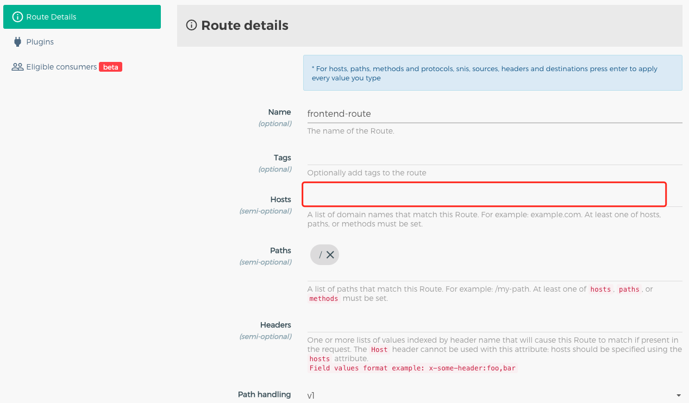

最近发现从百度跳转过来的都是很奇怪的域名，捏着鼻子想了想，一直用的是Google搜索问题，针对Google做了很多seo优化，后来了解一下大部分程序员还都是用百度的。想问一句：这么多的广告，几乎搜不到文档，甚至Github源码都搜不到～，怎么忍受的了～。

万般无奈，从Google跳过来的人着实比较少，也没有其他的入口可以让大家看到了～


问题：百度已经收录页面，虽然链接域名不对但是也不能放弃这些可怜的入口，毕竟是技术能解决的问题，如何能让百度继续保持收录？

首先为什么会有奇怪的域名，站点入口是通过kong网关代理转发流量的。肯定出在kong的配置上了。没有限制Hosts导致douyacun.com下的任意子域名只要路径正确都可以访问到，这是SEO的大忌～



那为啥Google的收录都是正常的？其实Google我一直都是提交的sitemap。其实Google也爬了很多其他域名的链接～


问题：那kong如何实现域名301跳转？

- 官方给出的是插件: `https://docs.konghq.com/hub/kong-inc/forward-proxy/` 企业付费插件

- github 给出的方案就是：https://github.com/Kong/kong/issues/3503 修改`nginx_kong.lua`模板

其他问题：

1. docker部署的kong套装～
2. 多个域名，不能用`server_name` 去匹配了～

第一个问题：使用逻辑卷挂载本地 `nginx_kong.lua` 到容器中去～，注意不能直接修改 kong/nginx-kong.conf ，一旦kong重启执行 nginx_kong.lua 生成新的nginx-kong.conf配置

第二个问题：多个域名匹配，这其实是nginx的事情了～，在 `location /` 根路径下判断域名是否需要重定向，注意 if 不支持 or / and，要用正则匹配，简单贴一下代码:

```nginx
....
location / {
  if ( $host ~ "(^douyacun.com$|^server.douyacun.com$|^7www.douyacun.com$|^rank.chinaz.comwww.douyacun.com$)") {
    rewrite ^/(.*) https://www.douyacun.com/$1 permanent;
    break;
  }
  ....
}
```


https://blog.csdn.net/dt763C/article/details/79799964

