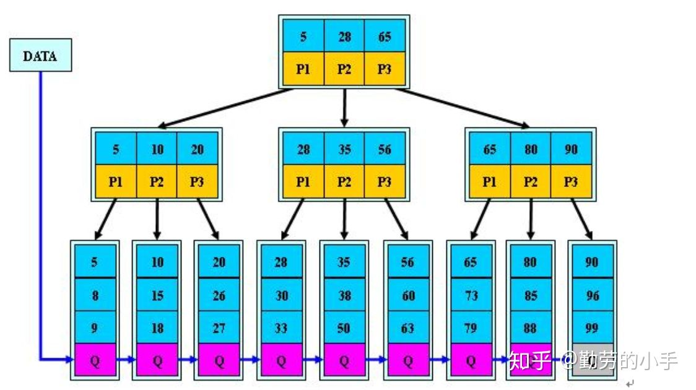
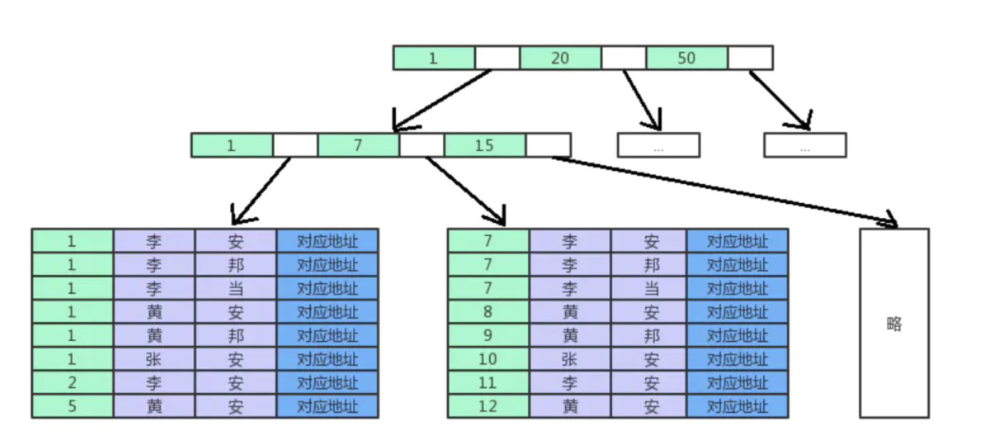

分析几个问题:

1. 为什么不用平衡二叉树?
2. B树、B+树有什么性质、区别?
3. 联合索引的B+树长什么样?
4. MyisAM索引数据结构？

# 平衡二叉树

**性质**

1. 非叶子节点最多只能有2个子节点
2. 非叶子节点中间值大于左边，小于右边
3. 树的左右两边层级树相差不会小于1
4. 没有值相等重复的节点

**图**

树的高度决定查询磁盘I/O的次数，二叉树是高瘦，树越高代价越大，而B+树是矮胖

# B树

平衡多路查找树

**性质**:

1. 根节点至少2个子节点
2. 所有叶子节点都在同一层
3. 节点关键字从左到右递增排列
4. 非叶子节点有k个子节点，k-1个关键字 2M<=k<=M
5. 叶子节点有K个关键字

**图**

# B+树

**性质**

叶节点:

1. 所有叶节点都在同一层
2. 叶节点包含所有的关键字和数据地址，
3. 每个叶子节点都会存储相邻叶子节点的指针，从小到大排列，形成链表

非叶子节点:

1. 非叶子节点只记录关键字，不记录数据地址，只进行数据索引，相比B树能保存的关键字更多、层级更少
2. 非叶子节点关键字数等于节点数

**优势**

1. B+树层级更少，非叶节点可以存储更多的关键字
2. B+树查询速度稳定，数据地址全部记录在叶子节点上，每次查找的次数相同
3. B+树更适合范围查找、排序，叶节点数据地址是个双向链表

**图**

# 联合索引

**性质**

1. 联合索引也是B+树
2. 非叶子节点存储的是第一个字段的关键字
3. 叶子节点存储的多个字段，按索引字段顺序排列

**图**

