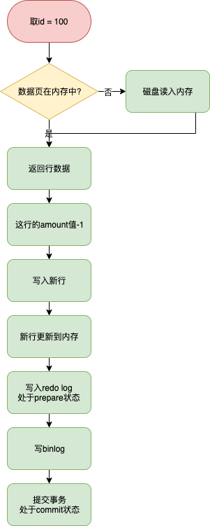

# 基础

**事务的概念**

并发操作的基本单位，逻辑上的一组操作，组成这组操作的各个单元，要么成功，要么失败。

**事务隔离级别**

- READ UNCOMMITTED (RU未提交读)
  事物的修改即使没有commit也可以被其他事物读到 - `脏读`

- READ COMMITTED (RC已提交读)
  一个事物从开始到提交对其他事物都是不可见的 - `不可重复读` 两次执行同样的查询读取的结果不一致

- REPEATABLE READ (RR可重复读)
  保证在同一个事物中多次读取到的结果是一致的 `幻读`

- SERIALIZABLE (串行化)
  强制事物串行执行，在读取的每一行上加锁

**事务ACID**：隔离性由锁来实现，原子性、一致性、持久性是通过redo log和undo log来实现。redo log保证原子性和持久性，undo log保证一致性。

-   atomicity 原子性：要么成功要么失败，commit事务一定是成功的，rollback整个事务的操作都要回滚掉，连接断开或者数据库崩溃也要保证事务回滚
-   consistency 一致性：任何时刻，数据都是一致的，保证不会读到中间状态的数据。包括数据库正常提供服务，数据库从异常中恢复。
-   isolation 隔离性：多个事务可以同时对数据修改，但是互不影响
-   durability 持久性：commit数据在任何情况下都不能丢失

**垃圾清理** 

- 对于删除的数据，innodb不是直接删除数据，而是标记一下，后台线程批量的删除
- 对于二级索引的更新，不是直接对索引进行更新，而是标记一下，然后产生一条新的。
- 过期的undolog也需要回收，过期指的是undo不需要被用来构建之前的版本，也不需要回滚事务

**回滚段**：数据页的修改链表，链表最前面的是最老的一次修改，最后面是最近的一次修改，从链表尾部逆向操作可以恢复到数据最老的版本，在innodb中与之相关的还有undo tablespace,undo segment,undo solt,undo log。undo log是最小的粒度，若干个undo page组成一个undo solt，一个事务最多有两个undo solt，其中一个是insert undo solt，里面记录了主键的信息，方便回滚时快速找到这一行，另外一个update undo solt，用来delete/update产生的undo，详细记录修改之前的记录的详细信息，便于在读请求需要的时候构造，1024个undo solt构成一个undo segment，若干个undo segment构成了undo tablespace。

**历史链表**：insert undo可以在事务提交和回滚后直接删除，没有事务要求查询新插入数据的历史版本。update undo则不可以，因为其他读请求可能需要使用update undo构建之前的历史版本。因此事务提交后，会把update undo加入一个全局链表（history list）中。链表按照事务提交顺序排序，保证最先提交的事务update undo在最情面，这样purge线程就可以从最老的事务开始清理。

**回滚点**：savepoint，事务回滚时可以指定回滚点，可以保证回滚到指定点，而不是回滚整个事务

```sql
savepoint "回滚点名";
rollback savepoint "回滚点名"; 
```


# 事务的启动

**事务启动方式**：

1.  显示启动事务语句，begin 或 start transaction，配套提交有commit，回滚语句是rollback。
2.  set autocommit = 0, 这个命令会将当前session的自动提交关闭掉，意味着只是执行一个select语句，这个事务就启动了，而且不会自动提交，这个持续到主动commit或rollback语句，或者断开连接

**事务启动的时机**:

begin/start transaction 并不是一个事务的起点，第一个快照读（执行第一个curd操作前），事务才真正的启动。可以使用`start transaction with consistent snapshot`立马启动一个事务。

| 事务A                                        | 事务B              |
| -------------------------------------------- | ------------------ |
| start transaction with consistent  snapshot; |                    |
|                                              | start transaction; |

```mysql
mysql> select * from information_schema.innodb_trx\G;
*************************** 1. row ***************************
                    trx_id: 422108885784400
                 trx_state: RUNNING
               trx_started: 2020-01-16 21:25:31	
               					.....
```

可以看到只有事务A启动了，而事务B虽然`start transaction`, `information_schema.innodb_trx`并没有事务B的信息。事务B执行一次查询，`innodb_trx才会有事务B的记录

-- 事务B

```mysql
mysql> select * from foo where id = 1;
+----+-------+
| id | value |
+----+-------+
|  1 |     1 |
+----+-------+
1 row in set (0.00 sec)
```

-- innodb_trx

```mysql
mysql> select * from information_schema.innodb_trx\G;
*************************** 1. row ***************************
                    trx_id: 422108885785312
                 trx_state: RUNNING
               trx_started: 2020-01-16 21:28:58
												.....
*************************** 2. row ***************************
                    trx_id: 422108885784400
                 trx_state: RUNNING
               trx_started: 2020-01-16 21:25:31
               					.....
```

**[使用长事务的弊病? 为什么使用长事务可能拖垮整个库?](#长事物)**

-   读长事务：
    -   开发同学链接从库查询，没有启用autocommit，查询完成后也没有commit（一般查询也不会commit）。连接就会被长时间挂起，这个事务会持有一个[share_read](https://dev.mysql.com/doc/refman/8.0/en/innodb-locking-reads.html) DML锁，它会影响对该表的DDL锁，如果这时DBA对主库该表做DDL操作，这个DDL操作复制到从库时，会因等待MDL锁而无法执行，这会造成从库复制大量延迟
    -   开发同学执行了一个复杂的统计查询sql，这个sql执行完本身时间就会很长，这也会长期占用DML锁，即使启用了autocommit也没用，而且还有可能大量数据文件排序造成磁盘空间耗尽
    -   更有甚者，程序执行了查询，没有autocommit，而程序用的是连接池，连接又不关闭
-   写长事务：就是长事务比较好理解，批量更新、插入。造成事务长时间执行。事务本身逻辑复杂，存在锁竞争、锁等待，超时后后端应该回滚或者重试。

对于复杂的应用场景，以不变应万变，监控。对于 读 的长事务，一旦超过一定阀值可立马kill掉，对与写操作不能这么任性，需要结合业务报警分析，或者代码回滚。

*Information_schema.innodb_trx*  包含了当前正在运行的事务信息

```sql
Create Table: CREATE TEMPORARY TABLE `INNODB_TRX` (
  `trx_id` varchar(18) NOT NULL DEFAULT '', -- 事务id
  `trx_state` varchar(13) NOT NULL DEFAULT '', -- 事务执行状态
  `trx_started` datetime NOT NULL DEFAULT '0000-00-00 00:00:00', -- 事务的开始时间
  `trx_requested_lock_id` varchar(81) DEFAULT NULL,-- 如果trx_state是lockwait,显示事务当前等待锁的id，不是则为空。innodb_locks.id 获取等多关于锁的信息
  `trx_wait_started` datetime DEFAULT NULL, -- 如果trx_state是lockwait,该值代表事务开始等待锁的时间；否则为空。
  `trx_weight` bigint(21) unsigned NOT NULL DEFAULT '0',-- 事务的高度，代表修改的行数（不一定准确）和被事务锁住的行数。
  `trx_mysql_thread_id` bigint(21) unsigned NOT NULL DEFAULT '0',-- mysql 线程id
  `trx_query` varchar(1024) DEFAULT NULL,-- 事务正在执行的sql语句。
  `trx_operation_state` varchar(64) DEFAULT NULL,-- 事务当前的操作状态，没有则为空。
  `trx_tables_in_use` bigint(21) unsigned NOT NULL DEFAULT '0',-- 事务在处理当前sql语句使用表的数量。
  `trx_tables_locked` bigint(21) unsigned NOT NULL DEFAULT '0',-- 当前sql语句有行锁的innodb表的数量。
  `trx_lock_structs` bigint(21) unsigned NOT NULL DEFAULT '0',-- 事务保留锁的数量。
  `trx_lock_memory_bytes` bigint(21) unsigned NOT NULL DEFAULT '0',--在内存中事务索结构占得空间大小
  `trx_rows_locked` bigint(21) unsigned NOT NULL DEFAULT '0',-- 事务行锁最准确的数量。
  `trx_rows_modified` bigint(21) unsigned NOT NULL DEFAULT '0', -- 事务修改和插入的行数
  `trx_concurrency_tickets` bigint(21) unsigned NOT NULL DEFAULT '0',-- 该值代表当前事务在被清掉之前可以多少工作
  `trx_isolation_level` varchar(16) NOT NULL DEFAULT '', -- 事务隔离等级。
  `trx_unique_checks` int(1) NOT NULL DEFAULT '0', -- 当前事务唯一性检查启用还是禁用。
  `trx_foreign_key_checks` int(1) NOT NULL DEFAULT '0',-- 当前事务的外键坚持是启用还是禁用
  `trx_last_foreign_key_error` varchar(256) DEFAULT NULL,-- 最新一个外键错误信息，没有则为空。
  `trx_adaptive_hash_latched` int(1) NOT NULL DEFAULT '0',-- 自适应哈希索引是否被当前事务阻塞。
  `trx_adaptive_hash_timeout` bigint(21) unsigned NOT NULL DEFAULT '0',-- 是否为了自适应hash索引立即放弃查询锁，或者通过调用mysql函数保留它
  `trx_is_read_only` int(1) NOT NULL DEFAULT '0',-- 值为1表示事务是read only。
  `trx_autocommit_non_locking` int(1) NOT NULL DEFAULT '0'-- 值为1表示事务是一个select语句，该语句没有使用for update或者shared mode锁，并且执行开启了autocommit，因此事务只包含一个语句。当TRX_AUTOCOMMIT_NON_LOCKING和TRX_IS_READ_ONLY同时为1，innodb通过降低事务开销和改变表数据库来优化事务。
) ENGINE=MEMORY DEFAULT CHARSET=utf8
1 row in set (0.00 sec)
```

**查找持续时间超过60s的长事务**

```sql
select * from information_schema.innodb_trx where TIME_TO_SEC(timediff(now(),trx_started))>60
```

-   trx_query 事务正在执行的sql，innodb也不知道后续还有没有sql要执行，因此trx_query不能提供有意义的信息
-   trx_is_read_only 1 说明是一个只读事务，用`start transaction read only`明确告诉innodb可以采用只读事务的流程来处理这个事务。会节省不少数据结构的空间。

# 日志

事务分为读写事务和只读事务，读写事务要比只读事务多做几点：

1.  分配事务id，只读事务的id是0
2.  分配回滚段，把老版本数据记录下来
3.  读写事务加入全局读写事务链表(trx_sys->rw_trx_list)，把事务id写入到全局活跃读写事务数组中(trx_descriptors)

## redo

innodb 在事物提交时，必须先将事务的所有事务写入到磁盘上的redo log file 和undo log file中进行持久化，为了确保每次日志都能写入到事务日志文件中，每次都会调用fsync，将内存中脏页同步到磁盘上

**mini transaction**是innodb对物理数据数据文件操作的最小事务单元，用于对page加锁，修改，释放以及日志提交到公共buffer等操作。mtr必须是原子性操作，一个事务可以包含多个mtr，每个mtr完成后需要将本地产生的日志拷贝到缓冲区，将修改的脏页放到flush list上

**LSN(log sequence number)** 用于记录日志序号，它是一个不断递增的 unsigned long long 类型整数。在 InnoDB 的日志系统中，LSN 无处不在，它既用于表示修改脏页时的日志序号，也用于记录checkpoint，通过LSN，可以具体的定位到其在redo log文件中的位置（注意: LSN不是自增+1，而是每次+日志的大小）

**Checkpoint**

-   sharp checkpoint

sharp checkpoint会把所有已提交事务相关的脏页刷到磁盘，并记录最新的已提交事务的LSN号。sharp checkpoint刷新到磁盘的脏页是某一时刻的一致性数据。
当数据库关闭时，会发生sharp checkpoint

-   fuzzy checkpoint

fuzzy checkpoint则复杂很多。fuzzy checkpoint会一点点的把脏页刷新到磁盘，直到与sharp checkpoint达到相同的目的（即所有的已提交事务相关的脏页到刷到磁盘）。fuzzy checkpoint会把两个LSN之间的脏页刷新到磁盘。但是并不能保障LSN之间的数据时一致性的。所以被称为fuzzy（失真） checkpoint。
innodb使用buffer pool来避免数据直接写入磁盘。这样数据可以再buffer pool中多次修改并最终写入磁盘，这样就减少了磁盘IO。buffer pool中维护了几个重要的list：free list、LRU list、flush list。当有新的数据读入buffer pool中时，会从free list中分配page。当free list中没有空闲page时，需要等待flush list中的数据刷到磁盘，这样很慢。所以innodb会定期的把flush list中的旧数据刷到磁盘。
再者，innodb redo log文件是循环使用的，所以必须保证日志文件在重写前，所有buffer pool中相关的脏数据刷新的磁盘，不然数据库宕机后这些数据就会丢失。因为日志是按照数据修改的时间记录的，所以旧的脏数据会被先刷到磁盘，这也就是fuzzy checkpoint的工作。因为日志中的旧数据已经刷新到磁盘，所以数据库宕机后，实例恢复会从fuzzy checkpoint后的LSN开始。
当数据库正常工作时，会进行fuzzy checkpoint

**innodb_flush_log_at_trx_commit** 控制重做日志刷新到磁盘的策略

- 1（默认）：事务提交时，必须调用一次fysnc同步到磁盘，宕机不会丢失事务
- 0：事务提交不用不会触发redo log写操作，而是依赖master thread每秒刷盘操作
- 2：每次提交只write写入到os buffer，并不保证写入到磁盘，crash不会丢失事务，宕机会丢失事
- 
日常场景设置为1,系统高峰期可以修改成2以应对大负载。

各个事务可以交叉拷贝到log bufeer中，一次事务commit触发的写redo(fysnc)到文件，可能隐式的帮别的线程也写了redo log，从而达到group commit操作。

**redo log 和 二进制文件的区别**

1. 二进制文件时存储引擎上层产生的，不管什么存储引擎都会产生二进制文件，redo log是innodb层产生的只记录存储引擎层表的修改，
2. 二进制日志是基于行格式修改，本质也是sql。redo log是物理日志记录每个page的修改(mini transaction)
3. 二进制是每次事务提交后写入缓存中的日志文件，而redo log在数据准备修改前写入缓存中的redo log中，写入完成后才会执行修改操作
4. 二进制日志只在提交时一次性写入，二进制记录顺序和提交顺序一致，redo log记录的物理页的修改，redo log文件同一个事务可能多次修改，
5. 二进制记录所有影响数据库的操作，记录的内容较多。eg. 插入记录一次，删除记录一次，而redo log记录的物理页的情况，插入一次删除一次前后状态一致
务

## MVCC 多版本并发控制

> multi-version concurrent control

数据版本控制，防止不该被事务发现的数据被看到，主要是通过read view来实现。 在innodb（trx_sys）事务系统，维护着一个全局的读写活跃的事务id数组(trx_sys->descriptors)，id从小到大排序，表示某个时间点，数据库中所有还未提交的读写事务。当需要一致性读时，会把全局读写事务id拷贝一份到read view本地read_view_t->desciptors，作为当前事务的快照.

- read_view_t->up_limit_id: 未提交读写事务数组read_view_t->desciptors中的最小id

- read_view_t->low_limit_id : 当前事务的id（先快照全局数组，然后生成当前事务id，当前事务id，一定大于快照中最大的事务id）

**查出一条记录后，是否可见？**

在每行记录后面会保存两个隐藏的列，一：trx_id 最后被修改时的事务id  二：删除时事务id

1. 记录 trx_id 小于 read_view_t->up_limit_id, 说明这条记录在事务之前创建，这条记录可见。
2. 记录 trx_id 大于 read_view_t->low_limit_id, 说明这条记录在事务之后修改，这条记录不可见。
3. 记录trx_id 在 read_view_t -> up_limit_id 和 read_view_t->low_limit_id 之间，说明这条记录在事务创建时，被另外一个未提交的事务所修改，事务隔离型，这条记录不可见。

总结一下，对于一个事务视图来说，出了自己的更新总是可见以外，有三种情况：

1. 版本未提交，不可见；
2. 版本已提交，是在视图创建后提交的，不可见；
3. 版本已提交，是在视图创建前提交的，可见；

表结构

```sql
CREATE TABLE `foo` (
  `id` int(11) unsigned NOT NULL AUTO_INCREMENT,
  `value` int(11) unsigned NOT NULL DEFAULT '0',
  PRIMARY KEY (`id`)
) ENGINE=InnoDB AUTO_INCREMENT=2 DEFAULT CHARSET=utf8mb4 COLLATE=utf8mb4_unicode_ci;
```

插入一条测试数据

```sql
insert into foo (`value`) values (1);
```

| 事务A                                        | 事务B                                           | 事务C                                          |
| -------------------------------------------- | ----------------------------------------------- | ---------------------------------------------- |
| start  transaction with consistent snapshot; |                                                 |                                                |
|                                              | start transaction;                              |                                                |
|                                              |                                                 | update foo `value` = `value` + 1 where id = 1; |
|                                              | update foo `value` = `value` + 1  where id = 1; |                                                |
|                                              | select * from foo where id = 1;                 |                                                |
| select * from foo where id = 1;              |                                                 |                                                |
| commit;                                      | commit;                                         | commit;                                        |

事务A查询的值是1，事务C的修改是在事务A的视图创建之后，不可见

事务B查询的值是3，事务C的修改是在事务B的视图创建之前，可见。**更新数据都是先读后写的，而这个读，只能读当前的值，称为“当前读”**，事务B的更新数据的时候是在C的版本是可见的，所以是在C的基础上更新。

如果记录不可见，则尝试用undo去构建老的版本，知道找到可见的版本或者解析完成所有的undo。

**事务可重复读是怎么实现？**

可重复的核心是一致性读：事务更新数据的时候，只能用当前读，如果当前记录的行锁被其他事物占用的话，就要进入锁等待；

读提交和可重复读的区别：

- RR(repeatable read 可重复度)级别的隔离：只需要在事务开始的时候创建一致性视图，之后事务里的其他查询都共用这个一致性视图；
- RC(read commited 读已提交)级别的隔离：每一个语句执行前都会重新算出一个新的视图，能够读取到该事务创建后其他事务已经提交的事务，这样两个查询的结果就不一样，RR级别的效率要比RC级别的效率高
- RU(read uncommited 读未提交)级别的隔离： 不会去检查可见性，效率时很高，但是会读取到未提交的脏数据
- 串行化隔离级别：使用锁来实现，性能很差

# 两阶段提交

事务提交，redo log的写入拆分成两个阶段: prepare和commit。两阶段提交保证binlog和redo log逻辑上的一致。

```sql
update amount=amount-1 where id = 100 and amount = 99;
```



1.  执行器先通过引擎取 id = 100这行, id时主键，引擎直接用树搜索找到这一行。如果id=100所在的数据页本来就在内存中，直接返回给执行器，否则从磁盘读取，然后再返回
2.  执行器拿到引擎给的数据行，把这个值加1，在调用引擎写入这行数据
3.  引擎将这行数据更新到内存中，同时将这个更新操作记录到redo里面，此时redo log处于prepare阶段，然后告知执行器执行完成了，随时可以提交事务
4.  执行器生成这个操作的binlog，并把binlog写入磁盘
5.  执行器调用引擎的提交事务接口，把写入的redo log改成commit状态。更新完成

# 推荐阅读

-   http://mysql.taobao.org/monthly/2017/12/01/
-   https://segmentfault.com/a/1190000012650596