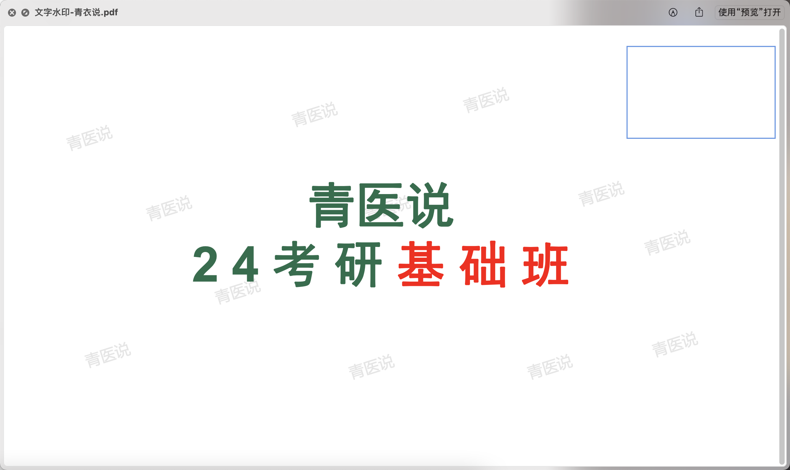
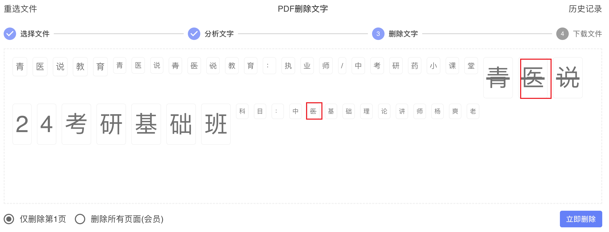
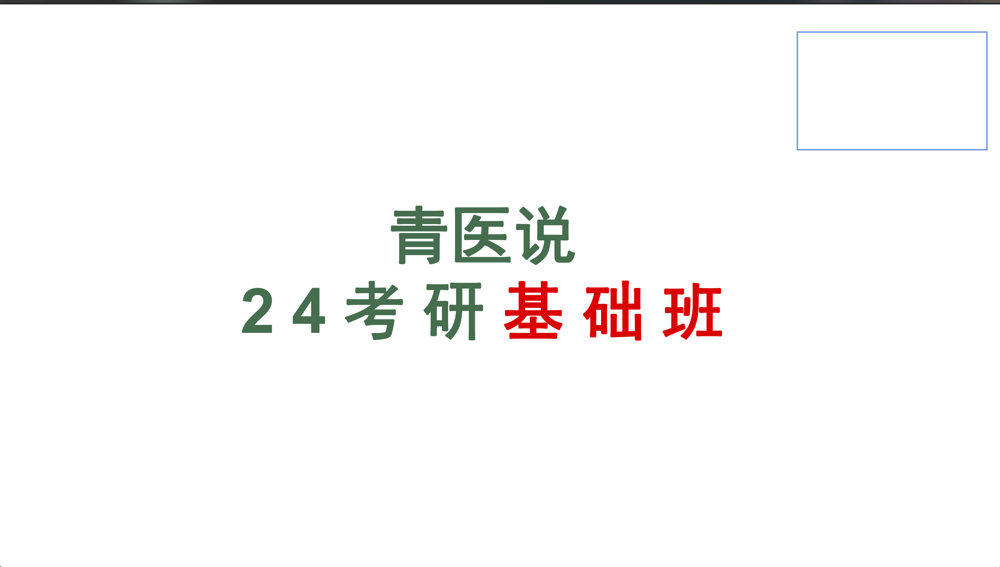

在线体验地址：[https://www.douyacun.com/pdf/remove-watermark](https://www.douyacun.com/pdf/remove-watermark)

[toc]

PDF 去除文字水印看起来像是在“删字”，真正难的是两件事要同时成立: 先把真正的水印识别出来，再把它精准删除，而且不能误伤正文、标题和页眉。

这篇文章只讲 4 件事: 为什么文字水印更难、早期为什么会误删标题、现在怎么做到更精准、以及怎么优化手动判断水印的操作。

## 为什么 PDF 文字水印比图片水印更难处理

图片水印通常是独立图片对象，定位后就能单独处理。文字水印往往藏在 PDF 内容流里，以 `Tj`、`TJ` 这类文字指令存在，程序真正面对的是字体、矩阵、透明度、颜色和所在 stream。

难点主要有 4 个:

1. 同样的字可能同时出现在水印和标题里，比如“青衣说”。
2. 文字水印常常是斜着的、半透明的、浅色的，不能只按内容判断。
3. PDF 会做对象复用，相同内容可能在多个位置共享。
4. 很多文字不是明文，需要结合字体的 `ToUnicode/CMap` 才能解码。

所以，文字去水印本质上不是“删字”，而是“识别 + 判断 + 精准改写 PDF 对象”。

## 早期方案遇到了什么问题

最典型的案例就是“青衣说”。页面里斜着有一层淡色的“青衣说”文字水印，同时正文或标题里还有更大的“青衣说”文字。用户能看出来哪个是水印，程序如果删除粒度太粗，就可能一起删掉。

早期方案很直接:

1. 先在内容流里提取出某条文字操作的 `raw_text`
2. 用户勾选后，把这些 `raw_text` 拼起来
3. 再到 PDF 里做一次全局字节替换

这个方案能快速打通闭环，但问题很明显:

1. 删除粒度太粗，只要别的位置也出现相同字节片段，就可能被一起删掉，这正是“青衣说”标题被误删的根因。
2. 候选经常是一字一个返回，选择成本很高。
3. 前端只展示普通按钮时，用户很难判断颜色、倾斜角、字号这些关键信息。
4. 没有可信度分层，明显像水印和不那么确定的候选混在一起。

所以，真正要把效果做稳，不能只改删除阶段，识别、展示和交互都得一起优化。

## 文字水印识别是怎么一步步优化的

文字识别后来的优化可以概括成 4 步:

1. 直接扫描 PDF 内容流里的 `Tj`、`TJ` 文字操作，而不是只看页面上能不能读出文字。
2. 结合字体的 `ToUnicode/CMap` 解码十六进制操作数，让候选尽量展示成真实中文，而不是乱码。
3. 提取颜色、透明度、倾斜角、字号、字体，让前端候选更接近真实水印。
4. 建立打分制度，用透明度、倾斜角、字号偏离、颜色偏离、位置、重复性、Form XObject 来源等信号来区分“高疑似水印”和“不确定候选”。

最终，明显像水印的候选会默认勾选，不确定候选也会返回给用户，但不会默认删除。

## 为什么要从全局替换升级到语法级精准删除

识别阶段解决的是“删谁”，删除阶段解决的是“怎么删才不会误伤”。这次最关键的升级，就是把删除从“全局替换字节”改成“语法级精准删除”。

旧方案的问题是: 它只知道某一段字节命中了，不知道这段字节来自哪个 `stream_xref`、哪一条 `Tj/TJ` 操作，也不知道字体、矩阵和透明度。结果就是，只要别处也有相似片段，就有误删风险。

新方案的思路是“删除操作，而不是删除字节”。检测阶段会记录 `page_no`、`stream_xref`、`operator`、`op_index`、`matrix`、`font_xref` 等定位信息；删除阶段再重新解析目标 stream，只改写被选中的那一条文字操作。

这里有一个很关键的安全边界: **严禁跨 `stream_xref` 做 fallback 匹配。**  
这就是为什么现在选中了水印“青衣说”，不会再顺手把标题里的“青衣说”一起删掉。

## 优化手动判断水印的操作

后端识别和删除逻辑做对了，只解决了一半问题。如果前端候选展示得不清楚、选择成本太高，用户一样会觉得这个功能“不好用”。

这次前端主要做了几件事:

1. 候选展示尽量保留颜色、倾斜角和字号，让用户一眼看出这是不是页面里的那层水印。
2. 展示态不完全照搬原始低透明度，而是做可读性增强，避免文字太淡看不清。
3. 选中的文字增加删除线，让用户明确知道哪些字会被清理。
4. 增加全选、取消全选、拖拽框选和双击同类切换，减少“一字一字点”的成本。
5. 增加处理结果截图和成功/失败反馈，让用户能快速确认效果。

## 这次优化后的实际效果

这轮优化主要有 3 个变化:

1. 识别结果更像真实水印，不再只是一排拆开的普通文字。
2. 选择效率更高，默认勾选、全选/取消全选、框选和双击同类切换能显著减少操作次数。
3. 删除结果更精准，像“青衣说”这种标题与水印同字样的场景，误删风险明显下降。

下面这张图展示的是去水印后的结果预览。

对用户来说，真正提升的是候选更容易看懂、选择更高效、删除结果更可信。

## 适用范围与当前边界

当前方案最适合的是这类 PDF:

- 水印本身是 PDF 文字对象
- 文字可由内容流里的 `Tj/TJ` 操作表达
- 水印和正文处在可区分的对象层或模板层
- 水印具备明显的透明度、倾斜角、位置或重复性特征

下面这些情况，仍然建议人工确认:

- PDF 模板结构非常复杂
- 同一页上存在很多风格非常接近的装饰性文字
- 使用了非常规字体编码或特殊子集字体
- 某些候选本身既像水印，也像页眉或版式元素

如果所谓“文字水印”其实已经被烘焙进图片里，比如扫描件上的浅色字样，那它本质上就不再是文字对象水印，而是图片域问题。

## 总结

PDF 去除文字水印，真正难的不是“能不能删掉几个字”，而是能不能既识别准确，又删除精准，还让用户操作起来足够省力。

这次效果提升，核心就来自 5 件事一起成立: 正确解码文字、提取视觉特征、建立候选打分、升级为语法级精准删除，以及优化手动判断和批量选择的操作。

如果你只是想快速使用，也可以直接打开在线页面体验:  
[https://www.douyacun.com/pdf/remove-watermark](https://www.douyacun.com/pdf/remove-watermark)
