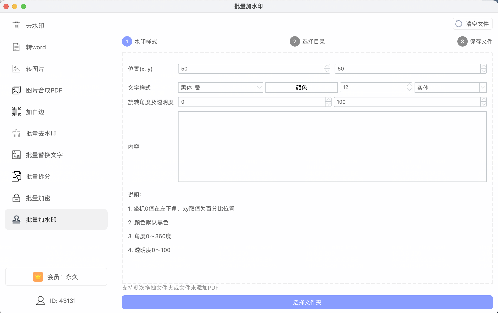
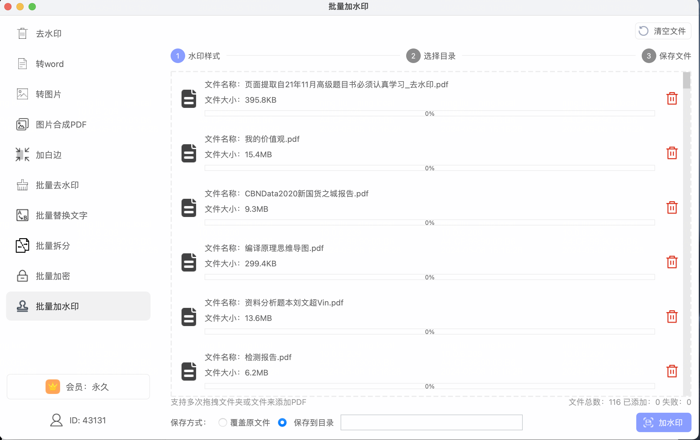

功能免费使用，不限制次数、文件数，支持并发批量处理，有需要的同学可以加QQ（799618819）交流

下载地址：

- [windows](https://www.douyacun.com/s/pdf_tools.exe) ：https://www.douyacun.com/s/pdf_tools.exe
- [mac](https://www.douyacun.com/s/pdftools)：https://www.douyacun.com/s/pdftools

### 参数说明

- 位置（x, y）: 坐标0值在页面的左下角开始，取值范围0～100，输入坐标时，要考虑文字的宽高，不要超出PDF显示页的大小
  - 第一个输入框是x坐标
  - 第二个输入是y坐标
- 文字样式：
  - 第一个输入框：字体，读取的系统字体文件，后续考虑上传字体文件
  - 第二个输入框：颜色
  - 第三个输入框：字体大小
  - 第四个输入框：文字样式
    - 实体
    - 空心
    - 描边
- 旋转角度及透明度：
  - 第一个输入框：旋转角度0-360度
  - 第二个输入框：透明度 0-100

如下图：

