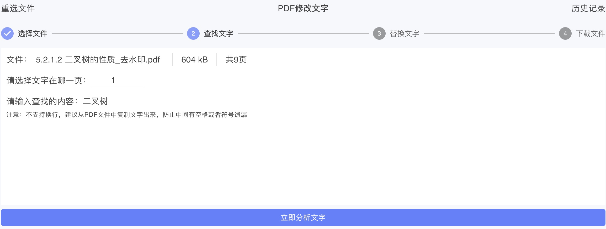
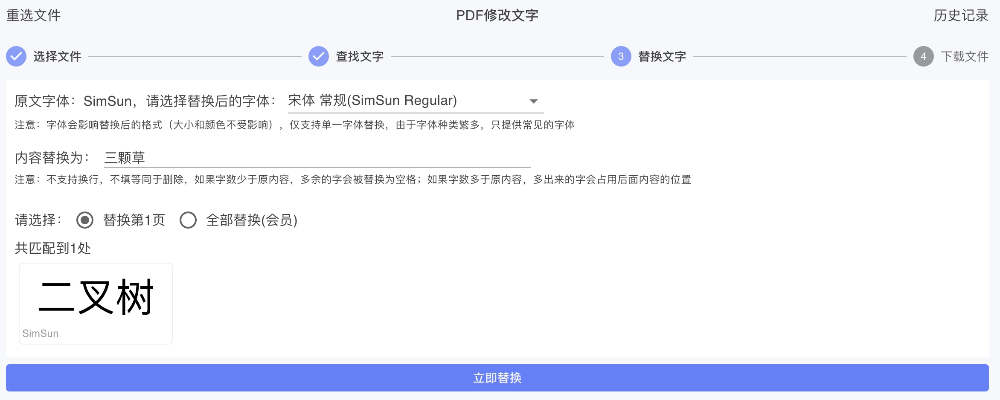
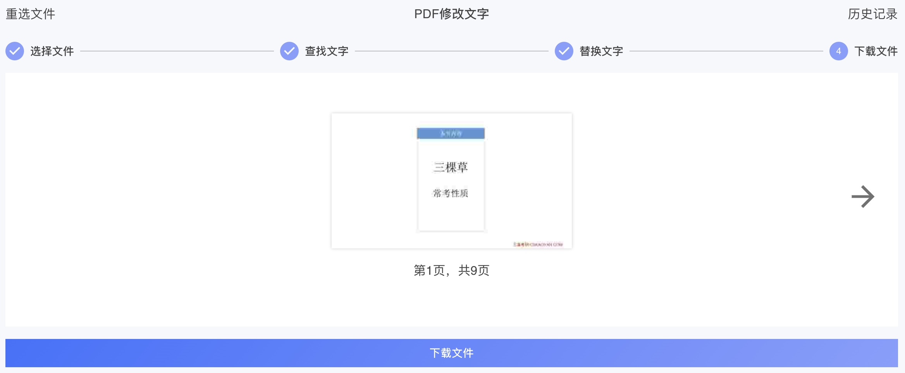
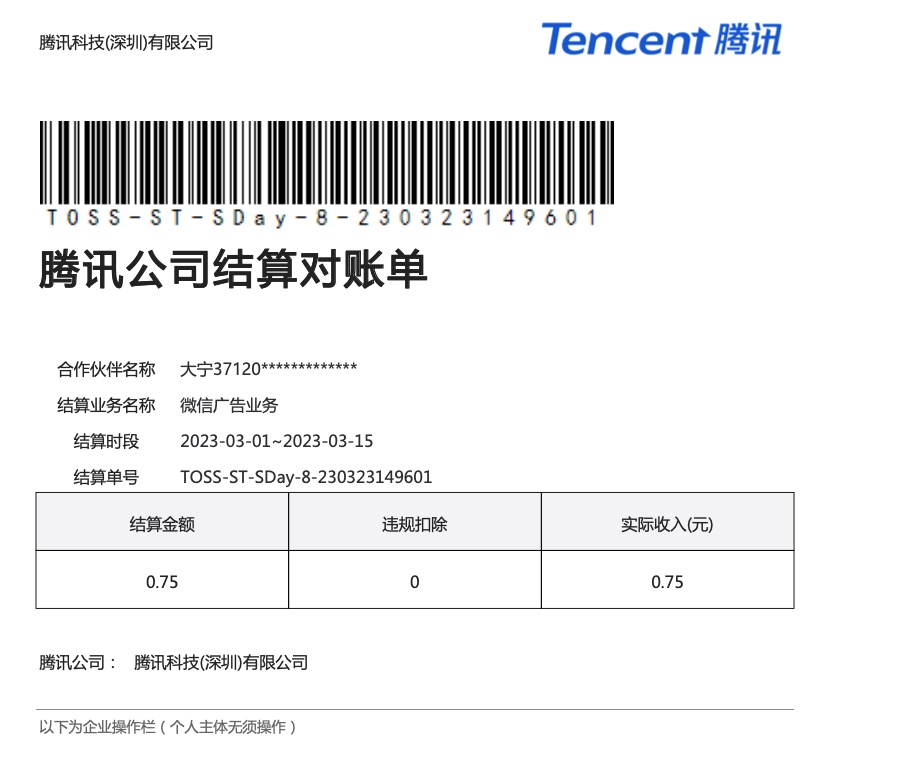
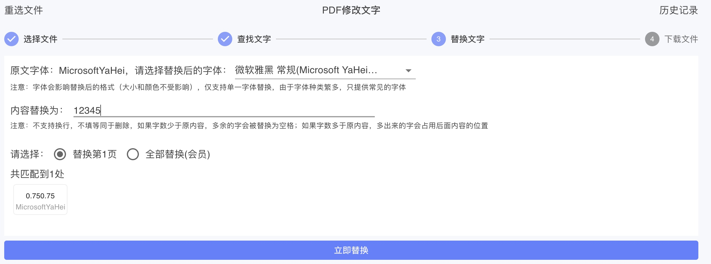
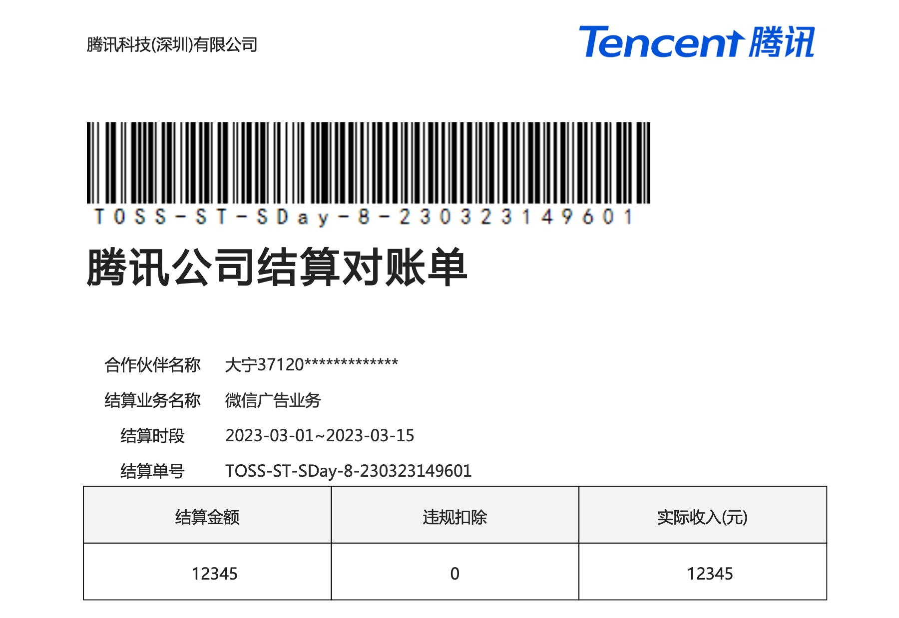

就想简简单单的改PDF里面一两个字，怎么就这么难？我就遇到过这样的问题，公司入职让打印流水，面的时候谈的和现在不一样好不容易面过了，银行给的流水都是PDF想改一下真难啊，还有运营同学问我能否将PDF里面对方的公司名称全部替换成我们公司的名称。

总结了一下百度搜到的可行方案：

1. pdf转word后编辑word，然后再转pdf，这个格式没办法保证，稍微复杂一点格式就乱了
2. 下载软件，wps pdf编辑器试可用，但是导出来后会被添加水印，不支持批量替换，一两处还可以忍受，一个PDF几十甚至几百页，累死也改不完，而且大小、字体、颜色还得自己调整，这要是有个格式刷就好了
3. 在线可以修改pdf，没有搜到可以用的

下面开始化重点

**网站地址:** [在线批量替换PDF文字](https://www.douyacun.com/pdf/replace-text)

**微信小程序:** 「大宁宝箱」

#### 操作步骤

第一步：选择上传PDF文件后，需要先输入文字在第几页，这一步是为了查找文字的位置，如下图输入：二叉树

> 注意：此功能是了批量替换PDF的关键词，所以不支持大段文字，换行文字匹配，不支持扫描版PDF替换文字，建议从PDF直接复制出文字来，这样可以更快确认文字是否存在

第二步：点击立即分析文字后会查找匹配文字信息，提取文字位置、颜色、字体、字体大小、角度信息

如果想要完全保证原有格式这一步的关键就是选择字体，部分情况下是无法获取到字体family信息，需要自己选择字体

接下来就是输入替换内容

> 如果PDF查找文字与替换文字的字数不一致会怎么样
>
> 第一种情况：字数一致，替换后的字对号入座，位置保持一致; 
>
> 第二种情况：替换的字数多，后面是空白会在空白添加多余的字，如果后面空白不足不会自动换行; 
>
> 第三种情况：替换的字数多，后面是其他文字，多出来的文字会替换后面的文字; 
>
> 第四种情况：替换的字数少，补空白;

第三步：点击立即替换，然后就可以预览替换后的效果，点击下载文件就可以将替换后的文件下载到本地

#### 更多PDF替换文字的效果

腾讯结算对账单PDF，我们替换收益0.75为123，共有2处数字会被替换

