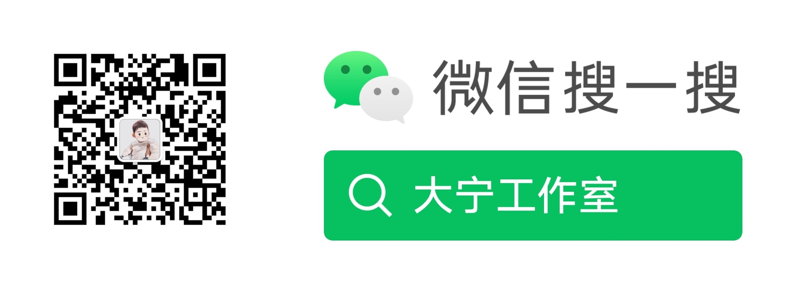
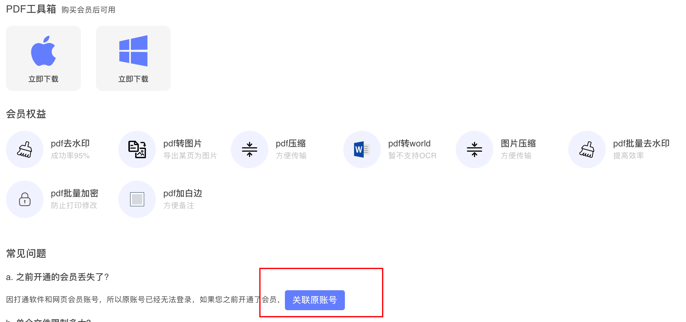
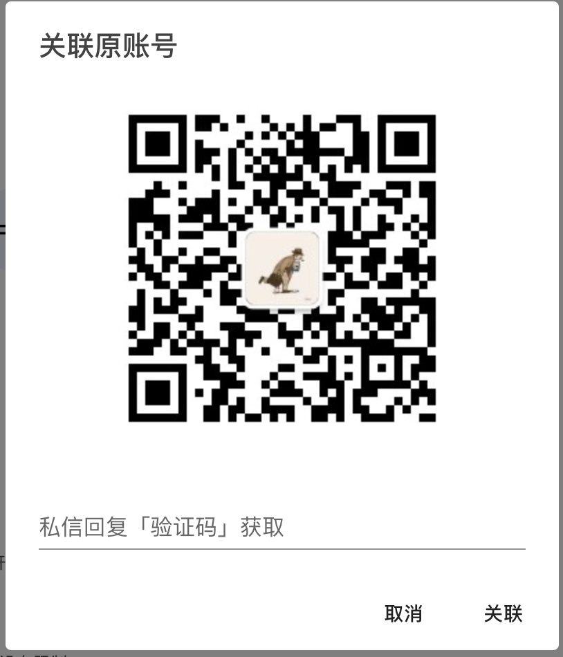
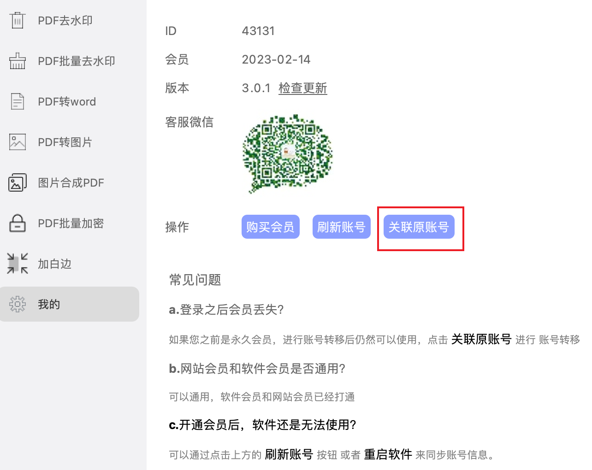

最近开通vip的同学吐槽网站开通会员以后无法使用软件，在过年这段期间比较空闲，就打通了网站和软件的账号体系，改版后的网站是通过扫码关注后登录，公众号是下面这个

#### 账号常见问题：

**a. 网站登录以后会员账号如何迁移？**

​	网站下方有 **关联原账号** 按钮，点击之后会打开 关联原账号 弹窗

**b. 软件会员如何迁移？**

打开软件点击 **我的**，可以看到 **关联原账号** 按钮

