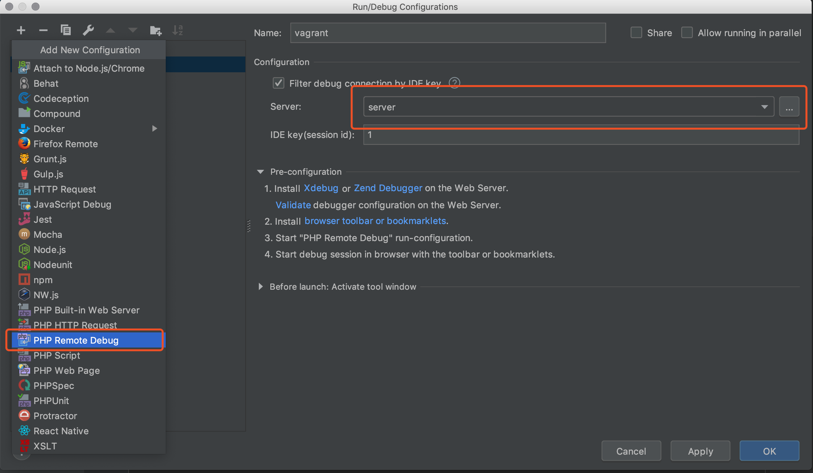

# xdebug + vagrant + phpstorm

### 环境:
- centos7.3
- vagrant
- php7.2
- phpstorm
- laravel

### 安装:
```
$ yum install -y --enablerepo=remi-php70 php-xdebug
```

注:(使用remi yum源)
```
$ wget http://rpms.famillecollet.com/enterprise/remi-release-6.rpm
$ rpm -Uvh remi-release-6.rpm
```

### 配置php.ini
```
xdebug.remote_enable = On
xdebug.remote_connect_back = on
xdebug.idekey=1
```

### 配置phpstorm

- file -> setting -> Languages & Frameworks -> PHP -> Servers
    + name 随便命名
    + Host 访问域名
    + port Debugger 不用动
    + use path mapping(select if the server is remote or symlinks are used)
    + 根目录同步目录
    + public 同步目录
    + 
    + 这里也可以
    + 


使用xdebug

postman app 可以参数 `XDEBUG_SESSION_START=1` phpstorm 就会自动调用
