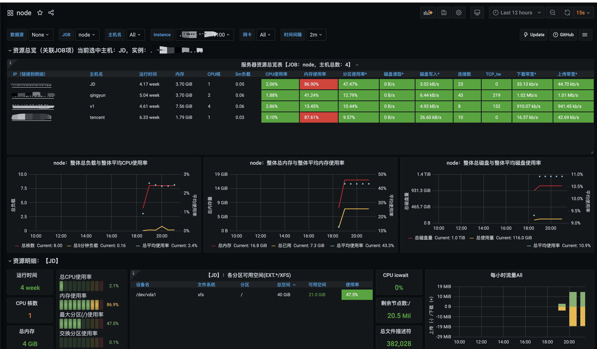

prometheus提供了node_exporter来收集主机数据

node_exporter下载地址: [https://github.com/prometheus/node_exporter/releases](https://github.com/prometheus/node_exporter/releases)

supervisor维护进程运行

```ini
[program:node_exporter]
command=/data/node_exporter/node_exporter-1.1.1.linux-amd64/node_exporter
autostart=true
autorestart=true
user=root
numprocs=1
redirect_stderr=true
stdout_logfile=/data/node_exporter/logs/access.log
```

grafana dashboard: [https://grafana.com/grafana/dashboards/8919](https://grafana.com/grafana/dashboards/8919)

