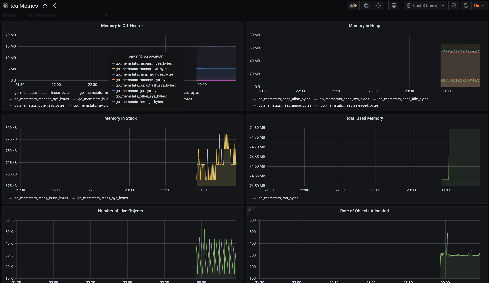

框架是用gin，收集请求总数，统计响应时间



go提供了`client_golang/prometheus` 和 `client_golang/prometheus/promhttp`sdk收集数据,增加一个中间件兼容gin框架
```go
package middleware

import (
	"github.com/gin-gonic/gin"
	"github.com/prometheus/client_golang/prometheus"
	"github.com/prometheus/client_golang/prometheus/promhttp"
	"strconv"
	"time"
)

const DefaultMetricPath = "/metrics"

var httpRequestTotal = prometheus.NewCounterVec(prometheus.CounterOpts{
	Name: "http_request_total",
	Help: "counter: 统计请求数量",
}, []string{"code", "method", "url"})

var httpRequestDuration = prometheus.NewHistogramVec(prometheus.HistogramOpts{
	Name:    "http_request_duration",
	Help:    "histogram：统计响应时间",
}, []string{"code", "method", "url"})

func init() {
	// 注册收集器
	prometheus.MustRegister(httpRequestTotal)
	prometheus.MustRegister(httpRequestDuration)
}

type monitor struct{}

func NewMonitor(e *gin.Engine) *monitor {
	m := &monitor{}
	// 注册metrics路由
	e.GET(DefaultMetricPath, prometheusHandler())
	// 注册中间件
	e.Use(m.HandleFunc())
	return m
}

func (m *monitor) HandleFunc() gin.HandlerFunc {
	return func(ctx *gin.Context) {
		// metrics 不统计
		if ctx.Request.URL.Path == DefaultMetricPath {
			ctx.Next()
			return
		}
		start := time.Now()
		ctx.Next()
		status := strconv.Itoa(ctx.Writer.Status())
		httpRequestTotal.WithLabelValues(status, ctx.Request.Method, ctx.Request.URL.Path).Inc()
		httpRequestDuration.WithLabelValues(status, ctx.Request.Method, ctx.Request.URL.Path).Observe(time.Since(start).Seconds())
	}
}
func prometheusHandler() gin.HandlerFunc {
	h := promhttp.Handler()
	return func(c *gin.Context) {
		h.ServeHTTP(c.Writer, c.Request)
	}
}
```


**grafana dashboard**

```json
{"annotations":{"list":[{"builtIn":1,"datasource":"-- Grafana --","enable":true,"hide":true,"iconColor":"rgba(0, 211, 255, 1)","name":"huoding.com","type":"dashboard"}]},"description":"Golang Application Runtime metrics (fitler by job and instance)","editable":true,"gnetId":13240,"graphTooltip":0,"id":6,"iteration":1614097506409,"links":[],"panels":[{"aliasColors":{},"bars":false,"dashLength":10,"dashes":false,"datasource":"Prometheus","fieldConfig":{"defaults":{"custom":{},"links":[]},"overrides":[]},"fill":1,"fillGradient":0,"gridPos":{"h":8,"w":12,"x":0,"y":0},"hiddenSeries":false,"id":26,"legend":{"avg":false,"current":false,"max":false,"min":false,"show":true,"total":false,"values":false},"lines":true,"linewidth":1,"links":[],"nullPointMode":"null","options":{"alertThreshold":true},"percentage":false,"pluginVersion":"7.3.7","pointradius":2,"points":false,"renderer":"flot","seriesOverrides":[],"spaceLength":10,"stack":false,"steppedLine":false,"targets":[{"expr":"go_memstats_mspan_inuse_bytes{job=\"$job\", instance=~\"$instance\"}","format":"time_series","interval":"","intervalFactor":1,"legendFormat":"go_memstats_mspan_inuse_bytes","refId":"A"},{"expr":"go_memstats_mspan_sys_bytes{job=\"$job\", instance=~\"$instance\"}","format":"time_series","interval":"","intervalFactor":1,"legendFormat":"go_memstats_mspan_sys_bytes","refId":"B"},{"expr":"go_memstats_mcache_inuse_bytes{job=\"$job\", instance=~\"$instance\"}","format":"time_series","interval":"","intervalFactor":1,"legendFormat":"go_memstats_mcache_inuse_bytes","refId":"C"},{"expr":"go_memstats_mcache_sys_bytes{job=\"$job\", instance=~\"$instance\"}","format":"time_series","interval":"","intervalFactor":1,"legendFormat":"go_memstats_mcache_sys_bytes","refId":"D"},{"expr":"go_memstats_buck_hash_sys_bytes{job=\"$job\", instance=~\"$instance\"}","format":"time_series","interval":"","intervalFactor":1,"legendFormat":"go_memstats_buck_hash_sys_bytes","refId":"E"},{"expr":"go_memstats_gc_sys_bytes{job=\"$job\", instance=~\"$instance\"}","format":"time_series","interval":"","intervalFactor":1,"legendFormat":"go_memstats_gc_sys_bytes","refId":"F"},{"expr":"go_memstats_other_sys_bytes{job=\"$job\", instance=~\"$instance\"} - go_memstats_other_sys_bytes{job=\"$job\", instance=~\"$instance\"}","format":"time_series","interval":"","intervalFactor":1,"legendFormat":"go_memstats_other_sys_bytes","refId":"G"},{"expr":"go_memstats_next_gc_bytes{job=\"$job\", instance=~\"$instance\"}","format":"time_series","interval":"","intervalFactor":1,"legendFormat":"go_memstats_next_gc_bytes","refId":"H"}],"thresholds":[],"timeFrom":null,"timeRegions":[],"timeShift":null,"title":"Memory in Off-Heap","tooltip":{"shared":true,"sort":0,"value_type":"individual"},"type":"graph","xaxis":{"buckets":null,"mode":"time","name":null,"show":true,"values":[]},"yaxes":[{"format":"decbytes","label":null,"logBase":1,"max":null,"min":null,"show":true},{"format":"short","label":null,"logBase":1,"max":null,"min":null,"show":false}],"yaxis":{"align":false,"alignLevel":null}},{"aliasColors":{},"bars":false,"dashLength":10,"dashes":false,"datasource":"Prometheus","fieldConfig":{"defaults":{"custom":{},"links":[]},"overrides":[]},"fill":1,"fillGradient":0,"gridPos":{"h":8,"w":12,"x":12,"y":0},"hiddenSeries":false,"id":12,"legend":{"avg":false,"current":false,"max":false,"min":false,"show":true,"total":false,"values":false},"lines":true,"linewidth":1,"links":[],"nullPointMode":"null","options":{"alertThreshold":true},"percentage":false,"pluginVersion":"7.3.7","pointradius":2,"points":false,"renderer":"flot","seriesOverrides":[],"spaceLength":10,"stack":false,"steppedLine":false,"targets":[{"expr":"go_memstats_heap_alloc_bytes{job=\"$job\", instance=~\"$instance\"}","format":"time_series","interval":"","intervalFactor":1,"legendFormat":"go_memstats_heap_alloc_bytes","refId":"B"},{"expr":"go_memstats_heap_sys_bytes{job=\"$job\", instance=~\"$instance\"}","format":"time_series","interval":"","intervalFactor":1,"legendFormat":"go_memstats_heap_sys_bytes","refId":"A"},{"expr":"go_memstats_heap_idle_bytes{job=\"$job\", instance=~\"$instance\"}","format":"time_series","interval":"","intervalFactor":1,"legendFormat":"go_memstats_heap_idle_bytes","refId":"C"},{"expr":"go_memstats_heap_inuse_bytes{job=\"$job\", instance=~\"$instance\"}","format":"time_series","interval":"","intervalFactor":1,"legendFormat":"go_memstats_heap_inuse_bytes","refId":"D"},{"expr":"go_memstats_heap_released_bytes{job=\"$job\", instance=~\"$instance\"}","format":"time_series","interval":"","intervalFactor":1,"legendFormat":"go_memstats_heap_released_bytes","refId":"E"}],"thresholds":[],"timeFrom":null,"timeRegions":[],"timeShift":null,"title":"Memory in Heap","tooltip":{"shared":true,"sort":0,"value_type":"individual"},"type":"graph","xaxis":{"buckets":null,"mode":"time","name":null,"show":true,"values":[]},"yaxes":[{"format":"decbytes","label":null,"logBase":1,"max":null,"min":null,"show":true},{"format":"short","label":null,"logBase":1,"max":null,"min":null,"show":true}],"yaxis":{"align":false,"alignLevel":null}},{"aliasColors":{},"bars":false,"dashLength":10,"dashes":false,"datasource":"Prometheus","fieldConfig":{"defaults":{"custom":{},"links":[]},"overrides":[]},"fill":1,"fillGradient":0,"gridPos":{"h":8,"w":12,"x":0,"y":8},"hiddenSeries":false,"id":24,"legend":{"avg":false,"current":false,"max":false,"min":false,"show":true,"total":false,"values":false},"lines":true,"linewidth":1,"links":[],"nullPointMode":"null","options":{"alertThreshold":true},"percentage":false,"pluginVersion":"7.3.7","pointradius":2,"points":false,"renderer":"flot","seriesOverrides":[],"spaceLength":10,"stack":false,"steppedLine":false,"targets":[{"expr":"go_memstats_stack_inuse_bytes{job=\"$job\", instance=~\"$instance\"}","format":"time_series","interval":"","intervalFactor":1,"legendFormat":"go_memstats_stack_inuse_bytes","refId":"A"},{"expr":"go_memstats_stack_sys_bytes{job=\"$job\", instance=~\"$instance\"}","format":"time_series","interval":"","intervalFactor":1,"legendFormat":"go_memstats_stack_sys_bytes","refId":"B"}],"thresholds":[],"timeFrom":null,"timeRegions":[],"timeShift":null,"title":"Memory in Stack","tooltip":{"shared":true,"sort":0,"value_type":"individual"},"type":"graph","xaxis":{"buckets":null,"mode":"time","name":null,"show":true,"values":[]},"yaxes":[{"format":"decbytes","label":null,"logBase":1,"max":null,"min":null,"show":true},{"format":"short","label":null,"logBase":1,"max":null,"min":null,"show":true}],"yaxis":{"align":false,"alignLevel":null}},{"aliasColors":{},"bars":false,"dashLength":10,"dashes":false,"datasource":"Prometheus","fieldConfig":{"defaults":{"custom":{},"links":[]},"overrides":[]},"fill":1,"fillGradient":0,"gridPos":{"h":8,"w":12,"x":12,"y":8},"hiddenSeries":false,"id":16,"legend":{"avg":false,"current":false,"max":false,"min":false,"show":true,"total":false,"values":false},"lines":true,"linewidth":1,"links":[],"nullPointMode":"null","options":{"alertThreshold":true},"percentage":false,"pluginVersion":"7.3.7","pointradius":2,"points":false,"renderer":"flot","seriesOverrides":[],"spaceLength":10,"stack":false,"steppedLine":false,"targets":[{"expr":"go_memstats_sys_bytes{job=\"$job\", instance=~\"$instance\"}","format":"time_series","interval":"","intervalFactor":1,"legendFormat":"go_memstats_sys_bytes","refId":"A"}],"thresholds":[],"timeFrom":null,"timeRegions":[],"timeShift":null,"title":"Total Used Memory","tooltip":{"shared":true,"sort":0,"value_type":"individual"},"type":"graph","xaxis":{"buckets":null,"mode":"time","name":null,"show":true,"values":[]},"yaxes":[{"format":"decbytes","label":null,"logBase":1,"max":null,"min":null,"show":true},{"format":"short","label":null,"logBase":1,"max":null,"min":null,"show":true}],"yaxis":{"align":false,"alignLevel":null}},{"aliasColors":{},"bars":false,"dashLength":10,"dashes":false,"datasource":"Prometheus","fieldConfig":{"defaults":{"custom":{},"links":[]},"overrides":[]},"fill":1,"fillGradient":0,"gridPos":{"h":8,"w":12,"x":0,"y":16},"hiddenSeries":false,"id":22,"legend":{"alignAsTable":false,"avg":false,"current":false,"max":false,"min":false,"rightSide":false,"show":true,"total":false,"values":false},"lines":true,"linewidth":1,"links":[],"nullPointMode":"null","options":{"alertThreshold":true},"percentage":false,"pluginVersion":"7.3.7","pointradius":2,"points":false,"renderer":"flot","seriesOverrides":[],"spaceLength":10,"stack":false,"steppedLine":false,"targets":[{"expr":"go_memstats_mallocs_total{job=\"$job\", instance=~\"$instance\"} - go_memstats_frees_total{job=\"$job\", instance=~\"$instance\"}","format":"time_series","intervalFactor":1,"refId":"A"}],"thresholds":[],"timeFrom":null,"timeRegions":[],"timeShift":null,"title":"Number of Live Objects","tooltip":{"shared":true,"sort":0,"value_type":"individual"},"type":"graph","xaxis":{"buckets":null,"mode":"time","name":null,"show":true,"values":[]},"yaxes":[{"format":"short","label":null,"logBase":1,"max":null,"min":null,"show":true},{"format":"short","label":null,"logBase":1,"max":null,"min":null,"show":false}],"yaxis":{"align":false,"alignLevel":null}},{"aliasColors":{},"bars":false,"dashLength":10,"dashes":false,"datasource":"Prometheus","description":"shows how many heap objects are allocated. This is a counter value so you can use rate() to objects allocated/s.","fieldConfig":{"defaults":{"custom":{},"links":[]},"overrides":[]},"fill":1,"fillGradient":0,"gridPos":{"h":8,"w":12,"x":12,"y":16},"hiddenSeries":false,"id":20,"legend":{"avg":false,"current":false,"max":false,"min":false,"show":true,"total":false,"values":false},"lines":true,"linewidth":1,"links":[],"nullPointMode":"null","options":{"alertThreshold":true},"percentage":false,"pluginVersion":"7.3.7","pointradius":2,"points":false,"renderer":"flot","seriesOverrides":[],"spaceLength":10,"stack":false,"steppedLine":false,"targets":[{"expr":"rate(go_memstats_mallocs_total{job=\"$job\", instance=~\"$instance\"}[1m])","format":"time_series","intervalFactor":1,"refId":"A"}],"thresholds":[],"timeFrom":null,"timeRegions":[],"timeShift":null,"title":"Rate of Objects Allocated","tooltip":{"shared":true,"sort":0,"value_type":"individual"},"type":"graph","xaxis":{"buckets":null,"mode":"time","name":null,"show":true,"values":[]},"yaxes":[{"format":"short","label":null,"logBase":1,"max":null,"min":null,"show":true},{"format":"short","label":null,"logBase":1,"max":null,"min":null,"show":true}],"yaxis":{"align":false,"alignLevel":null}},{"aliasColors":{},"bars":false,"dashLength":10,"dashes":false,"datasource":"Prometheus","description":"go_memstats_lookups_total – counts how many pointer dereferences happened. This is a counter value so you can use rate() to lookups/s.","fieldConfig":{"defaults":{"custom":{},"links":[]},"overrides":[]},"fill":1,"fillGradient":0,"gridPos":{"h":8,"w":12,"x":0,"y":24},"hiddenSeries":false,"id":18,"legend":{"avg":false,"current":false,"max":false,"min":false,"show":true,"total":false,"values":false},"lines":true,"linewidth":1,"links":[],"nullPointMode":"null","options":{"alertThreshold":true},"percentage":false,"pluginVersion":"7.3.7","pointradius":2,"points":false,"renderer":"flot","seriesOverrides":[],"spaceLength":10,"stack":false,"steppedLine":false,"targets":[{"expr":"rate(go_memstats_lookups_total{job=\"$job\", instance=~\"$instance\"}[1m])","format":"time_series","intervalFactor":1,"refId":"A"}],"thresholds":[],"timeFrom":null,"timeRegions":[],"timeShift":null,"title":"Rate of a Pointer Dereferences","tooltip":{"shared":true,"sort":0,"value_type":"individual"},"type":"graph","xaxis":{"buckets":null,"mode":"time","name":null,"show":true,"values":[]},"yaxes":[{"format":"ops","label":null,"logBase":1,"max":null,"min":null,"show":true},{"format":"short","label":null,"logBase":1,"max":null,"min":null,"show":true}],"yaxis":{"align":false,"alignLevel":null}},{"aliasColors":{},"bars":false,"dashLength":10,"dashes":false,"datasource":"Prometheus","fieldConfig":{"defaults":{"custom":{},"links":[]},"overrides":[]},"fill":1,"fillGradient":0,"gridPos":{"h":8,"w":12,"x":12,"y":24},"hiddenSeries":false,"id":8,"legend":{"avg":false,"current":false,"max":false,"min":false,"show":true,"total":false,"values":false},"lines":true,"linewidth":1,"links":[],"nullPointMode":"null","options":{"alertThreshold":true},"percentage":false,"pluginVersion":"7.3.7","pointradius":2,"points":false,"renderer":"flot","seriesOverrides":[],"spaceLength":10,"stack":false,"steppedLine":false,"targets":[{"expr":"go_goroutines{job=\"$job\", instance=~\"$instance\"}","format":"time_series","intervalFactor":1,"refId":"A"}],"thresholds":[],"timeFrom":null,"timeRegions":[],"timeShift":null,"title":"Goroutines","tooltip":{"shared":true,"sort":0,"value_type":"individual"},"type":"graph","xaxis":{"buckets":null,"mode":"time","name":null,"show":true,"values":[]},"yaxes":[{"format":"short","label":null,"logBase":1,"max":null,"min":null,"show":true},{"format":"short","label":null,"logBase":1,"max":null,"min":null,"show":true}],"yaxis":{"align":false,"alignLevel":null}},{"aliasColors":{},"bars":false,"dashLength":10,"dashes":false,"datasource":"Prometheus","fieldConfig":{"defaults":{"custom":{},"links":[]},"overrides":[]},"fill":1,"fillGradient":0,"gridPos":{"h":8,"w":12,"x":0,"y":32},"hiddenSeries":false,"id":14,"legend":{"avg":false,"current":false,"max":false,"min":false,"rightSide":false,"show":true,"total":false,"values":false},"lines":true,"linewidth":1,"links":[],"nullPointMode":"null","options":{"alertThreshold":true},"percentage":false,"pluginVersion":"7.3.7","pointradius":1,"points":true,"renderer":"flot","seriesOverrides":[],"spaceLength":10,"stack":false,"steppedLine":false,"targets":[{"expr":"rate(go_memstats_alloc_bytes_total{job=\"$job\", instance=~\"$instance\"}[1m])","format":"time_series","interval":"","intervalFactor":1,"legendFormat":"go_memstats_alloc_bytes_total","refId":"A"}],"thresholds":[],"timeFrom":null,"timeRegions":[],"timeShift":null,"title":"Rates of Allocation","tooltip":{"shared":true,"sort":0,"value_type":"individual"},"type":"graph","xaxis":{"buckets":null,"mode":"time","name":null,"show":true,"values":[]},"yaxes":[{"format":"Bps","label":null,"logBase":1,"max":null,"min":null,"show":true},{"format":"short","label":null,"logBase":1,"max":null,"min":null,"show":false}],"yaxis":{"align":false,"alignLevel":null}},{"aliasColors":{},"bars":false,"dashLength":10,"dashes":false,"datasource":"Prometheus","fieldConfig":{"defaults":{"custom":{},"links":[]},"overrides":[]},"fill":1,"fillGradient":0,"gridPos":{"h":8,"w":12,"x":12,"y":32},"hiddenSeries":false,"id":4,"legend":{"alignAsTable":false,"avg":false,"current":false,"max":false,"min":false,"show":true,"total":false,"values":false},"lines":true,"linewidth":1,"links":[],"nullPointMode":"null","options":{"alertThreshold":true},"percentage":false,"pluginVersion":"7.3.7","pointradius":2,"points":false,"renderer":"flot","seriesOverrides":[],"spaceLength":10,"stack":false,"steppedLine":false,"targets":[{"expr":"go_gc_duration_seconds{job=\"$job\", instance=~\"$instance\"}","format":"time_series","interval":"","intervalFactor":1,"legendFormat":"gc-{{quantile}}","refId":"A"}],"thresholds":[],"timeFrom":null,"timeRegions":[],"timeShift":null,"title":"GC duration quantile","tooltip":{"shared":true,"sort":0,"value_type":"individual"},"type":"graph","xaxis":{"buckets":null,"mode":"time","name":null,"show":true,"values":[]},"yaxes":[{"format":"ms","label":null,"logBase":1,"max":null,"min":null,"show":true},{"format":"short","label":null,"logBase":1,"max":null,"min":null,"show":true}],"yaxis":{"align":false,"alignLevel":null}}],"refresh":"15s","schemaVersion":26,"style":"dark","tags":["go","tea"],"templating":{"list":[{"allValue":null,"current":{"selected":false,"text":"tea","value":"tea"},"datasource":"Prometheus","definition":"label_values(go_goroutines, job)","error":null,"hide":0,"includeAll":false,"label":"job","multi":false,"name":"job","options":[],"query":"label_values(go_goroutines, job)","refresh":1,"regex":"","skipUrlSync":false,"sort":0,"tagValuesQuery":"","tags":[],"tagsQuery":"","type":"query","useTags":false},{"allValue":null,"current":{"selected":true,"text":["139.198.178.38:9003"],"value":["139.198.178.38:9003"]},"datasource":"Prometheus","definition":"label_values(go_goroutines{job=\"$job\"}, instance)","error":null,"hide":0,"includeAll":true,"label":"instance","multi":true,"name":"instance","options":[],"query":"label_values(go_goroutines{job=\"$job\"}, instance)","refresh":1,"regex":"","skipUrlSync":false,"sort":0,"tagValuesQuery":"","tags":[],"tagsQuery":"","type":"query","useTags":false}]},"time":{"from":"now-3h","to":"now"},"timepicker":{"refresh_intervals":["5s","15s","30s","1m","5m","15m","30m","1h","2h","1d"],"time_options":["5m","15m","1h","6h","12h","24h","2d","7d","30d"]},"timezone":"","title":"tea Metrics","uid":"CgCw8jKZz","version":10}
```

