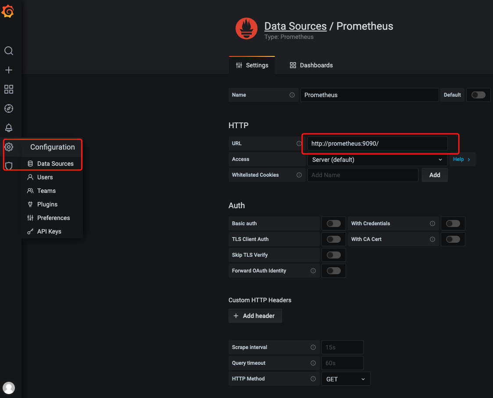

prometheus 是go语言编程的，可以直接下载对应系统的二进制文件运行即可。

**预编译二进制安装**

下载地址: 

- prometheus [https://prometheus.io/download/](https://prometheus.io/download/)
  - centos 下载 `.linux-amd64.tar.gz` 即可
- grafana https://grafana.com/grafana/download

prometheus安装:

```shell
tar -zxvf prometheus-2.25.0.linux-amd64.tar.gz
./prometheus
```

grafana安装：

```shell
wget https://dl.grafana.com/oss/release/grafana-7.4.2-1.x86_64.rpm
sudo yum install grafana-7.4.2-1.x86_64.rpm
```

**docker安装prometheus/grafana**

`docker-compose.md`

```yml
version: '3.2'
services:
  prometheus:
    image: prom/prometheus
    container_name: prometheus
    ports:
      - "9090:9090"
    volumes:
      - ./prometheus.yml:/etc/prometheus/prometheus.yml
    networks:
      - prometheus_network
  grafana:
    image: grafana/grafana
    container_name: grafana
    ports:
      - 3000:3000
    networks:
      - prometheus_network
networks:
  prometheus_network:
    driver: bridge
```

`prometheus.yml`

```yml
# my global config
global:
  scrape_interval:     15s # Set the scrape interval to every 15 seconds. Default is every 1 minute.
  evaluation_interval: 15s # Evaluate rules every 15 seconds. The default is every 1 minute.
  # scrape_timeout is set to the global default (10s).

# Alertmanager configuration
alerting:
  alertmanagers:
  - static_configs:
    - targets:
      # - alertmanager:9093

# Load rules once and periodically evaluate them according to the global 'evaluation_interval'.
rule_files:
  # - "first_rules.yml"
  # - "second_rules.yml"

# A scrape configuration containing exactly one endpoint to scrape:
# Here it's Prometheus itself.
scrape_configs:
  # The job name is added as a label `job=<job_name>` to any timeseries scraped from this config.
  - job_name: 'prometheus'
    # metrics_path defaults to '/metrics'
    # scheme defaults to 'http'.
    static_configs:
    - targets: ['docker.for.mac.host.internal:9003']
```

docker 调用宿主机服务，使用 `docker.for.mac.host.internal` 作为host

**grafana设置prometheus datasource**



