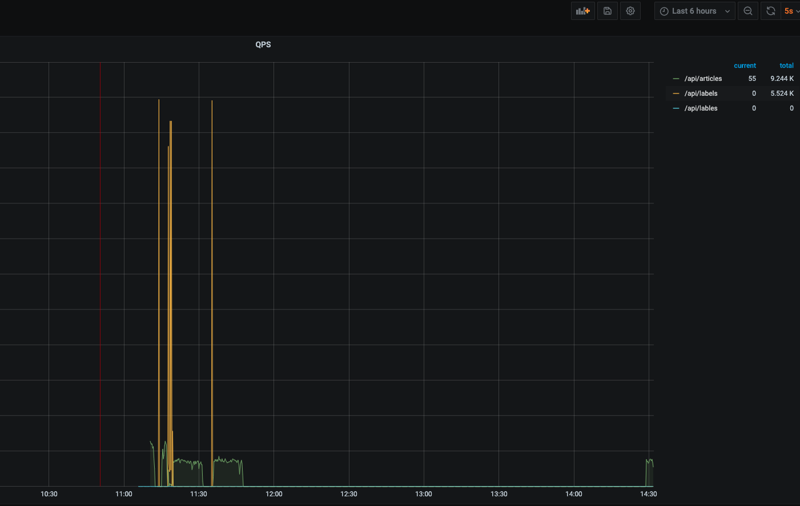

环境：
- gin


# 监控收集
go提供了`client_golang/prometheus` 和 `client_golang/prometheus/promhttp`sdk收集数据,增加一个中间件兼容gin框架
```go
package middleware
const DefaultMetricPath = "/metrics"

var httpRequestTotal = prometheus.NewCounterVec(prometheus.CounterOpts{
	Name: "http_request_total",
	Help: "counter: 统计请求数量",
}, []string{"code", "method", "handler", "host", "url"})

var httpRequestDuration = prometheus.NewHistogramVec(prometheus.HistogramOpts{
	Name: "http_request_duration",
	Help: "histogram：统计响应时间",
}, []string{"code", "method", "handler", "url"})

func init() {
	// 注册收集器
	prometheus.MustRegister(httpRequestTotal)
	prometheus.MustRegister(httpRequestDuration)
}
type monitor struct{}
func NewMonitor(e *gin.Engine) *monitor {
	m := &monitor{}
	// 注册metrics路由
	e.GET(DefaultMetricPath, prometheusHandler())
	// 注册中间件
	e.Use(m.HandleFunc())
	return m
}
func (m *monitor) HandleFunc() gin.HandlerFunc {
	return func(ctx *gin.Context) {
		// metrics 不统计
		if ctx.Request.URL.Path == DefaultMetricPath {
			ctx.Next()
			return
		}
		start := time.Now()
		ctx.Next()
		status := strconv.Itoa(ctx.Writer.Status())
		httpRequestTotal.WithLabelValues(status, ctx.Request.Method, ctx.HandlerName(), ctx.Request.Host, ctx.Request.RequestURI).Inc()
		httpRequestDuration.WithLabelValues(status, ctx.Request.Method, ctx.HandlerName(), ctx.Request.URL.Path).Observe(time.Since(start).Seconds())
	}
}
func prometheusHandler() gin.HandlerFunc {
	h := promhttp.Handler()
	return func(c *gin.Context) {
		h.ServeHTTP(c.Writer, c.Request)
	}
}
```


# QPS监控
这里使用prometheus有4中监控类型中的[Counter](https://prometheus.io/docs/concepts/metric_types/)，http_request_total counter单调递增的计数器,每次请求来都会加1，labels记录响应吗，域名、url，handler

对于counter类型是一直累加获得数据，而QPS是每秒的请求处理量，prometheus提供了rate和irate两个函数

**rate**

rate会取指定时间范围内所有数据点，算出一组速率，然后取平均值作为结

**irate**

在指定时间范围内的最近两个数据点来算速率

irate适合快速变化的计数器，rate适合缓慢变化的计数器

**公式**

```prometheus
irate(http_request_total[5m])
```


