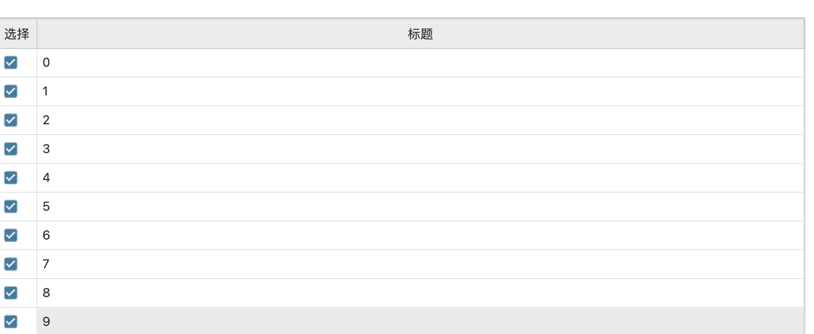

### 1. qtablewidget增加选择框？

```
cb = QtWidgets.QTableWidgetItem()
# item 转为checkbox，样式受checkbox样式影响
cb.setFlags(QtCore.Qt.ItemIsUserCheckable | QtCore.Qt.ItemIsEnabled)
# 居中
cb.setTextAlignment(QtCore.Qt.AlignCenter)
# 选中状态
cb.setCheckState(QtCore.Qt.Unchecked if not row.checked else QtCore.Qt.Checked)
# i：第i行，0：第0列，
self._table_widget.setItem(i, 0, cb)
```

样式：

```qss
/*---------qcheckbox-----------*/
QCheckBox {
}

QCheckBox::indicator {
    /* 选择框尺寸 */
}

QCheckBox::indicator::checked:pressed {
    image:url(:/resource/checkbox-checked.png);
}
QCheckBox::indicator::checked {
    image:url(:/resource/checkbox-checked.png);
}
```

效果：


### 2. QTableWidget设置进度条QProgressBar

```python
bar = QtWidgets.QProgressBar()
bar.setMinimum(0)
bar.setMaximum(100)
bar.setValue(100)
bar.setTextVisible(True)
self._table_widget.setCellWidget(0, 4, bar)
```

样式

```css
QProgressBar {
    text-align: right;
    vertical-align: center;
    padding-right: 40px;
    color: $selectBackground;
}

QProgressBar::chunk {
    background-color: $selectBackground;
    width: 10px;
    margin: 0.5px;
    text-align: center;
}
```

效果


### QTableWidget导出excel

https://blog.csdn.net/weixin_41882459/article/details/108394548