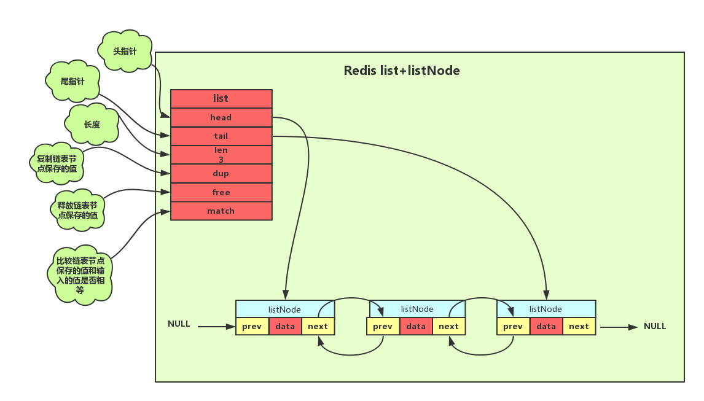

# redis链表节点


```c
typedef struct listNode
{ 
    // 前置节点 
    struct listNode *prev; 
    // 后置节点 
    struct listNode *next; 
    // 节点的值 
    void *value; 
} listNode;
```

# redis list结构

```c
typedef struct list{
    //表头节点
    listNode *head;
    //表尾节点
    listNode *tail;
    //链表所包含的节点数量
    unsigned long len;
    //节点值复制函数
    void *(*dup)(void *ptr);
    //节点值释放函数
    void *(*free)(void *ptr);
    //节点值对比函数
    int (*match)(void *ptr,void *key);
}list;
```
Redis链表结构其主要特性如下:
- 双向：链表节点带有前驱、后继指针获取某个节点的前驱、后继节点的时间复杂度为0(1)。
- 无环: 链表为非循环链表表头节点的前驱指针和表尾节点的后继指针都指向NULL，对链表的访问以NULL为终点。
- 带表头指针和表尾指针：通过list结构中的head和tail指针，获取表头和表尾节点的时间复杂度都为O(1)。
- 带链表长度计数器:通过list结构的len属性获取节点数量的时间复杂度为O(1)。
- 多态：链表节点使用void*指针保存节点的值，并且可以通过list结构的dup、free、match三个属性为节点值设置类型特定函数，所以链表可以用来保存各种不同类型的值

# list在redis中的使用
列表对象在底层的实现就是list，此外如：订阅、慢查询、监视器等，

|操作\时间复杂度|数组|单链表|双向链表|
|--|--|--|--|
|rpush(从右边添加元素)|O(1)|O(1)|O(1)|
|lpush(从左边添加元素)|0(N)|O(1)|O(1)|
|lpop|(从右边删除元素)|O(1)|O(1)|O(1)|
|rpop|(从左边删除元素)|O(N)|O(1)|O(1)|
|lindex(获取指定索引下标的元素)|O(1)|O(N)|O(N)|
|len|(获取长度)|O(N)|O(N)|O(1)|
|linsert(向某个元素前或后插入元素)|O(N)|O(N)|O(1)|
|lrem|(删除指定元素)|O(N)|O(N)|O(N)|
|lset|(修改指定索引下标元素)|O(N)|O(N)|O(N)|

