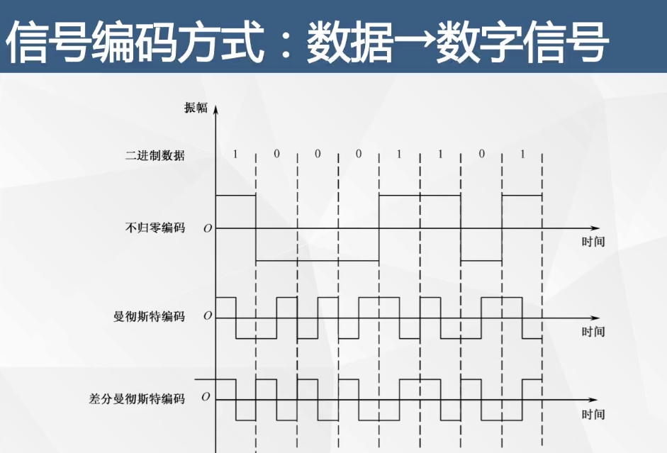
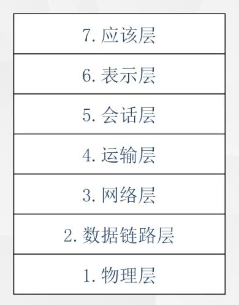
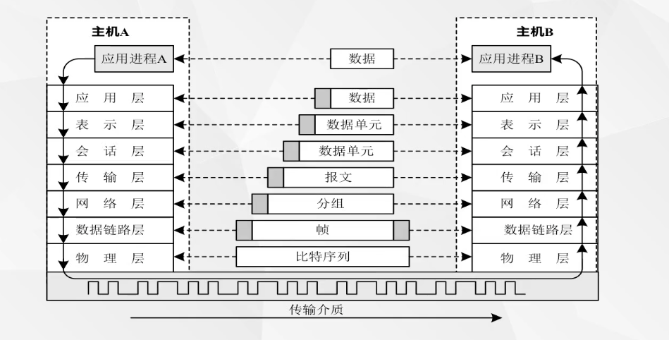
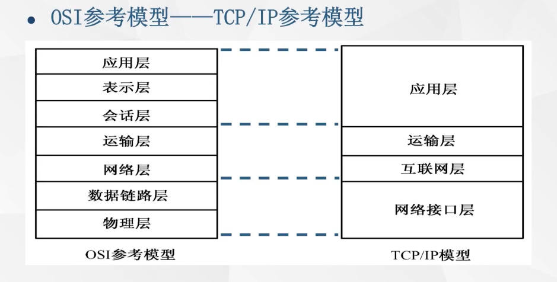
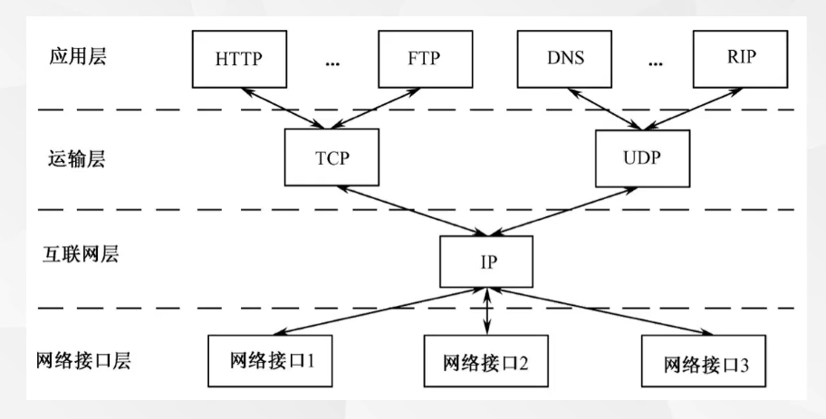
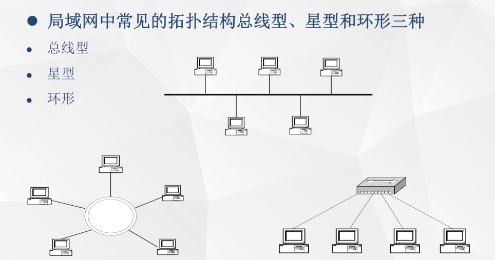
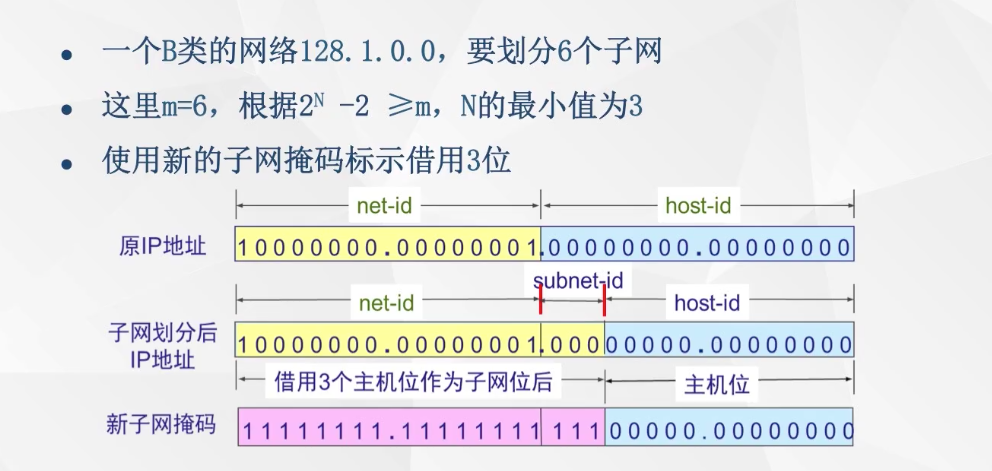
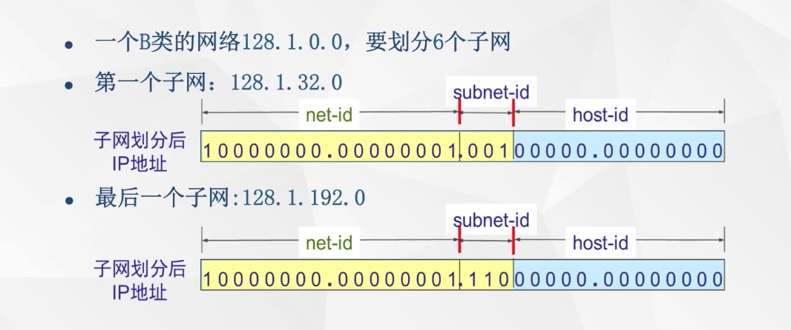

#
计算机网络概述

* 计算机网络组成

终端,网线,交换设备\(路由器,交换机\)

* 网络交换技术

电路交换\(电话通讯\),面向连接

报文交换

分组交换

* 网络拓扑结构

星型 环型 总线型 树型 网状型\(广域网\)

# 数据通信技术基础

* 信息:

信息-&gt;数据-&gt;信息

* 信息编码方式: 数据-&gt;信号


* 信息编码方式: 数据-&gt;数字信号



曼彻斯特编码: 从高到低代表1,低到高0

差分曼彻斯特编码: 上一个和下一个相同代表1:否则0

- 数据传输方式: 单工,半双工,全双工

# 传输介质 双绞线的制作

# 网络体系结构
1. OSI参考模型





2. TCP/IP参考模型





# 局域网



# 子网
ip子网划分方法:
- 确定借用多少位主机位: 如果需要划分m个子网,假设需要借用n位主机位,两者满足 `2的n - 2 >= m`
- 确定子网划分的新的子网掩码
- 确定每个子网划分后的新的子网掩码
- 确定每个子网的网络地址(每个网段的第一个地址)是什么
- 确定每个子网的广播地址(每个网段的最后一个地址)是什么
- 确定每个子网中有效主机范围是什么

```
128.1.0.0 划分6个子网
n >= 3

网络位  -   子网掩码   -  主机位
第一个         128 .1 .32 .0
最后一个       128 .1 .192 .0

第一个子网第一个可用ip地址  128.1.32.1
10000000  00000001  001 00000  00000001

第一个子网最后一个可用ip地址  128.1.63.254
10000000  00000001  001 11111  11111110

广播地址网络不变,主机位全变成1  128.1.63.255
10000001  00000001  001 11111  11111111

第二个子网  网络 128.1.64.0  网段 128.1.64.1 - 128.1.95.254
10000000  00000001  010 00000  00000001

第三个子网  网络 128.1.96.0  网段 128.1.96.1 - 128.1.127.254
10000000  00000001  011 00000  00000001

第四个子网  网络 128.1.128.0  网段 128.1.128.1 - 128.1.159.254
10000000  00000001  100 00000  00000001

第四个子网  网络 128.1.160.0  网段 128.1.160.1 - 128.1.191.254
10000000  00000001  101 00000  00000001

第五个子网  网络 128.1.192.0  网段 128.1.192.1 - 128.1.223.254
10000000  00000001  110 00000  00000001

第五个子网  网络 128.1.224.0  网段 128.1.192.1 - 128.1.255.254
10000000  00000001  111 00000  00000001

新子网掩码: 255.255.224.0 网络位全变1,主机位全0
11111111  111111111  111 00000  00000000
```





