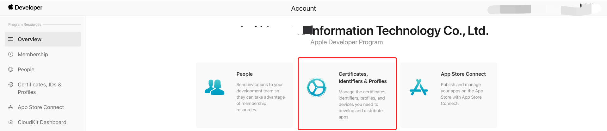

概述：

- 注册加入 Apple Developer Program
- 具有 **Sign In with Apple** 功能的 App Id
- 关键配置: App ID/Service ID/Keys
- Jwt: 校验，apple提供了2种校验方式
  - 通过code获取token验证
  - 通过接口获取public key，验证jwt

##  配置Sign in with Apple

登录界面：

#### 配置App ID

### App Id 开启 Sign In with Apple

文档：[https://help.apple.com/xcode/mac/11.0/#/dev50571b902](https://help.apple.com/xcode/mac/11.0/#/dev50571b902) 

https://mp.weixin.qq.com/s/xkxCnKqA0u-guEYcYCkcOg 账号注册流程

https://juejin.cn/post/6844903914051993607 流程

https://github.com/RafPe/go-jwk-pem/blob/master/main.go  go jwt to pem

