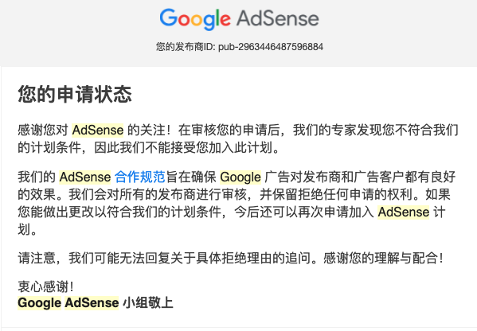
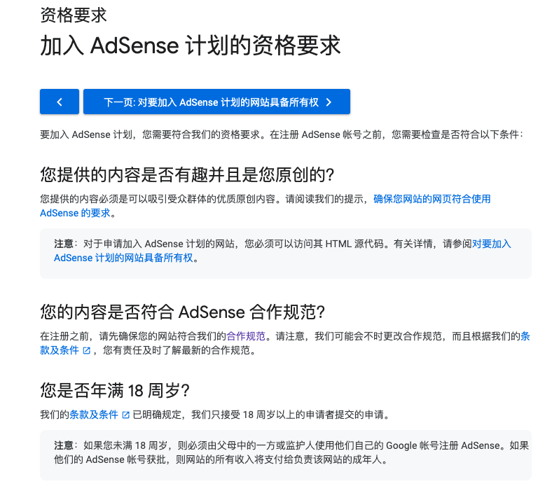
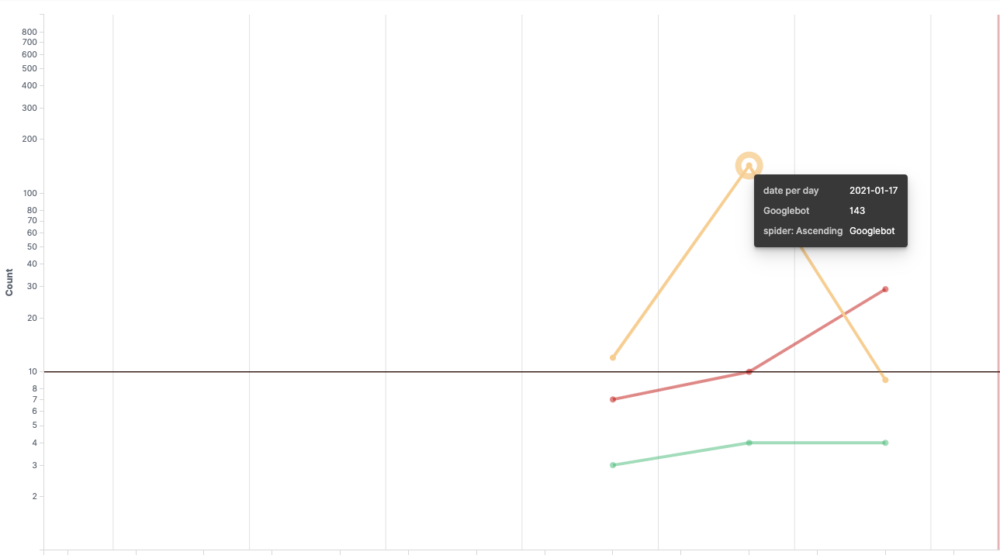

非常重要：原创，原创数量，Google搜索引擎收录数量

总结一下我的3次申请经历，希望能给大家有点提示

第一次申请：2018年3月那时开始学习react，摸索着做了一个视频种子站（00h.tv），现在在google上还是可以通过  [site:00h.tv](https://www.google.com/search?q=site%3A00h.tv) 看到当时已经被收录的页面，申请时也没有报太大的希望～，google也不会让你失望

第二次申请：2020年快过年那会申请，此时的我已经工作了3年了，会go php python c，有一次面头条，被问到你有什么优势，瞬间懵逼了。故此才决定开始写博客。从整个架子搭建出来以后就开始申请google adsense，又被拒绝了～，也是因为没啥内容，质量也不过关

这会得贴一下google adsense加入 [AdSense 计划的资格要求](https://support.google.com/adsense/answer/9724?hl=zh-Hans)，第一条就是：**您提供的内容是否有趣并且是您原创**的，可以看作是申请时唯一的要求了

第三次申请：2021-01-16填写的申请，01-17号就获得了资格，也就是说如果你的网站是合格的话（稳定性很重好），一天就可以出结果了。这里可以看下我申请后，网站内google搜索引擎蜘蛛的请求量，正常情况每天也就10个左右，但是申请后1天内爬虫达到了143次

接下来就是维护了，其实维护比申请更重要，被封了以后此账号再也没有机会了

- **不要自己点击：** 对 Google 广告的点击必须来自真正感兴趣的用户，严禁以任何手段虚增 Google 广告的点击次数或展示次数。禁止使用的手段包括但不限于：人工重复点击或展示，使用可自动产生点击和展示的工具，以及诉诸漫游器或欺诈性软件。**请注意，发布商不得出于任何原因点击自己的广告。**

- **不要引导用户点击：** 虚假消息，出人意料的点击区域，误导性网站行为，操纵浏览器历史记录，社交工程学（网上诱骗网站和欺骗性网站），自动重定向，模仿移动中或点击中的鼠标指针，试图诱使用户与其互动。列出来就说明google已经有响应的反作弊措施了
- **其他反人类的内容：** 这个比较放心，毕竟在国内是要备案的，我是不敢发的～