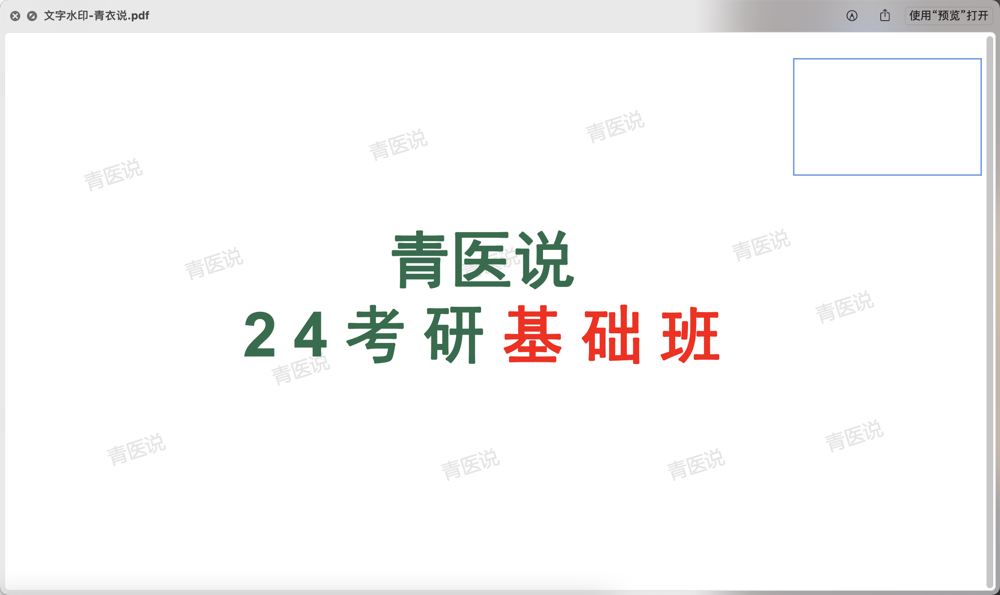
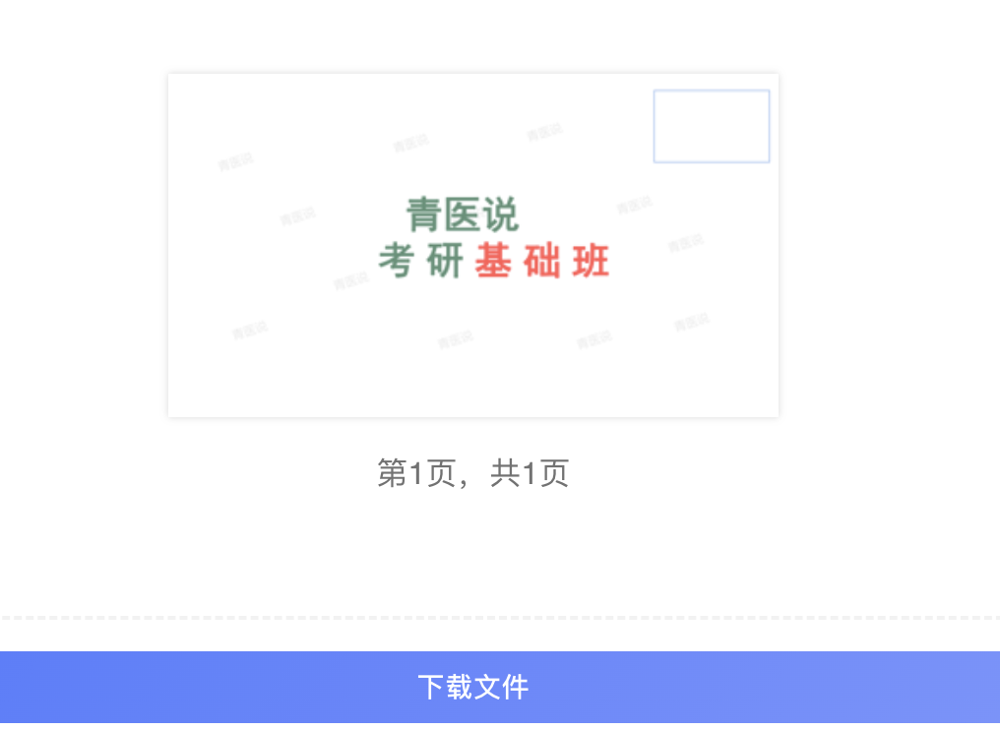

网址：https://www.douyacun.com/pdf/delete-text

微信小程序：搜索 「**大宁宝箱**」

步骤概览

- 第一步：选择文件，上传文件
- 第二步：选择页面，分析文字
- 第三步：选择文字，删除文字
- 第四步：预览成果，下载文件

优势

- PDF删除文字速度快，准确度高
- 支持删除单页/整本文字
- 结果预览

问题：

- 无法精准删除，不影响其他位置、其他页面（努力优化）
- 第三步识别的文字  字体、颜色 信息无法展示 （后续优化）
- 点击选择文字时会选中多处？（后续优化）
- 只想删除某页的文字，整本内容都删除了？

#### 第一步：选择文件

支持拖拽文件上传

文件上传完成后需要选择第几页来分析文字，如下图：

#### 第二步：选择页面、分析PDF文字

> 选择第几页是为了快速分析文字，如果分析整本PDF会可能占用多的资源和时间

点击立即分析之后会提取第N页的文字内容，这里可以会提取文字字体编码、大小，后续会分析文字颜色，如下图：

这里有2种情况：

1. 每个字单独分开，如上
2. 几个字拼在一起，点击会全部删除

#### 第三步：选择删除文字

点击文字选中需要删除的文字，会有中划线标记需要删除的文字，如上图。

问题：**点击选择文字时会选中多处？（如上图红线标记的地方）**

> PDF删除文字是通过匹配字体编码的方式进行删除的，如果是相同字体相同长度的文字，那选中的都会被删除掉
>
> 后续优化！

问题：**只想删除某页的文字，整本内容都删除了！**

> 这种情况多见于文字水印，PDF为了减小体积，对于相同的内容是可以以引用的方式加载
>
> 这里多半情形无需优化！

 

### 第四步：成果预览、下载文件

下方是原图和删除文字后的对比图，第二张是第四步成果预览的截图。

