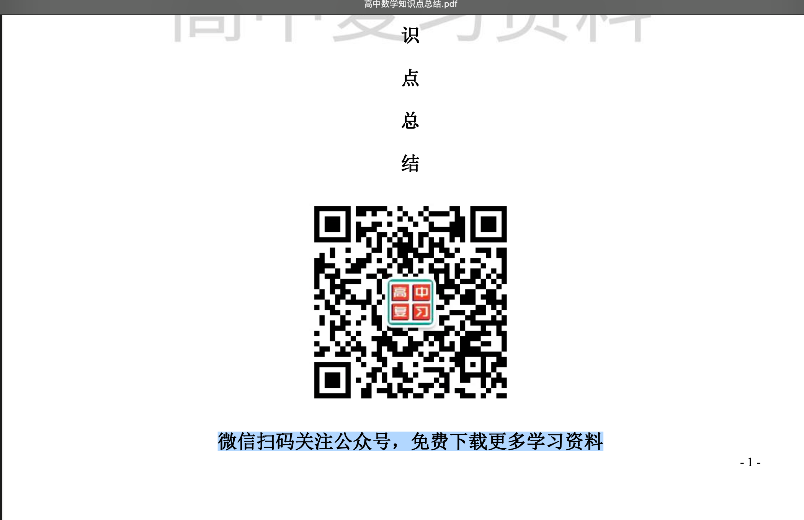

**在线网站地址：[https://www.douyacun.com/pdf/remove-watermark](https://www.douyacun.com/pdf/remove-watermark)**

**步骤：**

**第一步：**选择文件

**第二步：**处理图片水印，点击分析文档，此步骤会分析文档中的疑似水印的图片，对与确认是水印的会标记删除，这一步需要确认以免误删或遗漏

**第三步：**处理文字水印，可以打开文档，尝试选中

如果可以像下图一样选中文字，可以确定这是文字水印，如下图，需要在填写框中填写粘贴上面的文字： ”微信扫码关注公众号，免费下载更多学习资料“

**第四步：**点击清理文档，清理完成后，点击下载文档即可

