**下载地址**：

- [windows](https://www.douyacun.com/s/pdf_tools.exe)
- [mac](https://www.douyacun.com/s/pdftools)

PDF工具箱功能：

[toc]

# 一、PDF去水印-专业版

**先介绍常见的PDF水印：**

- 文字水印，可以选中，并且文字可以复制出来（空空说考研）的，就是文字水印，此类水印一般是在正文图层下方

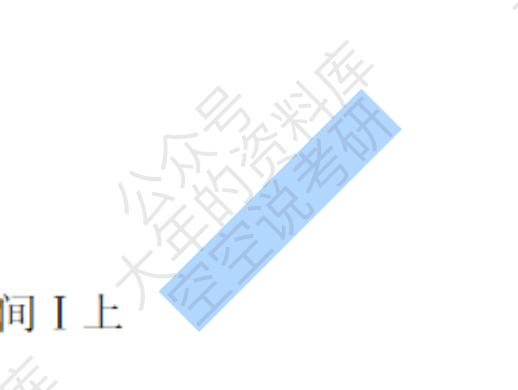

- 图片水印，此类水印需要分为2种
  - 正文中嵌入水印图片，典型的像是扫描全能王的水印

      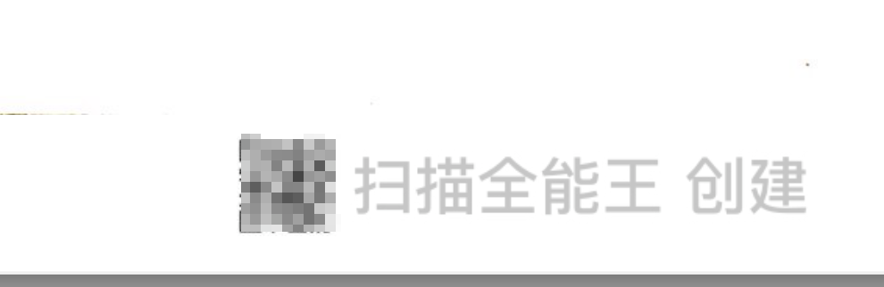

  - 正文和水印是一张图片，这种水印是需要图片去水印的，目前PDF还不支持图片去水印

- 图形水印，将unicode文字用贝尔曲线画出来的图形（画图工具嵌入的文字就是贝尔曲线），可以选中但是文字复制不出来，这种水印是难以识别的，文字转图形以后就无法在转回来了。不过软件可以将这块内容标记出来，供大家判别是否为水印。

    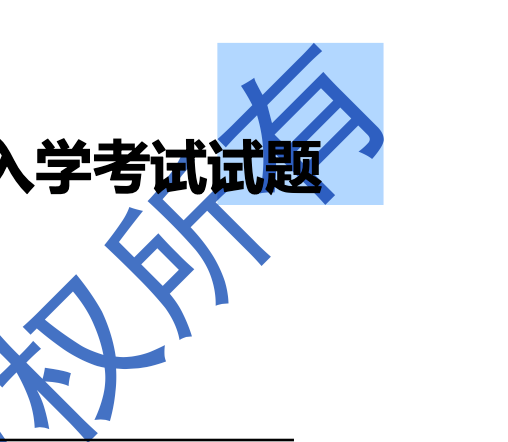

**去水印步骤（windows与mac一致）：**

1. 选择PDF文件

选择文件以后软件会分析PDF文件中的文字水印、图片水印、图形水印

2. 图片水印

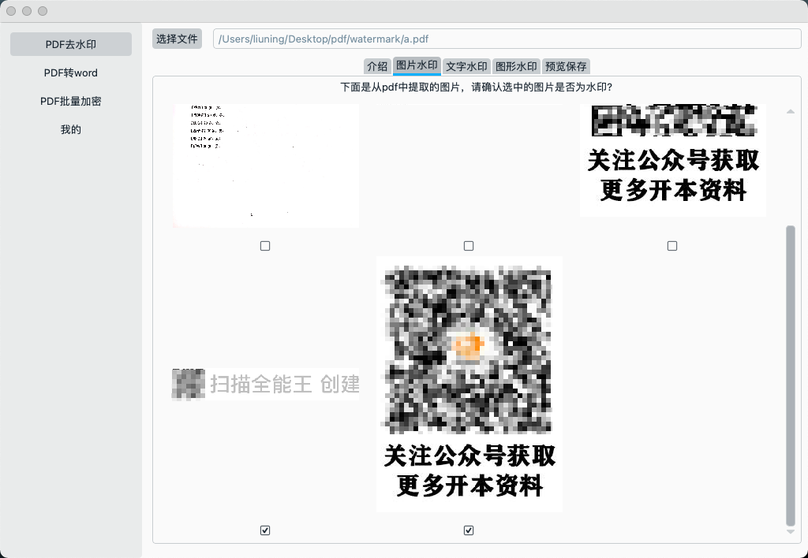

软件会提取嵌入在正文中的图片，如上图，像这种水印是和正文分开的，是可以去掉的。

但如果像是下面这种，正文文字和水印在同一张图片上是去不掉的。常见的就是扫描版的图书

3. 文字水印

选择文件后软件分析PDF最多前10页的所有文字段落并统计出现次数：

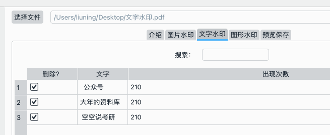

大家可以用这个功能来删除文字

4. 图形水印

选择文件后会分析PDF中的文字图形水印，然后将其截图标记出来，如下图：

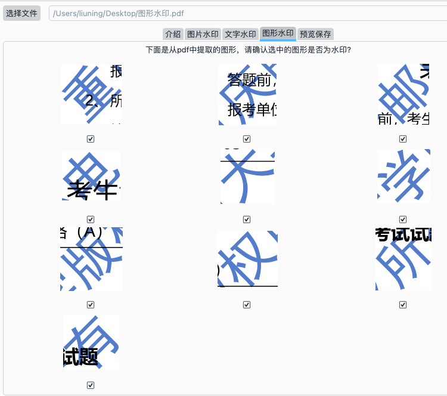

5. 预览保存

预览保存，会将判别为水印的文字移除掉，可以预览去水印效果是否能去掉水印，预览效果只会处理一次，再次预览不会二次处理，需要重选文件后预览。

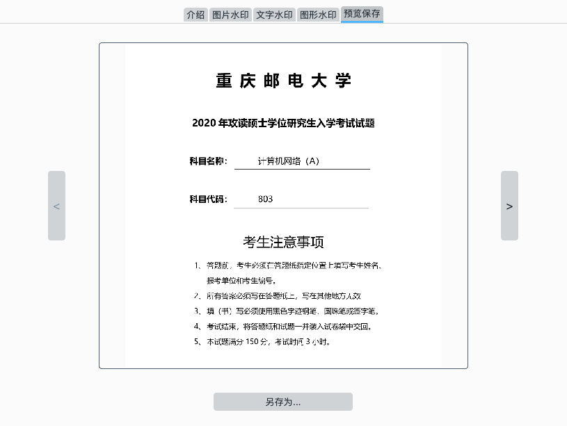

# 二、PDF转Word

使用步骤：

1. 选择文件

2. 保存为docx

控制台会显示处理进度：

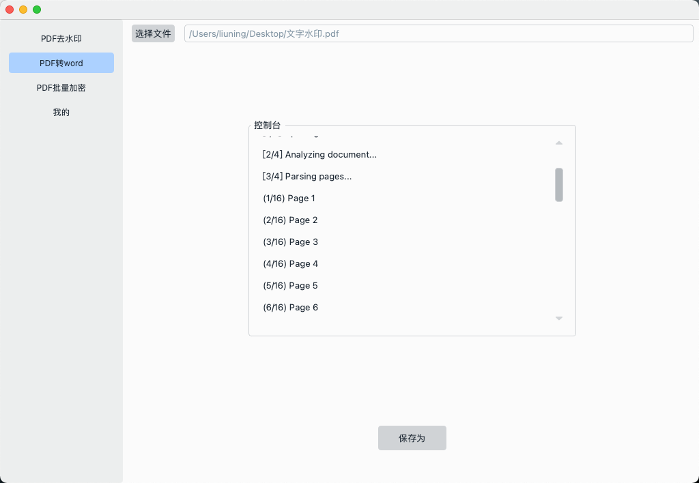

# 三、PDF批量加密文件

PDF批量加密功能，选择目录会遍历目录下的所有PDF文件，展示在下方表格中。可以取消勾选来取消加密文件

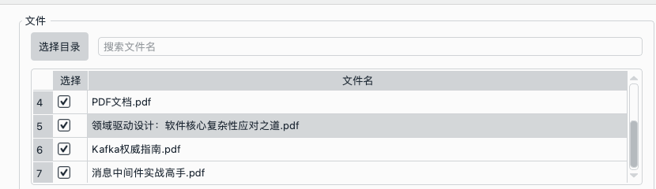

加密选项：

**用户密码：** 只有使用用户密码才可以打开PDF文件，否则无法访问，加密方式默认使用res_256（原美国军方）加密。此加密比较安全，难以破解。

**所有者秘密：** 此项用作限制用户复制、打印、修改、添加备注、添加表单的权限，没有密码也是可以访问文件内容。

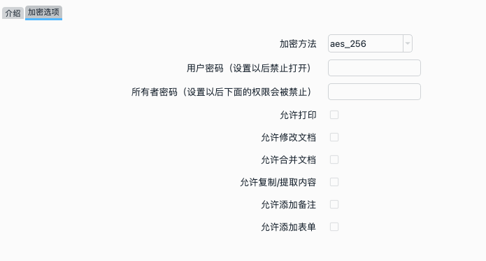

用户密码 和 所有者密码 可以同时设置不同的密码，

填写所有者密码以后，默认是禁止打印、禁止修改文档、禁止合并文档、禁止复制/提取内容、禁止添加备注、禁止添加表单。

# 四、PDF转图片

文档待补充～

**软件截图**

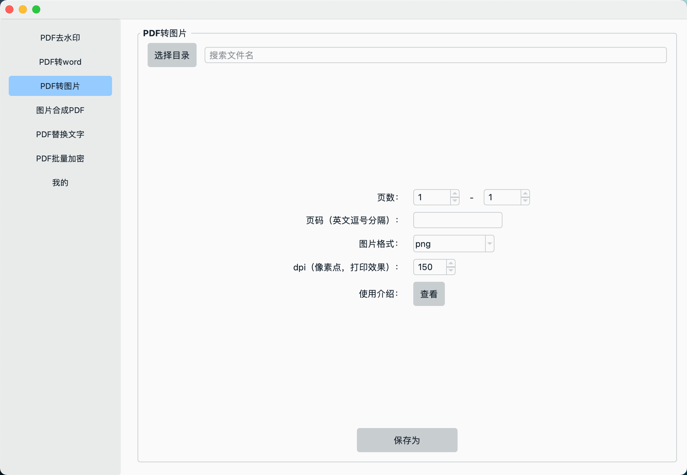

**参数介绍**

页数：从 x - y 生成图片，比如: 1-10 表示会生成 从第一页到第十页 11张图片， 此项与页码互不影响。

页码：特殊指定某页，比如: 1,2,4,8,9

图片格式：支持png、jpeg、webp

dpi：像素点，会影响打印效果，超过300dpi，人眼是分辨不出来的

保存：建议选择一个空文件夹，图片以页码作为文件名

# TODO

## PDF强力水印

## 

## 图片合成PDF
