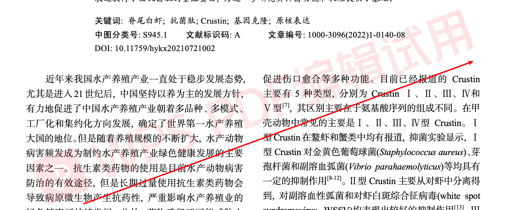
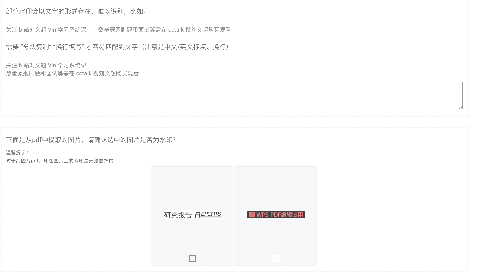
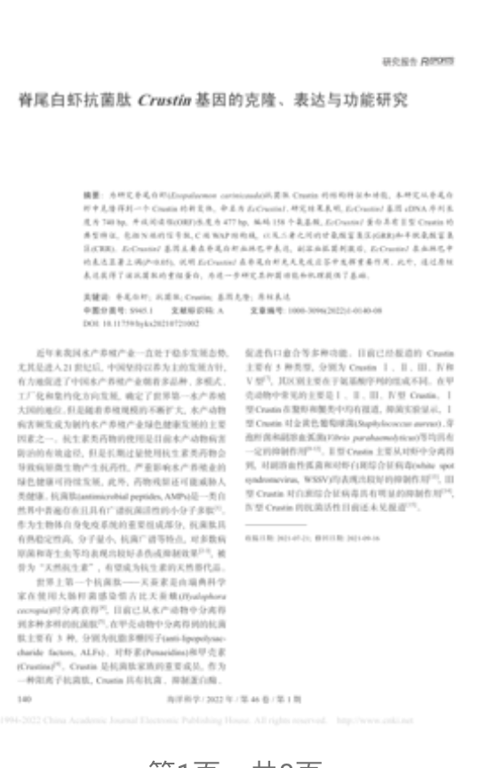
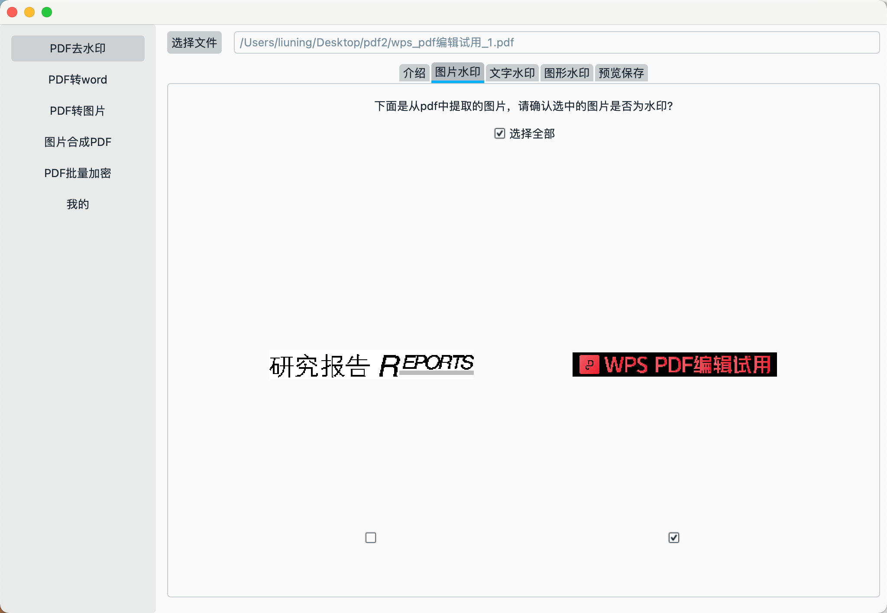
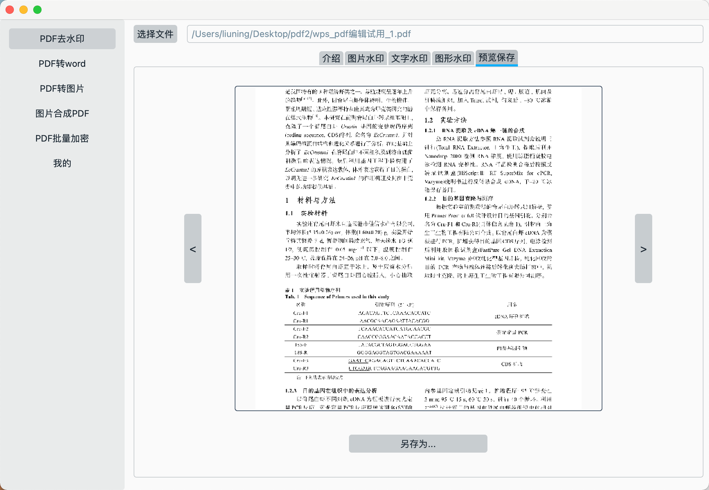

大家如何去除 wps word导出来的pdf文件水印  "WPS PDF编辑试用" ,

一、通过网站去除"WPS PDF编辑试用"水印

1. 打开网站: https://www.douyacun.com/pdf/remove-watermark

2. 选择PDF文件，分析PDF文件，勾选 `WPS PDF编辑试用` 水印图片

3. 预览去除"WPS PDF编辑试用"水印的效果，点击下载文件即可

二、PDF工具箱使用教程

下载地址：

mac: [https://www.douyacun.com/s/pdftools](https://www.douyacun.com/s/pdftools)

windows: [https://www.douyacun.com/s/pdf_tools.exe](https://www.douyacun.com/s/pdf_tools.exe)

选择文件

图片水印：勾选“WPS PDF编辑试用”水印图片

文字水印：搜索并选中文字水印，取消其他不是水印的文字

预览保存：

