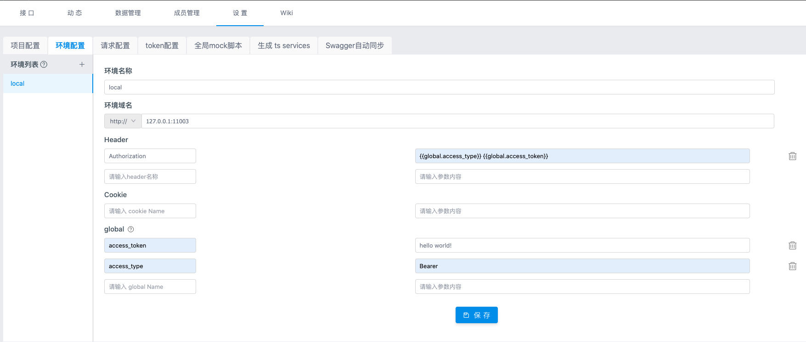
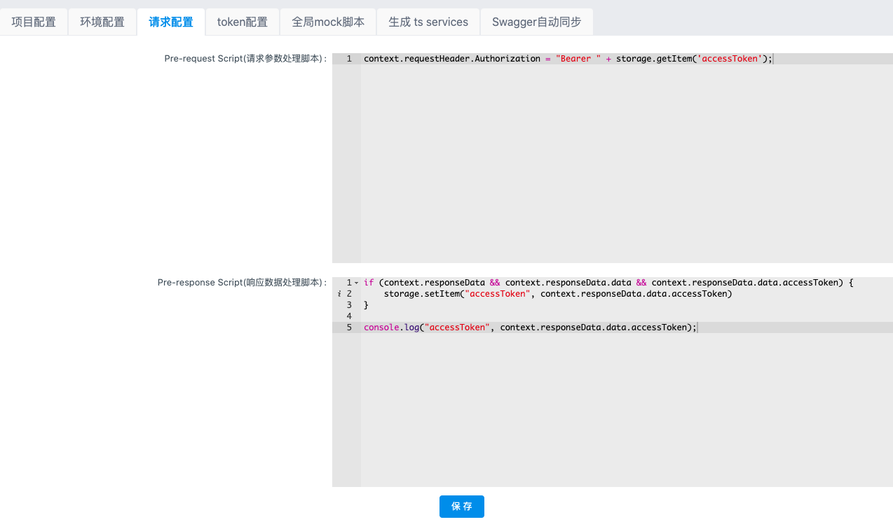
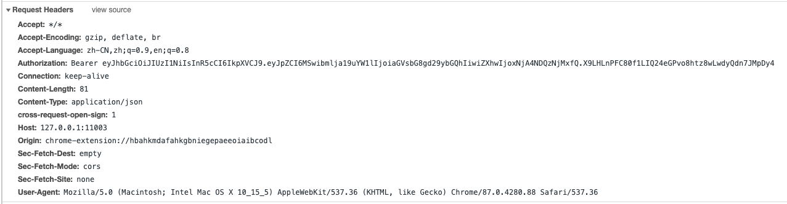

# yapi 设置环境变量，如何修改全局变量？

`环境配置` 一项可以添加该项目下接口的实际环境，供 [接口测试](https://hellosean1025.github.io/yapi/documents/case.html) 使用，这里增加了全局 header，可以在项目中设置全局 header 值



可以设置全局的header，cookie，global，使用 `{{}}`来引用环境变量，但是大部分使用环境变量的场景是需要能自动修改环境变量，比如：调用登录接口获取token，其他接口在调用时可以自动设置 `Authorization: Bearer helloworld`这种场景，如果使用global，yapi没有提供可以修改global的接口，做不到


那怎么办？我肯定不会每次token过期了再去手动设置global access_token的！


思路：

yapi提供了 storage 来存储数据 和  pre-script/pre-script 请求前后处理脚本。

每次调用登录接口后存储 access_token到storage中, 然后每次请求拼接设置header  `Authorization: Bearer helloworld`

`Pre-request Script(请求参数处理脚本)`

```js
context.requestHeader.Authorization = "Bearer " + storage.getItem('accessToken');
```

`Pre-response Script(响应数据处理脚本)`

```js
if (context.responseData && context.responseData.data && context.responseData.data.accessToken) {
    storage.setItem("accessToken", context.responseData.data.accessToken)
}

console.log("accessToken", context.responseData.data.accessToken);
```




注意必须保存才能生效的，不生效看看有没有保存成功，字段是否一致？

请求成功案例：

[YApi 新版如何查看 http 请求数据](https://juejin.cn/post/6844903795743260685)

