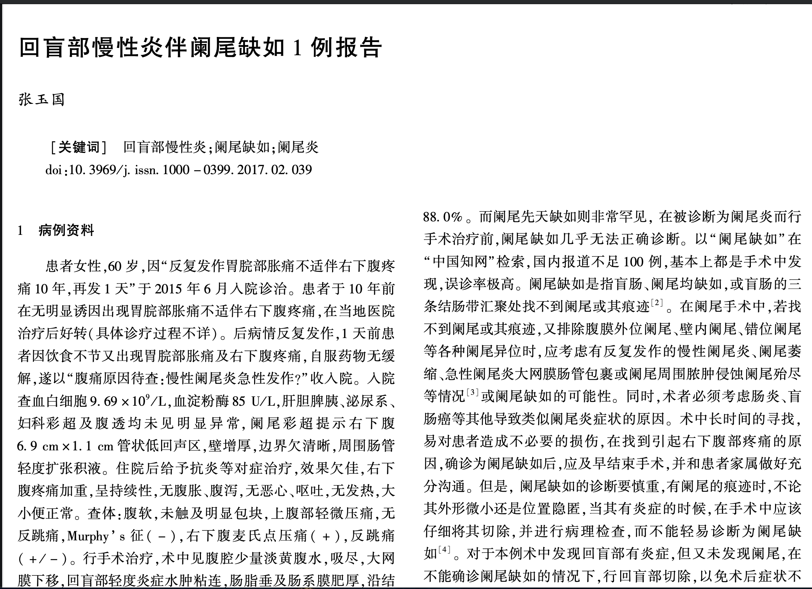

网站地址：[https://www.douyacun.com/image/ocr-to-docx](https://www.douyacun.com/image/ocr-to-docx)

**功能特点：**

1. 识别图片上的文字
2. 按照图片文字样式进行格式化
3. 导出为word文档
4. 2算法实现：googel-tesseract-ocr / easyocr
5. 借助开源库实现，功能免费

**背景：**

几天前媳妇给了我一张图片，让我把图片上的内容导出来为可以编辑，识别图片文字的软件有挺多的了，不过能相对格式化的不多，借这次东风就顺便了解了一下文字识别（OCR）相关的技术，经过一段时间摸底之后找到了3种比较靠谱的方式

最先接触到的第一个开源工具Tesseract，大家说的比较多是Tesseract对于中文不是很友好，识别率不高。在我多次调试配置之下发现他们都是没有用心学习Tessract，实践下来发现：中文识别率较高，中文标点准确。cpu识别速度可以接受。

第二个了解到的工具请教了一下搞算法的同学，他告诉我用百度云的接口，中文识别率较高，速度快，API可享每天1000次免费调用，对于我来说尝鲜足够了。要是做成一个功能就比较费钱了。

第三个工具是在逛Github途中发现的，easyocr，尝试下来总结：中文识别  率较高，中文符号识别率不高，有人提过issue，作者也在3.0.1的版本进行了修复，实验了几次还是不准。CPU速度较慢，没有GPU所以没有尝试GPU的速度如何。

测试用例1:



Tesseract-or识别结果：


**技术实现：**

- tesseract-ocr（40.4k star）: https://github.com/tesseract-ocr/tesseract  c++ 语言实现
  - pytesseract（3.7k star）: https://github.com/madmaze/pytesseract  python对tesseract-ocr的包装
  - goesseract （1.5k star）：https://github.com/otiai10/gosseract go语言对tesseract-ocr的包装
- easyocr （1.7k star）: https://github.com/JaidedAI/EasyOCR python语言实现

最终选择 pytesseract + easyocr 来实现的功能，2个包都是python实现，可以多一种替代方案。python-docx来保存docx

easyocr 返回的只是bbox位置信息

```json
([[462, 162], [1376, 162], [1376, 264], [462, 264]], '会议签到小程序 MRD 文档', 0.6382400515609702)
# （左上 右上 左下 右下），内容，可信度
([[177, 473], [435, 473], [435, 539], [177, 539]], '1.行业背景', 0.8461557775997883)
```

判断上下2行文本是否属于同一行的内容就需要根据bbox x、y信息判断。

而pytesseract 提供了hocr的方式，Block/TextBlock/line 可以比较方便判断是否为同一段落的内容，甚至可以区分左右分页段落

```xml
<ComposedBlock ID="cblock_0" HPOS="467" VPOS="175" WIDTH="900" HEIGHT="75">
  <TextBlock ID="block_0" HPOS="467" VPOS="175" WIDTH="900" HEIGHT="75">
    <TextLine ID="line_0" HPOS="467" VPOS="175" WIDTH="900" HEIGHT="75">
      <String ID="string_0" HPOS="476" VPOS="175" WIDTH="133" HEIGHT="75" WC="0.93" CONTENT="会"/><SP WIDTH="15" VPOS="175" HPOS="609"/>
      <String ID="string_1" HPOS="624" VPOS="176" WIDTH="51" HEIGHT="70" WC="0.92" CONTENT="议"/><SP WIDTH="30" VPOS="176" HPOS="675"/>
      <String ID="string_2" HPOS="705" VPOS="177" WIDTH="116" HEIGHT="72" WC="0.88" CONTENT="签到"/><SP WIDTH="7" VPOS="177" HPOS="821"/>
      <String ID="string_3" HPOS="828" VPOS="177" WIDTH="105" HEIGHT="72" WC="0.95" CONTENT="小"/><SP WIDTH="5" VPOS="177" HPOS="933"/>
      <String ID="string_4" HPOS="938" VPOS="171" WIDTH="108" HEIGHT="106" WC="0.91" CONTENT="程序"/><SP WIDTH="-7" VPOS="171" HPOS="1046"/>
      <String ID="string_5" HPOS="1039" VPOS="191" WIDTH="154" HEIGHT="50" WC="0.91" CONTENT="MRD"/><SP WIDTH="25" VPOS="191" HPOS="1193"/>
      <String ID="string_6" HPOS="1218" VPOS="176" WIDTH="149" HEIGHT="73" WC="0.96" CONTENT="文档"/>
    </TextLine>
  </TextBlock>
</ComposedBlock>
```

- HPOS: 横向距离 X轴
- VPOS: 竖向距离 Y轴
- WIDTH: 宽度
- HEIGHT: 高端

使用这4个参数可以计算出像bbox一样的位置信息。

相应的代码实现在github：https://github.com/douyacun/ocr-to-docx

