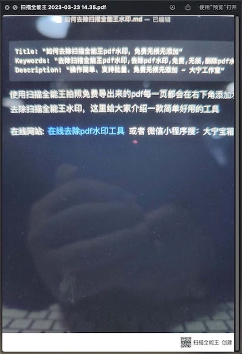
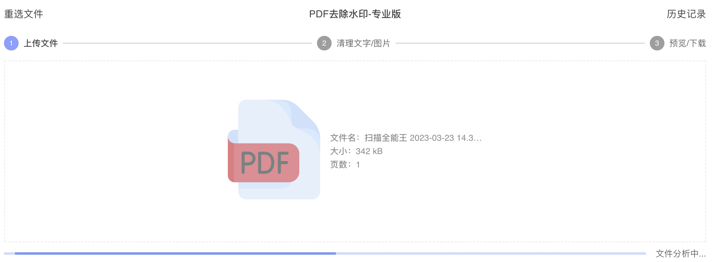
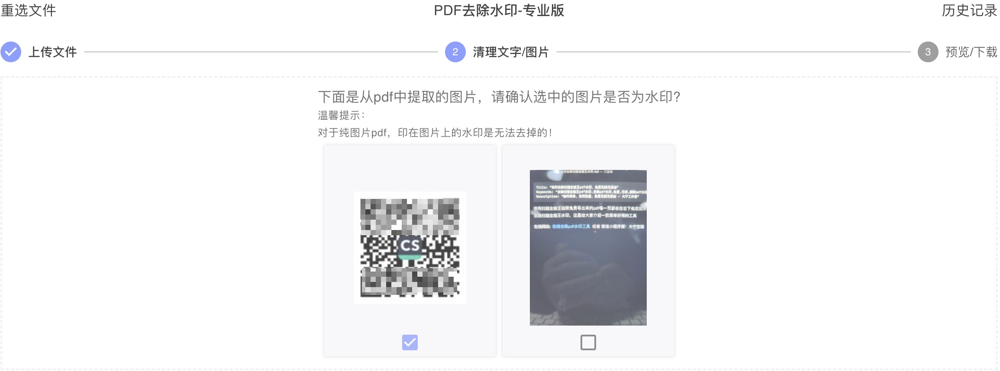

扫描全能王拍照免费导出来的pdf每一页都会在右下角添加水印『扫描全能王 创建』，如何免费去除扫描全能王水印，这里给大家介绍一款简单好用的工具，无需转为word，支持批量去除pdf每一页的扫描全能王水印，保留原有pdf格式，无添加，下面就是写这一篇文章时现场用扫描全能拍照导出的pdf截图

在线网站:  [在线去除pdf水印工具](https://www.douyacun.com/pdf/remove-watermark)  或者 微信小程序搜：大宁宝箱， 下面介绍操作步骤

第一步：选择文件，上传文件

> 但是文件安全的小伙伴，可以使用桌面软件pdf工具箱，本地处理，不会上传到服务器，安全可靠
>
> 也可以放心使用网站去除水印，文件是上传到阿里云oss对象私有加密存储，去除水印的文件下载链接也是经过加密处理，5分钟有效，每天凌晨自动删除前一天的所有文件

第二步：分析文件，识别水印

这一步可以识别出扫描全能王的二维码图片水印，是『扫描全能王 创建』的文字水印程序就可以判断，没有展示出来

