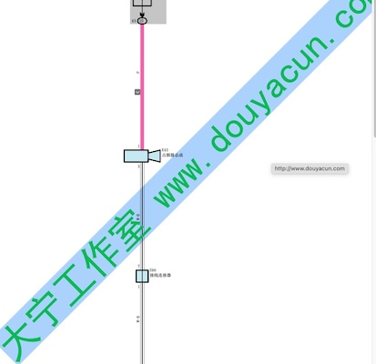
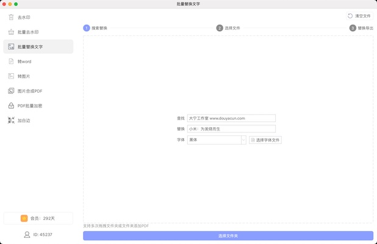
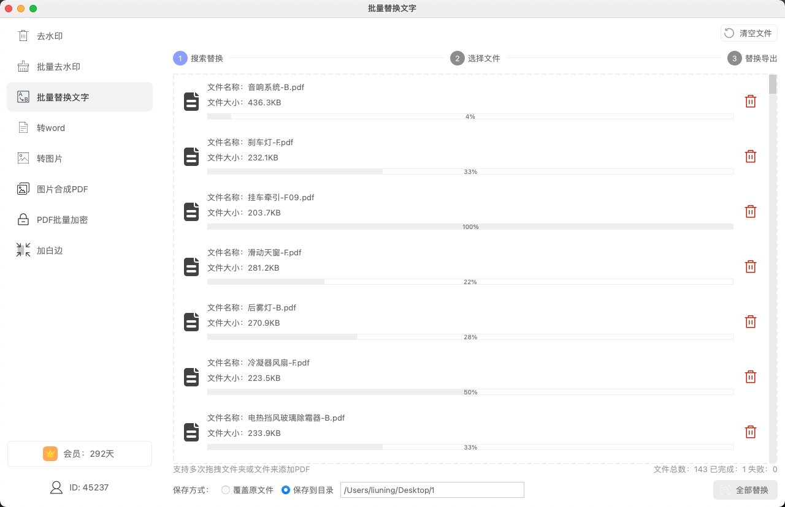
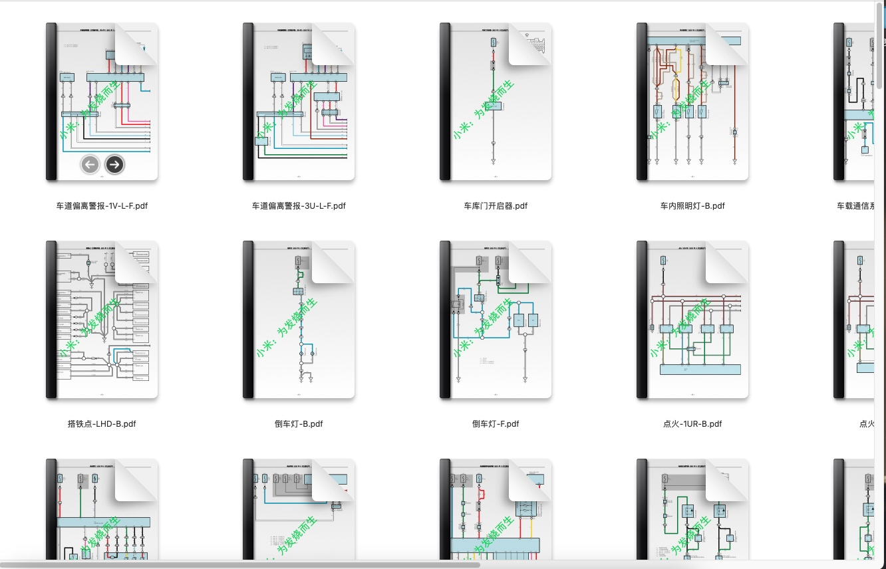

支持pdf编辑的软件挺多，比如：wps pdf编辑，福昕pdf 是很好用的

但是如果有一堆文件需要去修改的话估计会累死个人。更新软件此次就新增了 多文件批量替换PDF文字内容。不喜欢下载软件的同学可以使用网页或者微信小程序免费体验，不过网页只支持单个文件替换。

网页地址：https://www.douyacun.com/pdf/replace-text

微信小程序:

同时批量替换PDF文字也可以用来批量删除PDF文字，只要在输入替换内容不输入即可。

选择文件夹或拖拽文件到软件中时，支持多层文件夹导入PDF，比如：一个手册pdf，每层目录就是一个文件夹。替换时可以选择 “覆盖原文件”替换之后会保留原目录结构。**注意备份原文件**。此功能适用于批量去除PDF水印。

mac/win软件下载地址：https://www.douyacun.com/tools/vip

### 视频教程：

[微信公众号视频](https://mp.weixin.qq.com/s?__biz=Mzg2MDcwMjI4NQ==&mid=2247483758&idx=1&sn=dd01f7e81f9cccc260c2a39f45305eee&chksm=ce23124cf9549b5a577818693e34dfce8cbcaf7ea9a472996e595d8c80c5f23f597c928613e3&token=260449002&lang=zh_CN#rd)

### 文字截图教程：

比如有一堆文字水印 "大宁工作室 www.douyacun.com" ，目标是替换成本公司的宣传语："小米：为发烧而生"

- **输入查找文字、替换文字，选择字体**

从PDF中复制文字出来（避免漏掉中间空格。如果无法复制处理可能是PDF中图片上的文字软件是没办法处理的），输入查找、替换文字，选择字体后拖入文件夹或者点击选择文件夹导入pdf进入下一步

- **选择 保存到目录 或 覆盖原文件**

默认是保存到目录，点击全部替换会弹框选择文件夹，会在输入框显示保存的目录

覆盖原文件，点击全部替换不会弹框提示选择文件夹，替换之后的文件会覆盖原文件，注意做好备份

批量处理是异步多线程处理的，并发数量取决于电脑cpu数量，进度条是每个文件的处理进度，底部“文件总数：已完成：失败：”是汇总整体处理进度，处理完成之后点击清空文件可再次替换

如果文字能从PDF中复制处理，如果存在失败会提示：文字没有匹配到

