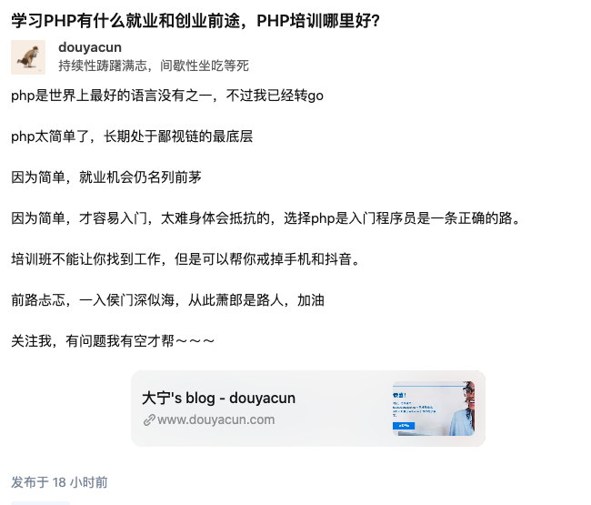

背景：我是佛系写博客，写完就凉在那，简单的做一下seo，19年末（农历）上线（年底需求少）持续了大概有1年的时间，有时间就写点。隔段时间看看友盟统计，有几个人来过，基本上一天能有2，3个人来看看，偶尔有个人评论一下，我都不知道当时写的啥了。一度想关掉，但页面，接口都是一点点写出来的，不是用的开源的博客站。还是决定好好运营一下，也能享受自己开发功能服务自己需求成就感～

第一次尝试：博客文章转发到知乎平台

2019-06-07 ～ 2021-01-21 前后陆续发了有16篇文章，阅读总数6789，每天阅读数量大概20-60之间浮动。点击链接卡片到博客的数量约等于0

 

最近14天的数据统计

| 日期       | 阅读数 | 赞数 | 评论数 | 收藏数 |
| ---------- | ------ | ---- | ------ | ------ |
| 2021-01-20 | 28     | 0    | 0      | 0      |
| 2021-01-19 | 47     | 0    | 0      | 0      |
| 2021-01-18 | 33     | 0    | 0      | 0      |
| 2021-01-17 | 28     | 0    | 0      | 3      |
| 2021-01-16 | 25     | 0    | 0      | 0      |
| 2021-01-15 | 45     | 0    | 0      | 0      |
| 2021-01-14 | 61     | 0    | 0      | 0      |
| 2021-01-13 | 57     | 1    | 0      | 0      |
| 2021-01-12 | 50     | 0    | 0      | 0      |
| 2021-01-11 | 50     | 0    | 0      | 2      |
| 2021-01-10 | 11     | 0    | 0      | 0      |
| 2021-01-09 | 6      | 0    | 0      | 0      |
| 2021-01-08 | 22     | 0    | 0      | 0      |
| 2021-01-07 | 50     | 0    | 0      | 0      |

第二次尝试：知乎问答

第一次的尝试有数据是可行的，但是流量太低，不符合期望。但是每天的20-60流量也不能丢掉继续保持前提下转变思路。就想知乎这么大的流量去哪儿了？每天刷刷知乎，关注一下哪些曝光量比较高。知乎是一个问答社区，百亿流量支持～

那我连续3天，在知乎上回答问题。会找推荐流量大，适合我的领域作答，一般是理性分析，然后拐歪磨脚的贴一下博客链接卡片

贴一下知乎的数据：

| 日期       | 阅读数 | 评论数 | 赞同数 | 感谢数 | 收藏数 |
| ---------- | ------ | ------ | ------ | ------ | ------ |
| 2021-01-20 | 450    | 0      | 1      | 0      | 1      |
| 2021-01-19 | 487    | 1      | 1      | 1      | 0      |
| 2021-01-18 | 155    | 0      | 1      | 0      | 1      |
| 2021-01-17 | 19     | 0      | 0      | 0      | 0      |
| 2021-01-16 | 12     | 0      | 0      | 0      | 0      |

点击外链进去博客的数量：

