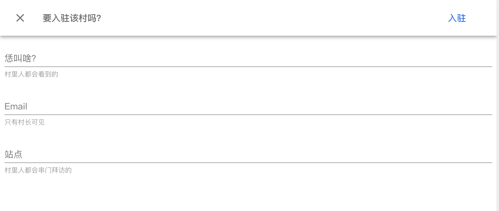

---

Title: "敬请周知：如何在Douyacun添加友情链接?"
Keywords: "douyacun友情链接,friends site list"
Description: "寒冬季节，互相取暖"
---

**敬请周知**：

1. 添加友情链接的2种方式
    1. **注册并且在此文章底部评论以后** 会自动添加（推荐） :
        1. 恁叫啥 -> 站点名称 eg: Douyacun
        2. 站点 -> 博客的地址 eg: https://www.douyacun.com
    2. 发个邮件到 douyacun@gmail.com ，写明站点名称/站点连接
2. 小技巧：
    1. `command + alt + u` 查看源码必须包含有站点名称和站点链接
    2. `<a>` 标签里面不要 `alt="nofollow"`
    3. 确保你的站点已经添加了友情链接 `<a href="https://www.douyacun.com" target="_blank">Douyacun</a>` 
    4. `robots.txt` 不要 `Disallow`
3. 目前仅有20个坑位

